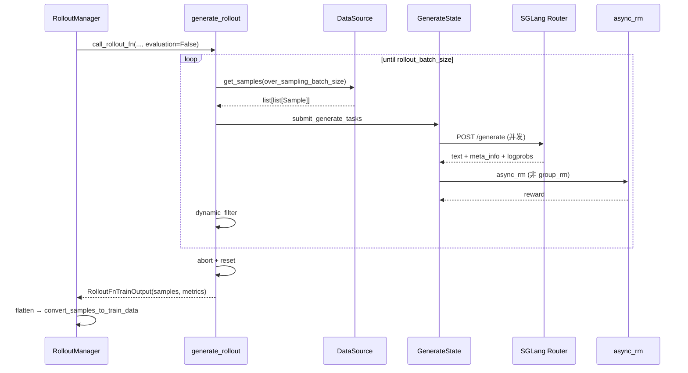
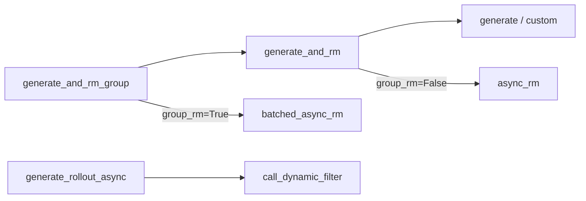

# SGLang Rollout · 数据流与交互

> IO 边界、消息格式、上下游模块衔接。

---

## 1. 端到端数据流（训练 rollout）



---

## 2. RolloutManager 调用边界

**Explain：** `RolloutManager._get_rollout_data` 动态 import `--rollout-function-path`，默认指向本模块 `generate_rollout`。返回的 `RolloutFnTrainOutput.metrics` 与 `compute_metrics_from_samples` 合并后写 wandb。

**Code：**

```python
## 来源：slime/ray/rollout.py L440-L441, L651-L653
        self.generate_rollout = load_function(self.args.rollout_function_path)
        self.eval_generate_rollout = load_function(self.args.eval_function_path)
        # ...
            data = call_rollout_fn(self.generate_rollout, self.args, rollout_id, self.data_source, evaluation=False)
            metrics = data.metrics
            data = data.samples
```

**Code：**

```python
## 来源：slime/rollout/base_types.py L7-L26
@dataclass
class RolloutFnTrainOutput:
    samples: list[list[Sample]]
    metrics: dict[str, Any] = None

def call_rollout_fn(fn, *args, evaluation: bool, **kwargs):
    output = fn(*args, **kwargs, evaluation=evaluation)
    if not isinstance(output, (RolloutFnTrainOutput, RolloutFnEvalOutput)):
        output = RolloutFnTrainOutput(samples=output) if not evaluation else RolloutFnEvalOutput(data=output)
    return output
```

**Comment：** legacy 插件若仍返回裸 `list[list[Sample]]`，`call_rollout_fn` 自动包装。

---

## 3. HTTP 请求 / 响应结构

### 3.1 请求 payload

| 字段 | 来源 | 说明 |
|------|------|------|
| `sampling_params` | `GenerateState.sampling_params` + per-group 覆盖 | temperature、top_p、max_new_tokens 等 |
| `input_ids` | `_prepare_prompt_ids` | 纯文本路径 |
| `text` + `image_data` | multimodal | SGLang 侧展开 image placeholder |
| `return_logprob` | 固定 True | 训练需要 rollout log probs |
| `return_routed_experts` | `use_rollout_routing_replay` | MoE routing replay |

**Code：**

```python
## 来源：slime/rollout/sglang_rollout.py L175-L200
    payload = {
        "sampling_params": sampling_params,
        "return_logprob": True,
    }
    if args.use_rollout_routing_replay:
        payload["return_routed_experts"] = True

    images = sample.multimodal_inputs.get("images") if sample.multimodal_inputs else None
    if images:
        payload["image_data"] = [encode_image_for_rollout_engine(image) for image in images]
        payload["text"] = sample.prompt
    else:
        payload["input_ids"] = prompt_ids

    headers = None
    if sample.session_id and getattr(args, "router_policy", None) == "consistent_hashing":
        headers = {"X-SMG-Routing-Key": sample.session_id}
```

### 3.2 响应 → Sample 字段映射

**Explain：** `append_response_tokens` 统一追加 tokens、loss_mask、rollout_log_probs、top-p tensors、routed_experts、status。

| SGLang `meta_info` | Sample 字段 |
|--------------------|-------------|
| `output_token_logprobs` | `tokens`（response 段）、`rollout_log_probs` |
| `top_p_token_ids` / offsets（base64 int32） | `rollout_top_p_token_ids/offsets` |
| `routed_experts`（base64） | `rollout_routed_experts` |
| `finish_reason` | `status` → COMPLETED / TRUNCATED |
| spec / cache 相关 | `spec_info`、`prefix_cache_info` |

**Code：**

```python
## 来源：slime/rollout/sglang_rollout.py L205-L218
    if "output_token_logprobs" in output["meta_info"]:
        new_response_tokens = [item[1] for item in output["meta_info"]["output_token_logprobs"]]
        new_response_log_probs = [item[0] for item in output["meta_info"]["output_token_logprobs"]]

    sample.append_response_tokens(
        args,
        tokens=new_response_tokens,
        log_probs=new_response_log_probs,
        trainable=True,
        meta_info=output["meta_info"],
        text=output["text"],
    )
```

---

## 4. Metrics 两条路径

### 4.1 Rollout 内建 metrics（dynamic filter）

**Explain：** `MetricGatherer` 在 oversampling 循环中记录 filter drop，经 `RolloutFnTrainOutput.metrics` 返回。

### 4.2 RolloutManager 聚合 metrics（Sample 衍生）

**Explain：** flatten 后 `compute_metrics_from_samples` 读取 Sample 上已 materialize 的字段。`top_p_kept_vocab_per_token` 依赖 `rollout_top_p_token_offsets` 与 `loss_mask`——这正是 `generate` → `append_response_tokens` 写下的数据。

**Code：**

```python
## 来源：slime/ray/rollout.py L1309-L1321
def compute_metrics_from_samples(args, samples):
    response_lengths = [sample.effective_response_length for sample in samples]
    log_dict = {}
    log_dict |= dict_add_prefix(compute_statistics(response_lengths), "response_len/")
    log_dict |= _compute_zero_std_metrics(args, samples)
    log_dict |= _compute_spec_metrics(args, samples)
    log_dict |= _compute_prefix_cache_metrics(args, samples)
    log_dict |= _compute_reward_cat_metrics(args, samples)
    log_dict |= _compute_top_p_kept_vocab_metrics(args, samples)
    log_dict["repetition_frac"] = np.mean([int(has_repetition(s.response)) for s in samples]).item()
    log_dict["truncated_ratio"] = np.mean([int(s.status == Sample.Status.TRUNCATED) for s in samples]).item()
    return log_dict
```

**Code：**

```python
## 来源：slime/ray/rollout.py L1427-L1454
def _compute_top_p_kept_vocab_metrics(args, all_samples: list[Sample]):
    total_kept = 0
    total_tokens = 0
    for sample in all_samples:
        offsets = sample.rollout_top_p_token_offsets
        if offsets is None or sample.response_length == 0:
            continue
        if sample.remove_sample:
            continue
        if sample.loss_mask is None:
            total_kept += int(offsets[-1] - offsets[0])
            total_tokens += sample.response_length
            continue
        loss_mask = torch.as_tensor(sample.loss_mask, dtype=torch.bool, device=offsets.device)
        total_kept += int(torch.diff(offsets)[loss_mask].sum())
        total_tokens += int(loss_mask.sum())
    if total_tokens == 0:
        return {}
    return {"top_p_kept_vocab_per_token": total_kept / total_tokens}
```

**Comment：** 当 `rollout_top_p == 1.0` 时不请求 top-p ids，此 metric 为空 dict。

---

## 5. DataSource 交互

| 方法 | 调用时机 | 数据形状 |
|------|----------|----------|
| `get_samples(n)` | oversampling 补货 | `list[list[Sample]]`，内层长度 = `n_samples_per_prompt` |
| `add_samples(groups)` | abort 后 partial 回收 | 同上 |

**Explain：** partial rollout 把未完成组回灌 buffer，下轮可续生成；`start_rollout_id` metadata 标记起源 rollout。

---

## 6. 与 RM / Filter 模块边界



- **RM 时机：** 非 group 在 sample 级；group 在 group gather 后
- **Filter 时机：** group 完成且 RM 就绪后，在 oversampling 循环内
- 详见 [[13-RM-FilterHub-03-数据流与交互]]

---

## 7. 评估输出形状

**Explain：** `eval_rollout` 返回 `RolloutFnEvalOutput(data={dataset_name: {rewards, truncated, samples}})`。

**Code：**

```python
## 来源：slime/rollout/sglang_rollout.py L608-L615
    return {
        dataset_cfg.name: {
            "rewards": [sample.reward if not reward_key else sample.reward[reward_key] for sample in data],
            "truncated": [sample.status == Sample.Status.TRUNCATED for sample in data],
            "samples": data,
        }
    }
```

---

## 8. 并发与背压

| 机制 | 作用 |
|------|------|
| `asyncio.Semaphore` | 限制同时 in-flight 的 HTTP generate 数 |
| `remaining_batch_size` | 追踪已提交但未消费的 group 数，驱动 oversampling |
| `state.aborted` | 全局 cancel gate；新请求标记 ABORTED |
| `dp_rank_context` | SGLang DP 维度负载均衡 |
