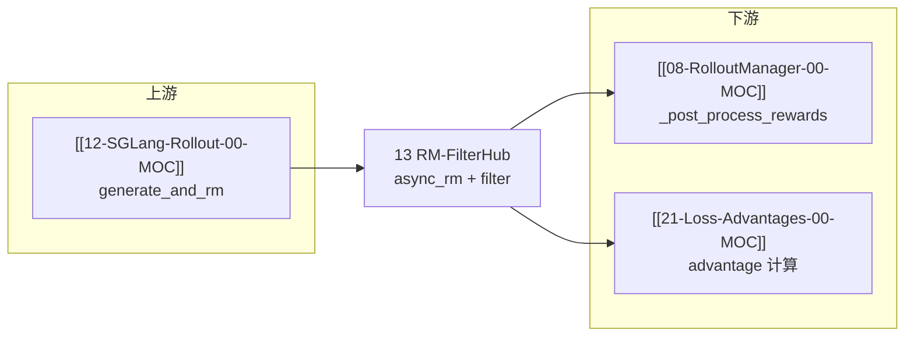

---
type: module-moc
module: 13-RM-FilterHub
batch: "13"
doc_type: moc
title: "RM-FilterHub · 专题概述"
tags:
  - slime/batch/13
  - slime/module/rm-filter-hub
  - slime/doc/moc
updated: 2026-07-02
---

# RM-FilterHub · 专题概述

> 源码主目录：`slime/rollout/rm_hub/`、`slime/rollout/filter_hub/`

---

## 本专题目标

读完本专题六件套后，读者应能：

1. 说明 `async_rm` 如何按优先级选择 **per-sample custom RM → args custom RM → 内置 rm_type 分支**
2. 对比 `math_utils`（Verl/DeepScaler 路径）与 `math_dapo_utils`（DAPO 路径）的评分差异
3. 解释 `--dynamic-sampling-filter-path` 在 `generate_rollout_async` 中的 **过采样 + 过滤 + 凑 batch** 逻辑
4. 能编写并挂载 `--custom-rm-path` / `--dynamic-sampling-filter-path` 插件

---

## 文档导航

| 文档 | 内容 |
|------|------|
| [[13-RM-FilterHub-01-核心概念]] | RM Hub 分发、Filter Hub 契约、rm_type 枚举 |
| [[13-RM-FilterHub-02-源码走读]] | **主文档**：`async_rm` → 各 scorer → `check_reward_nonzero_std` |
| [[13-RM-FilterHub-03-数据流与交互]] | generate_and_rm → filter → metrics 全链路 |
| [[13-RM-FilterHub-04-关键问题]] | FAQ、DAPO vs math、group_rm、插件签名 |
| [[13-RM-FilterHub-05-checkpoint]] | 验收清单 |

---

## 源码范围

| 优先级 | 文件 / 符号 | 本专题覆盖 |
|--------|------------|---------|
| P0 | `rm_hub/__init__.py` — `async_rm`, `batched_async_rm`, `remote_rm` | ✅ |
| P0 | `rm_hub/math_utils.py` — `grade_answer_verl`, `extract_boxed_answer` | ✅ |
| P0 | `rm_hub/math_dapo_utils.py` — `compute_score` | ✅ |
| P0 | `rm_hub/deepscaler.py` — `get_deepscaler_rule_based_reward` | ✅ |
| P1 | `rm_hub/f1.py`, `gpqa.py`, `ifbench.py` | 01/04 引用 |
| P0 | `filter_hub/base_types.py` — `DynamicFilterOutput`, `call_dynamic_filter` | ✅ |
| P0 | `filter_hub/dynamic_sampling_filters.py` — `check_reward_nonzero_std` | ✅ |
| 测试锚点 | `tests/test_rm_math_dapo.py` | 04 FAQ |

---

## 入口代码：`async_rm` 分发中枢

**Explain：** Rollout 在 `generate_and_rm` 里对每个 `Sample` 调用 `async_rm`（或 `batched_async_rm`）。该函数是 **Reward Model Hub 的唯一入口**：先查插件路径，再按 `metadata.rm_type` / `--rm-type` 路由到内置 rule-based scorer 或远程 HTTP RM。

**Code：**

```python
## 来源：slime/rollout/rm_hub/__init__.py L55-L96
async def async_rm(args, sample: Sample, **kwargs):
    # Per-sample custom_rm_path (from eval dataset config) takes priority
    if sample.custom_rm_path:
        rm_function = load_function(sample.custom_rm_path)
        return await rm_function(args, sample, **kwargs)

    if args.custom_rm_path is not None:
        rm_function = load_function(args.custom_rm_path)
        return await rm_function(args, sample, **kwargs)

    metadata = sample.metadata if isinstance(sample.metadata, dict) else {}
    rm_type = (metadata.get("rm_type") or args.rm_type or "").strip()
    response = sample.response
    label = sample.label
    if rm_type.startswith("boxed_"):
        response = extract_boxed_answer(response) or ""
        rm_type = rm_type[len("boxed_") :]

    if rm_type == "remote_rm":
        return await remote_rm(args, sample)
    elif rm_type == "deepscaler":
        return get_deepscaler_rule_based_reward(response, label)
    elif rm_type == "dapo":
        return compute_score_dapo(response, label)
    elif rm_type == "math":
        return 1 if grade_answer_verl(response, label) else 0
    elif rm_type == "f1":
        return f1_score(response, label)[0]
    elif rm_type == "gpqa":
        return compute_gpqa_reward(response, label, metadata=metadata)
    elif rm_type == "ifbench":
        from .ifbench import compute_ifbench_reward
        return compute_ifbench_reward(response, label, metadata=metadata)
    elif rm_type == "random":
        return random.randint(0, 1)
    elif rm_type:
        raise NotImplementedError(f"Rule-based RM for {rm_type} is not implemented.")
    else:
        raise NotImplementedError("Rule-based RM type is not specified.")
```

**Comment：**

- `sample.custom_rm_path` 优先于 `args.custom_rm_path`，eval 数据集可在 `EvalDatasetConfig` 里 per-dataset 指定
- `boxed_*` 前缀会在打分前用 `extract_boxed_answer` 剥出 `\boxed{}` 内容（适用于模型已输出完整 CoT 但 RM 只比最终答案）
- `dapo` 返回 **dict**（含 `score`/`acc`/`pred`），训练侧需配合 `--reward-key score`；`math`/`deepscaler` 返回 0/1 标量
- 远程 RM 走 `remote_rm`，payload 为 `{prompt, response, label}`，带指数退避重试

---

## 衔接关系



---

## 阶段验收点

- [ ] 能列举 ≥5 种 `--rm-type` 及返回值形态（标量 vs dict）
- [ ] 能说明 `check_reward_nonzero_std` 为何用 reward 标准差过滤
- [ ] 能指出 `math_utils` 与 `math_dapo_utils` 的三处关键差异（见 [[13-RM-FilterHub-04-关键问题]]）

---

## 验证命令

```bash
cd slime && pytest tests/test_rm_math_dapo.py -q
cd slime && pytest tests/plugin_contracts/test_plugin_path_loading_contracts.py -k "rm or dynamic_filter" -q
```
