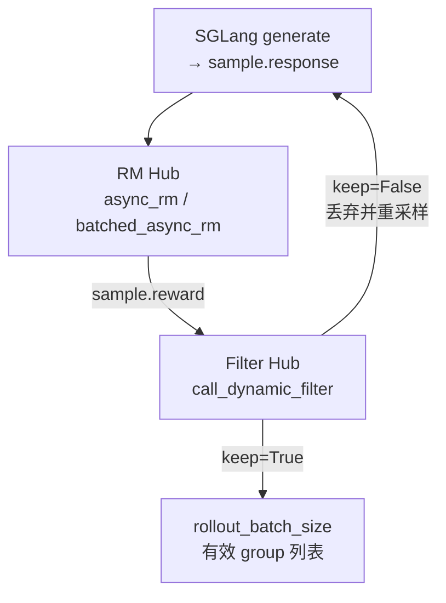

# RM-FilterHub · 核心概念

---

## 架构位置

Slime Rollout 在 SGLang 生成 `response` 之后、写入训练 buffer 之前，需要两道 **可插拔** 处理：

| 阶段 | 模块 | CLI 挂载点 | 粒度 |
|------|------|-----------|------|
| 打分 | **RM Hub** | `--rm-type` / `--custom-rm-path` | 单 sample 或整组（`--group-rm`） |
| 采样过滤 | **Filter Hub** | `--dynamic-sampling-filter-path` | 一组 `n_samples_per_prompt` |

二者解耦：RM 只负责 `sample.reward`；Filter 在 **组级** 决定该 prompt 的多条 rollout 是否进入训练 batch（DAPO 式 dynamic sampling）。



---

## 术语表

| 术语 | 含义 |
|------|------|
| `rm_type` | 内置 rule-based RM 枚举；来自 `sample.metadata["rm_type"]` 或 `--rm-type` |
| `custom_rm_path` | 可 import 的 async 函数路径；签名 `(args, sample) -> float \| dict` |
| `group_rm` | 为 True 时 RM 在整组生成完成后一次性 `batched_async_rm(args, group)` |
| `reward_key` | 当 RM 返回 dict 时，用该 key 取标量（如 DAPO 的 `"score"`） |
| `DynamicFilterOutput` | Filter 返回值：`keep` + 可选 `reason`（用于 metrics） |
| `MetricGatherer` | 统计被 filter 丢弃的 reason 计数，写入 rollout metrics |

---

## RM Hub：三层优先级

**Explain：** 同一 batch 内不同 sample 可以走不同 RM（eval 场景），但训练 rollout 通常统一 `--rm-type`。

**Code：**

```python
# 来源：slime/slime/rollout/rm_hub/__init__.py L56-L63
    if sample.custom_rm_path:
        rm_function = load_function(sample.custom_rm_path)
        return await rm_function(args, sample, **kwargs)

    if args.custom_rm_path is not None:
        rm_function = load_function(args.custom_rm_path)
        return await rm_function(args, sample, **kwargs)
```

**Comment：**

1. **Per-sample** `custom_rm_path` — eval 数据集配置注入（`sglang_rollout.eval_rollout_single_dataset`）
2. **Global** `--custom-rm-path` — 用户插件；若设置则 **完全替换** 内置 rm_type 分支
3. **内置** `rm_type` 分支 — 无需外部服务，适合 GSM8K/MATH/GPQA 等 benchmark

`batched_async_rm` 规则：`args.custom_rm_path` 存在时要求插件实现 **batch 签名** `(args, samples) -> list`；否则对每个 sample 并发 `async_rm`。

---

## 内置 rm_type 一览

| `--rm-type` | 实现 | 典型返回值 | 用途 |
|-------------|------|-----------|------|
| `math` | `grade_answer_verl` | `0` / `1` | GSM8K、`\boxed{}` 答案校验 |
| `dapo` | `compute_score` | `dict{score, acc, pred}` | DAPO 训练；错题为 `-1.0` |
| `deepscaler` | `get_deepscaler_rule_based_reward` | `0` / `1` | DeepScaler CoT 格式 + sympy |
| `f1` | `f1_score` | `[0,1]` 三元组取 f1 | 抽取式 QA |
| `gpqa` | `compute_gpqa_reward` | 选项字母匹配 | GPQA 多选 |
| `ifbench` | `compute_ifbench_reward` | 指令遵循 | IFBench |
| `remote_rm` | HTTP POST `--rm-url` | JSON（常配合 `--reward-key`） | 神经网络 RM 服务 |
| `random` | `random.randint(0,1)` | 调试 | CI / smoke test |
| `boxed_<type>` | 先 `extract_boxed_answer` 再按 `<type>` 路由 | 同上 | 长 CoT 后段 boxed 答案 |

CLI 定义见 `arguments.py` 的 `add_reward_model_arguments`。

---

## math_utils：Verl 风格答案校验

**Explain：** `rm_type=math` 与 `deepscaler` 共用 `math_utils`。核心思路：从 response 提取最后一个 `\boxed{}`，经 **mathd 字符串规范化** 或 **sympy 等价** 与 label 比较。

**Code：**

```python
# 来源：slime/slime/rollout/rm_hub/math_utils.py L484-L493
def grade_answer_verl(solution_str, ground_truth):
    if not ground_truth:
        return False
    ground_truth = str(ground_truth)
    if "\\boxed" in ground_truth:
        ground_truth = extract_answer(ground_truth)
    given_answer = extract_answer(solution_str)
    if given_answer is None:
        return False
    return grade_answer_mathd(given_answer, ground_truth) or grade_answer_sympy(given_answer, ground_truth)
```

**Comment：**

- `extract_answer` → `last_boxed_only_string` + `remove_boxed`；无 box 则返回 `None` → 判错
- `grade_answer_sympy` 对分数题 **禁止** sympy 化简（未约分不算对）
- `remove_boxed` 在 malformed 输入时 **静默返回 None**（与 dapo 版不同）

---

## math_dapo_utils：DAPO 评分契约

**Explain：** DAPO 使用独立实现；`compute_score` 只验证 **最后 300 字符**（效率），错误答案 reward 为 **-1.0** 而非 0。

**Code：**

```python
# 来源：slime/slime/rollout/rm_hub/math_dapo_utils.py L279-L292
    solution_str = solution_str[-300:]

    correct, pred = verify(solution_str, ground_truth, strict_box_verify, pause_tokens_index)

    reward = 1.0 if correct else -1.0
    acc = correct

    return {
        "score": reward,
        "acc": acc,
        "pred": pred,
    }
```

**Comment：**

- 默认 `verify` 走 Minerva 路径（`Answer:` 正则提取）；`strict_box_verify=True` 走 strict box
- 训练时需 `--reward-key score`，否则 `Sample.get_reward_value` 无法取标量
- `tests/test_rm_math_dapo.py` 锁定与 `math_utils` 的行为差异，防止日后合并实现

---

## deepscaler：CoT 分段 + 多 GT

**Explain：** 从 DeepScaler 格式 response 中截取 thinking 之后的正文，再复用 `math_utils` 判题。

**Code：**

```python
# 来源：slime/slime/rollout/rm_hub/deepscaler.py L4-L14
def get_deepscaler_rule_based_reward(response, label):
    if "</think>" in response:
        model_solution = response.split("</think>")[-1]
    elif "###Response" in response:
        model_solution = response.split("###Response")[1]
    else:
        return 0

    model_answer = extract_answer(model_solution)
    if model_answer is None:
        return 0
```

**Comment：**

- 无 thinking 分隔符 → 直接 0 分（比 `math` 更严格）
- label 可含 `\boxed{}`，会先 extract 再比较

---

## Filter Hub：Dynamic Sampling

**Explain：** DAPO / 多篇 Slime 脚本使用 **过采样 + 组级过滤**：同一 prompt 生成 `n_samples_per_prompt` 条，若组内 reward 无方差则丢弃整组，避免 GRPO/PPO 优势为 0。

**Code：**

```python
# 来源：slime/slime/rollout/filter_hub/dynamic_sampling_filters.py L9-L15
def check_reward_nonzero_std(args, samples: list[Sample], **kwargs):
    rewards = [sample.get_reward_value(args) for sample in samples]
    keep = torch.tensor(rewards, dtype=torch.float64).std() > 1e-6
    return DynamicFilterOutput(
        keep=keep,
        reason=None if keep else f"zero_std_{round(rewards[0], 1)}",
    )
```

**Comment：**

- 使用 `get_reward_value` 以支持 dict reward + `--reward-key`
- `reason` 写入 `MetricGatherer` → `rollout/dynamic_filter/drop_zero_std_*` metrics
- Filter 函数 **同步**、无 async；在 `generate_rollout_async` 的 completed task 回调里调用

---

## DynamicFilterOutput 与兼容层

**Explain：** `call_dynamic_filter` 统一入口；`fn is None` 时默认 keep；旧插件返回 bare `bool` 仍兼容。

**Code：**

```python
# 来源：slime/slime/rollout/filter_hub/base_types.py L5-L21
@dataclass
class DynamicFilterOutput:
    keep: bool
    reason: str | None = None


def call_dynamic_filter(fn, *args, **kwargs):
    if fn is None:
        return DynamicFilterOutput(keep=True)

    output = fn(*args, **kwargs)

    if not isinstance(output, DynamicFilterOutput):
        output = DynamicFilterOutput(keep=output)

    return output
```

**Comment：**

- 新插件应返回 `DynamicFilterOutput`，便于可观测性
- `MetricGatherer.collect()` 在 rollout 结束时并入 `RolloutFnTrainOutput.metrics`
