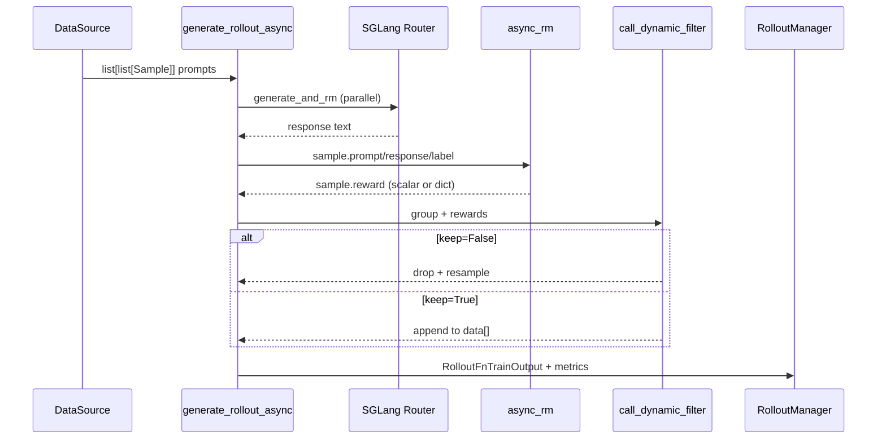
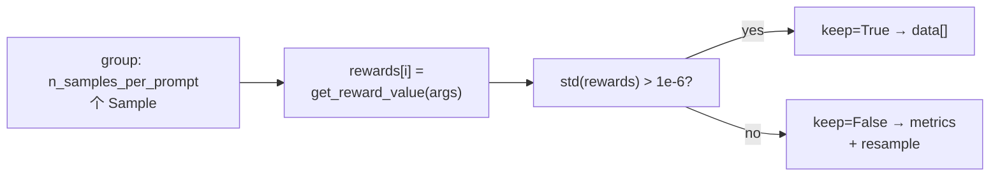

# RM-FilterHub · 数据流与交互

---

## 在 RL 闭环中的位置



RM 与 Filter 均运行在 **Rollout 进程**（`sglang_rollout.generate_rollout_async`），不占用 Megatron 训练 GPU。

---

## 核心数据结构

### Sample 上与 RM/Filter 相关字段

**Explain：** RM 读 prompt/response/label/metadata；写 `reward`。Filter 读整组 samples 的 reward。

**Code：**

```python
## 来源：slime/utils/types.py（字段节选）
@dataclass
class Sample:
    prompt: str | list[int] = ""
    response: str = ""
    label: str | None = None
    reward: float | dict[str, Any] | None = None
    metadata: dict[str, Any] = field(default_factory=dict)
    custom_rm_path: str | None = None
```

**Comment：**

- `metadata["rm_type"]` 可 per-sample 覆盖 CLI `--rm-type`（eval 数据集注入）
- `reward` 在 RM 之前为 `None`；filter 执行前必须已完成 `generate_and_rm`

### DynamicFilterOutput

**Code：**

```python
## 来源：slime/rollout/filter_hub/base_types.py L5-L8
@dataclass
class DynamicFilterOutput:
    keep: bool
    reason: str | None = None
```

**Comment：** `keep=False` 时整组 `n_samples_per_prompt` 条 sample 均不进入训练 batch。

---

## 上游：谁调用 RM

| 调用方 | 函数 | 条件 |
|--------|------|------|
| 单 sample rollout | `generate_and_rm` | `not group_rm` |
| 整组 rollout | `generate_and_rm_group` | `group_rm` |
| Fan-out agent | `generate_and_rm` list 分支 | `batched_async_rm` on 子 samples |
| Multi-agent 示例 | `agent_system.py` | 直接 `batched_async_rm` |

**Code（multi-agent 示例）：**

```python
## 来源：slime/examples/multi_agent/agent_system.py L224（节选）
    rewards = await batched_async_rm(args, args.results_dict["solver"])
```

**Comment：** 自定义工作流可 bypass `generate_and_rm`，但仍应遵循 async RM 签名约定。

---

## RM 输入输出形态

| rm_type | 输入 | 输出 | 训练侧处理 |
|---------|------|------|-----------|
| `math` | response 全文 + label | `0`/`1` int | 直接作 reward |
| `deepscaler` | CoT response + label | `0`/`1` | 同左 |
| `dapo` | response + label | `{score, acc, pred}` | `--reward-key score` |
| `remote_rm` | HTTP JSON | 服务定义（常为 dict） | `--reward-key` |
| `custom_rm_path` | Sample 全字段 | 用户定义 | 建议 float 或 dict |

**Explain：** `RolloutManager._post_process_rewards`（[[08-RolloutManager-00-MOC]]）可能在 tensor 化前对 reward 做后处理（`--custom-reward-post-process-path`），本专题 RM Hub 只负责 **原始打分**。

---

## Filter 数据流：过采样环

**Explain：** `GenerateState` 跟踪 `remaining_batch_size` 与 pending asyncio tasks。Filter 丢弃一组时递减 remaining，迫使外层 while 继续向 data_source 要 prompt。

**Code：**

```python
## 来源：slime/rollout/sglang_rollout.py L401-L412
    target_data_size = args.rollout_batch_size

    data = []
    all_data = []
    while len(data) < target_data_size:
        while state.remaining_batch_size < target_data_size:
            samples = data_source(args.over_sampling_batch_size)
            state.submit_generate_tasks(samples)
```

**Comment：**

- 有效输出 `data` 长度最终 **assert** 等于 `rollout_batch_size`
- `all_data` 含被 filter 掉的 group，供 `--rollout-all-samples-process-path` 可选后处理

### check_reward_nonzero_std 数据流



**Code：**

```python
## 来源：slime/rollout/filter_hub/dynamic_sampling_filters.py L9-L15
def check_reward_nonzero_std(args, samples: list[Sample], **kwargs):
    rewards = [sample.get_reward_value(args) for sample in samples]
    keep = torch.tensor(rewards, dtype=torch.float64).std() > 1e-6
    return DynamicFilterOutput(
        keep=keep,
        reason=None if keep else f"zero_std_{round(rewards[0], 1)}",
    )
```

**Comment：**

- 典型场景：同一数学题 n 条 rollout 全对或全错 → std=0 → 对 GRPO 无学习信号，丢弃
- reason 字符串含首个 reward 值，便于在 metrics 中区分「全 1」vs「全 -1」

---

## 下游：metrics 与训练

**Explain：** `generate_rollout_async` 返回 `(RolloutFnTrainOutput, aborted_samples)`；metrics 与 samples 一并交给 RolloutManager。

**Code：**

```python
## 来源：slime/rollout/sglang_rollout.py L467
    return RolloutFnTrainOutput(samples=data, metrics=metric_gatherer.collect()), aborted_samples
```

**Comment：**

- metrics key 形如 `rollout/dynamic_filter/drop_zero_std_1.0`
- 训练侧 `process_rollout_data` 消费 `Sample.reward` 计算 advantage（[[21-Loss-Advantages-00-MOC]]）

---

## Eval 数据流差异

| 维度 | 训练 rollout | Eval rollout |
|------|-------------|--------------|
| Filter | 可用 `--dynamic-sampling-filter-path` | 通常不用 dynamic filter 环 |
| `group_rm` | 支持 | **不支持** |
| RM 来源 | `--rm-type` / custom | `EvalDatasetConfig` 可设 `rm_type` + `custom_rm_path` |

**Code：**

```python
## 来源：slime/utils/eval_config.py L200-L201
        if self.rm_type is not None:
            metadata["rm_type"] = self.rm_type
```

---

## 插件加载：`load_function`

**Explain：** CLI 路径与 eval 配置均通过 `slime.utils.misc.load_function` 动态 import，与 `--custom-generate-function-path` 同一机制。

**Comment：**

- 路径格式：`package.module.function`（无 `.py` 后缀）
- 插件契约测试：`tests/plugin_contracts/test_plugin_path_loading_contracts.py`

---

## 典型 CLI 组合（GSM8K + DAPO filter）

```bash
--rm-type math \
--dynamic-sampling-filter-path slime.rollout.filter_hub.dynamic_sampling_filters.check_reward_nonzero_std \
--n-samples-per-prompt 8 \
--over-sampling-batch-size 16
```

**Comment：** 见 `tests/test_qwen3.5_0.8B_gsm8k_short.py` 与 `scripts/run-deepseek-r1.sh`。

---

## 边界：与 buffer / loss mask 侧 filter 的关系

本专题覆盖 **dynamic sampling filter**（rollout 生成环内）。`--buffer-filter-path`、`--rollout-sample-filter-path` 等在更后阶段作用于 buffer/loss mask，详见 [[28-Customization-01-核心概念]]（buffer-filter、rollout-sample-filter 等 Train 侧 hook）。
