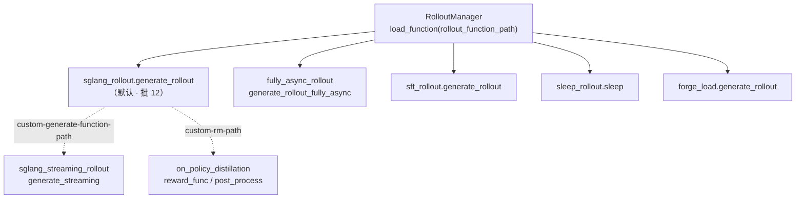

# Alt-Rollout · 替代 Rollout 路径

> **阶段 III · Rollout 生成** | 批次 14 | 基线 commit `22cdc6e1`  
> **源码范围：** `slime/rollout/` 下 6 个可插拔 rollout 模块

---

## 本模块在架构中的位置

Slime 通过 `--rollout-function-path` 将 **RolloutManager.generate** 委托给任意 Python 函数。默认路径是 `sglang_rollout.generate_rollout`（批次 12）；本批覆盖 **6 种替代实现**——从 fully-async 流水线、SSE 流式生成，到 SFT 离线 tokenize、OPD 教师 log-prob、profiling 占位、磁盘 replay。



---

## 零基础一句话

**像「换引擎」**：训练闭环（generate → train → update_weights）不变，只把「怎么产出 Sample」这一步换成另一套实现——有的更快（fully-async），有的不走 SGLang（SFT），有的只读磁盘（forge_load）。

---

## 六件套阅读顺序

| 顺序 | 文件 | 一句话说明 |
|------|------|------------|
| 01 | [[14-Alt-Rollout-01-核心概念]] | 插拔契约、fully-async vs sync、streaming 动机 |
| 02 | [[14-Alt-Rollout-02-源码走读]] | 6 个文件按调用顺序精读（**主文档**） |
| 03 | [[14-Alt-Rollout-03-数据流与交互]] | fully-async 与 `train_async` 流水线重叠 |
| 04 | [[14-Alt-Rollout-04-关键问题]] | sync/async/fully-async 对比、forge vs debug |
| ✓ | [[14-Alt-Rollout-05-checkpoint]] | 验收清单 |

---

## 核心源码锚点

**Explain：** `RolloutManager` 在初始化时 `load_function(args.rollout_function_path)`，每个 rollout step 调用该函数产出 `RolloutFnTrainOutput` 或原始 `list[list[Sample]]`。fully-async 版本额外维护跨 rollout 边界的后台 worker。

**Code：**

```python
# 来源：slime/ray/rollout.py L440-L450
self.generate_rollout = load_function(self.args.rollout_function_path)
self.eval_generate_rollout = load_function(self.args.eval_function_path)
# ...
logger.info(f"import {self.args.rollout_function_path} as generate_rollout function.")
```

```python
# 来源：slime/rollout/fully_async_rollout.py L251-L256
def generate_rollout_fully_async(args, rollout_id, data_buffer, evaluation: bool = False):
    """Slime ``--rollout-function-path`` entrypoint."""
    if evaluation:
        raise ValueError("fully-async rollout doesn't support evaluation mode")
    return run(_generate_rollout_async(args, rollout_id, data_buffer))
```

**Comment：**

- 所有 rollout 函数签名统一：`(args, rollout_id, data_buffer|data_source, evaluation=False)`。
- fully-async 用全局 `AsyncRolloutWorker` 保持队列温热，与 `train_async.py` 的「提前启动下一步 generate」叠加。
- streaming / OPD 是 **inner hook**（`custom-generate-function-path` / `custom-rm-path`），外层仍可用默认 `sglang_rollout`。

---

## 前置与衔接

| 方向 | 批次 | 说明 |
|------|------|------|
| ← 上游 | [[12-SGLang-Rollout-00-MOC]] | 默认 rollout、`generate_and_rm_group` |
| ← 上游 | [[11-DataSource-00-MOC]] | `data_buffer.get_samples` |
| → 下游 | [[20-Train-Data-00-MOC]] | Sample → train tensor |
| → 下游 | [[28-Customization-00-MOC]] | 自定义 rollout 扩展模式 |

---

## CLI 速查

| 场景 | 关键参数 |
|------|----------|
| Fully-async | `--rollout-function-path slime.rollout.fully_async_rollout.generate_rollout_fully_async` + `train_async.py` |
| Streaming generate | `--custom-generate-function-path slime.rollout.sglang_streaming_rollout.generate_streaming` |
| SFT | `--rollout-function-path slime.rollout.sft_rollout.generate_rollout` |
| OPD | `--custom-rm-path slime.rollout.on_policy_distillation.reward_func` + `post_process_rewards` |
| Profiling 占位 | `--rollout-function-path slime.rollout.sleep_rollout.sleep` |
| 内存测试 replay | `--rollout-function-path slime.rollout.forge_load.generate_rollout` + `--load-forge-rollout-data` |

---

## 验证建议

1. CI：`tests/test_qwen2.5_0.5B_fully_async_short.py` 覆盖 fully-async + `train_async.py` 端到端。
2. 示例：`examples/fully_async/run-qwen2.5-0.5B-fully_async.sh`、`examples/on_policy_distillation/`。
