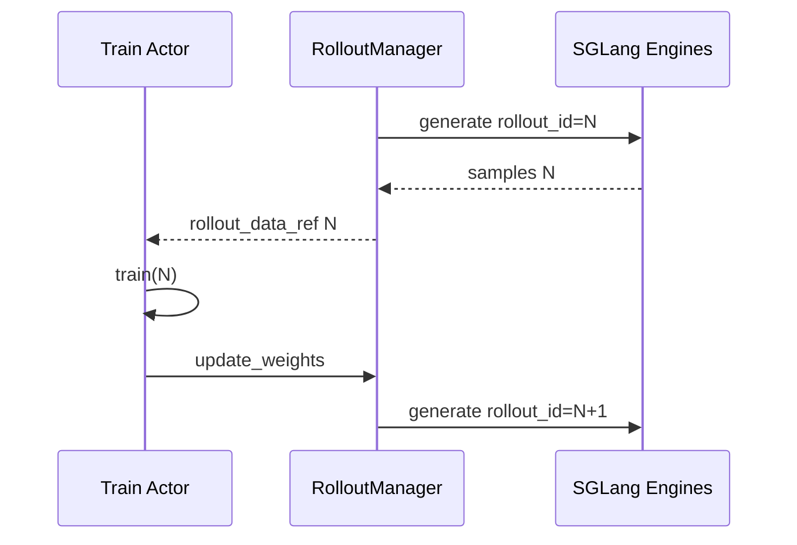
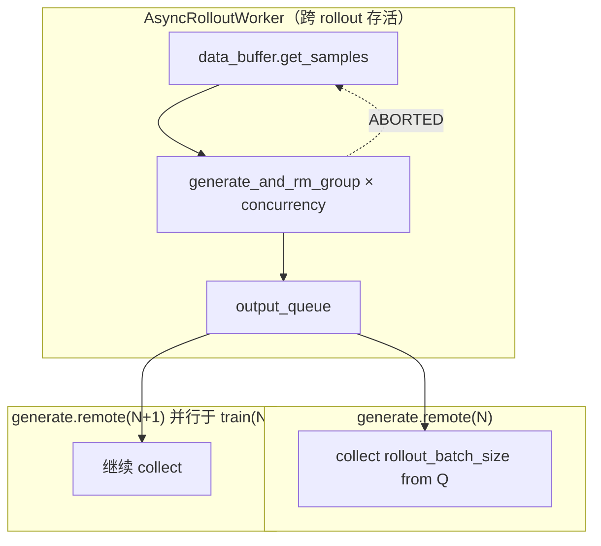
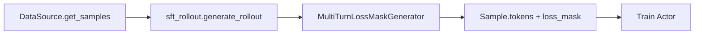
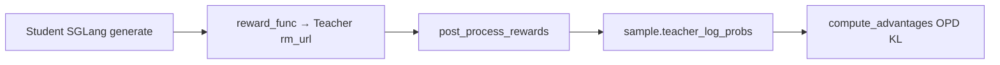
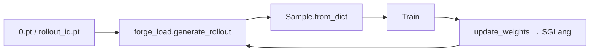

# Alt-Rollout · 数据流与交互

> 重点：**fully-async rollout** 与 **`train_async.py`** 如何叠加形成三级流水线重叠。

---

## 1. 默认 sync 闭环（对照基线）

**Explain：** `train.py` 严格串行：generate(step N) 完成 → train(step N) → update_weights → generate(step N+1)。Rollout 内部由 `sglang_rollout` 的 pending task 池并发，但 **step 边界**不重叠。



---

## 2. train_async：训练与下一步 generate 重叠

**Explain：** `train_async.py` 在训练 step N 的同时，通过 Ray `generate.remote(N+1)` **提前启动**下一步 rollout。注意 `assert not args.colocate`——异步训练不支持 colocate 模式。

**Code：**

```python
# 来源：train_async.py L9-L49
# The framework supports other asynchronous approaches such as fully async (which is shown in examples/full_async).
def train(args):
    assert not args.colocate, "Colocation is not supported for async training."
    # ...
    rollout_data_next_future = rollout_manager.generate.remote(args.start_rollout_id)
    for rollout_id in range(args.start_rollout_id, args.num_rollout):
        if rollout_data_next_future is not None:
            rollout_data_curr_ref = ray.get(rollout_data_next_future)

        if rollout_id + 1 < args.num_rollout:
            rollout_data_next_future = rollout_manager.generate.remote(rollout_id + 1)

        ray.get(actor_model.async_train(rollout_id, rollout_data_curr_ref))
```

**Comment：**

- 第一行注释直接指向 fully-async 示例——两层异步可组合。
- `update_weights_interval` 时强制 `ray.get` 挂起的 next future，防止权重更新切到生成中途（L65-L69）。

**Code：**

```python
# 来源：train_async.py L65-L69
if (rollout_id + 1) % args.update_weights_interval == 0:
    rollout_data_curr_ref = ray.get(x) if (x := rollout_data_next_future) is not None else None
    rollout_data_next_future = None
    actor_model.update_weights()
```

**Comment：**

- 权重更新前必须 drain 进行中的 generate，避免 stale weight 与 mid-flight 样本混杂。
- fully-async worker 内 in-flight 任务通过 `GenerateState.aborted` + ABORTED 重入队配合此语义。

---

## 3. fully-async：Rollout 内部跨 step 持续生成

**Explain：** 替换 `--rollout-function-path` 后，每次 `generate.remote` 调用 `generate_rollout_fully_async`。全局 `AsyncRolloutWorker` **不随 rollout_id 重置**，在 step 边界间维持 in-flight 池。



**数据流步骤：**

1. Worker loop 持续 `get_samples(1)` → 提交 `generate_and_rm_group`。
2. 完成组入 `output_queue`；ABORTED 组 `add_samples` 回 buffer。
3. `generate_rollout_fully_async(rollout_id=N)` 从 queue drain 直到 `collected >= rollout_batch_size`。
4. RolloutManager 将结果 ref 传给 `async_train(N)`；**同时** worker 已为 N+1 继续生成。

**Code：**

```python
# 来源：slime/rollout/fully_async_rollout.py L182-L189
# Aborted group → requeue, don't ship to training.
if any(getattr(s, "status", None) == Sample.Status.ABORTED for s in result):
    try:
        self.data_buffer.add_samples([result])
    except Exception:
        logger.exception("fully-async: failed to requeue aborted group")
    return
self.output_queue.put((gid, result))
```

**Comment：**

- 权重更新触发 abort 时，in-flight 样本不会污染当前 train batch。
- 重入队样本在 refresh weight 后的 rollout 中被重新 pick up。

---

## 4. 三级重叠时序（train_async + fully-async）

```mermaid
gantt
    title 单步时间线（理想情况）
    dateFormat X
    axisFormat %s

    section Rollout Worker
    in-flight pool（持续） :active, w1, 0, 100

    section Ray generate
    collect batch N :g1, 0, 30
    collect batch N+1 :g2, 30, 60

    section Train
    async_train N :t1, 30, 70
    async_train N+1 :t2, 70, 110
```



**Explain：** 当 train 耗时 ≈ generate 耗时，双重叠可接近 2× 吞吐；fully-async 进一步消除「等最慢 sample 凑 batch」的长尾。

| 时间点 | train_async | fully-async worker |
|--------|-------------|-------------------|
| T0 | `generate.remote(0)` 开始 collect | worker 已在跑，queue 可能有 warmup |
| T1 | collect(0) 完成，返回 ref | worker 继续处理 0 之外 in-flight |
| T2 | `generate.remote(1)` 启动 ∥ `async_train(0)` | 新 collect(1) 从 queue 取，不必等全新启动 |
| T3 | `async_train(0)` 完成 | worker 无感知，只关心 buffer/queue |
| T4 | update_weights（若到 interval） | abort in-flight → ABORTED → buffer |

---

## 5. 与 generate_and_rm_group 的边界

**Explain：** fully-async **不复制** sglang_rollout 的 dynamic filter、oversampling、partial_rollout abort 收集——它直接调用 `generate_and_rm_group`。因此 custom generate / custom rm / group_rm 仍生效。

**Code：**

```python
# 来源：slime/rollout/sglang_rollout.py L294-L333
async def generate_and_rm_group(args, group, sampling_params, evaluation=False):
    state = GenerateState(args)
    if state.aborted:
        return group
    # session_id, asyncio.gather(generate_and_rm × n_samples_per_prompt)
    group = await asyncio.gather(*tasks)
    if not state.aborted and args.group_rm:
        rewards = await batched_async_rm(args, group)
        for sample, reward in zip(group, rewards, strict=False):
            sample.reward = reward
    return group
```

**Comment：**

- streaming generate 若启用，在 `generate_and_rm` 内 dispatch 到 `generate_streaming`。
- OPD 的 `reward_func` 在 per-sample RM 阶段注入 `teacher_log_probs` 前置 raw JSON。

---

## 6. 其他替代路径的数据流

### 6.1 SFT：无 SGLang HTTP



- 无 router / engine HTTP；RolloutManager 仍 init SGLang（除非 debug 模式）。
- `reward=0`；优势估计取决于 loss 类型（SFT 非 RL advantage）。

### 6.2 OPD：Rollout 内嵌教师查询



**Code：**

```python
# 来源：slime/rollout/on_policy_distillation.py L41-L43
# Note: The reward_func calls the teacher server which returns token-level log-probs.
# For pure on-policy distillation without task rewards, we return 0.0 for each sample.
# The actual learning signal comes from the OPD KL penalty applied in compute_advantages_and_returns.
```

### 6.3 forge_load：跳过生成、保留同步



- 数据从磁盘；**权重同步、colocate offload 仍执行**——区别于 debug rollout load。

### 6.4 streaming + partial_rollout

**Explain：** abort 时 streaming 已在 sample 上累积 partial tokens；外层 `sglang_rollout.abort` 将 partial 组写入 buffer（`start_rollout_id` metadata）。与 fully-async ABORTED 重入队形成 **两条** partial 回收路径。

---

## 7. RolloutManager → Train 数据结构

**Explain：** 无论哪种 rollout 函数，RolloutManager 最终将 samples 转为 `rollout_data_ref`（object store），Train Actor `async_train` 消费。fully-async 返回 `list[list[Sample]]`（每组 n_samples_per_prompt）。

| 字段 | fully-async | SFT | forge_load | OPD |
|------|-------------|-----|------------|-----|
| `tokens` | SGLang 生成 | mask generator | 来自 .pt | 同 student generate |
| `reward` | RM | 0 | 来自 .pt | 0（纯蒸馏） |
| `teacher_log_probs` | — | — | 可选 | post_process 写入 |
| `loss_mask` | generate 路径 | SFT 写入 | 来自 .pt | 同 generate |

---

## 8. 配置组合矩阵

| rollout-function | train 脚本 | custom-generate | custom-rm | 典型用途 |
|------------------|-----------|-----------------|-----------|----------|
| `sglang_rollout.generate_rollout` | train.py | — | — | 默认 RL |
| `fully_async_rollout...` | train_async.py | 可选 streaming | 可选 OPD | 低延迟 RL |
| `sft_rollout.generate_rollout` | train.py | — | — | SFT |
| `forge_load.generate_rollout` | train.py | — | — | 显存测试 |
| `sleep_rollout.sleep` | train.py | — | — | Profiling |
| `sglang_rollout` + streaming | train.py/async | streaming | — | abort 友好 |

---

## 9. CI 端到端路径

**Explain：** `test_qwen2.5_0.5B_fully_async_short.py` 使用 `generate_rollout_fully_async` + `train_async.py` + GRPO，验证双重叠路径。

**Code：**

```python
# 来源：tests/test_qwen2.5_0.5B_fully_async_short.py L30-L33
rollout_args = (
    "--rollout-function-path slime.rollout.fully_async_rollout.generate_rollout_fully_async "
    # ...
)
# train_script="train_async.py"
```

**Comment：**

- 与 `test_qwen2.5_0.5B_async_short.py` 唯一差别是 rollout-function-path。
- 证明 fully-async 与标准 async train 兼容。
