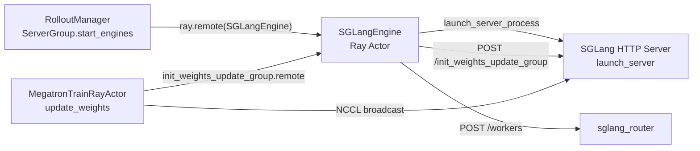

# SGLang Engine · 专题概述

> **阶段 III · Rollout 生成** | Git：`22cdc6e1`  
> **源码范围：** `sglang_engine.py`（`SGLangEngine`、`launch_server_process`、`update_weights*`）、`server_control.py`

---

## 本模块在架构中的位置

`SGLangEngine` 是 Slime 对 SGLang HTTP Server 的 **Ray Actor 薄封装**：RolloutManager 通过 Ray 创建 engine actor，actor 在 `init()` 中启动（或对接外部）SGLang 进程，并通过 HTTP 暴露 generate、flush_cache、权重更新等能力。训练侧 Megatron Actor 在 `update_weights` 时通过 Ray remote 调用 engine 的 `init_weights_update_group` / `update_weights_from_distributed` 等接口，与 SGLang 侧 NCCL 进程组对接。



---

## 零基础一句话

**Slime 的「推理引擎遥控器」**：不直接跑 forward，而是启动 SGLang 子进程、注册到 Router，并用 HTTP + NCCL 双通道把训练权重同步到推理 GPU。

---

## 用户场景

**Persona：** RL 工程师小陈在 colocate 模式下训练 Qwen3-4B，需要理解 engine 何时启动、权重如何从 Megatron rank 0 广播到 SGLang TP rank，以及 `update_weights` 前为何要 `pause_generation` + `flush_cache`。

---

## 六件套阅读顺序

| 顺序 | 文件 | 一句话说明 |
|------|------|------------|
| 01 | [[15-SGLang-Engine-01-核心概念]] | Ray 封装、HTTP 适配器、四种权重同步路径 |
| 02 | [[15-SGLang-Engine-02-源码走读]] | **主文档**：启动、Router 注册、update_weights* 全链路 |
| 03 | [[15-SGLang-Engine-03-数据流与交互]] | **NCCL group 建立**与 distributed 权重广播时序 |
| 04 | [[15-SGLang-Engine-04-关键问题]] | node_rank、external engine、flush 超时等 FAQ |
| ✓ | [[15-SGLang-Engine-05-checkpoint]] | 验收：能否说明 engine 生命周期与 NCCL 建组 |

---

## 核心源码锚点

**Explain：** `RolloutManager` 的 `ServerGroup.start_engines` 将 `SGLangEngine` 包装为 Ray Actor，分配 GPU bundle 与端口后异步调用 `init()`——这是 Slime 侧 engine 生命周期的唯一入口。

**Code：**

```python
## 来源：slime/ray/rollout.py L168-L216, L238-L245
        RolloutRayActor = ray.remote(SGLangEngine)
        # ...
            rollout_engine = RolloutRayActor.options(
                num_cpus=num_cpus,
                num_gpus=num_gpus,
                scheduling_strategy=scheduling_strategy,
                runtime_env={"env_vars": add_default_ray_env_vars(env_vars)},
            ).remote(
                self.args,
                rank=global_rank,
                worker_type=self.worker_type,
                base_gpu_id=base_gpu_id,
                sglang_overrides=self.sglang_overrides,
                num_gpus_per_engine=self.num_gpus_per_engine,
            )
        # ...
        init_handles = [
            engine.init.remote(
                **(addr_and_ports[rank]),
                router_ip=self.router_ip,
                router_port=self.router_port,
            )
            for rank, engine in rollout_engines
        ]
```

**Comment：**

- `num_gpus=0.2` 是 Ray 调度占位；真实 GPU 绑定靠 Placement Group + `base_gpu_id`。
- `init()` 非阻塞返回 ObjectRef；RolloutManager 统一 `ray.get(init_handles)` 等待 health。
- 权重同步 API 在 `SGLangEngine` 上，由 Megatron `UpdateWeightFromDistributed` 在训练初始化后调用 `connect_rollout_engines`。

---

## 与相邻专题

| 方向 | 专题 | 关系 |
|------|------|------|
| 上游 | [[08-RolloutManager-00-MOC]]（批 08） | 创建 engine actor、分配端口 |
| 下游 | [[24-WeightSync-Dist-00-MOC]]（批 24） | `connect_rollout_engines_from_distributed` 完整逻辑 |
| 对照 | [[03-HTTP-Server-00-MOC]] | SGLang HTTP 端点语义 |

---

## 验证建议

1. 启动小规模训练，观察 Ray dashboard 中 `SGLangEngine` actor 数量 = `rollout_num_gpus / rollout_num_gpus_per_engine`。
2. 权重同步日志搜索 `[slime-pp_0] Update weights` 与 `init_weights_update_group` HTTP 200。
