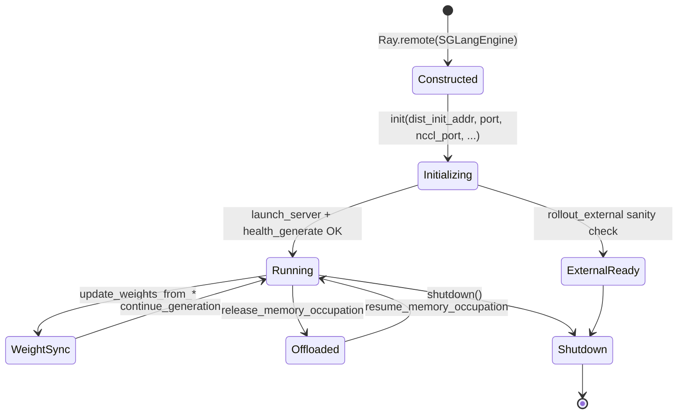

# SGLang Engine · 核心概念

---

## 1. 架构位置

| 层级 | 组件 | 职责 |
|------|------|------|
| Ray 编排 | `RolloutManager` / `ServerGroup` | 创建 engine actor、PG 绑定、端口分配 |
| 适配层 | `SGLangEngine` | HTTP 客户端 + Ray Actor 生命周期 |
| 推理内核 | SGLang `launch_server` | 模型加载、Scheduler、KV Cache |
| 训练侧 | `UpdateWeightFromDistributed` | NCCL 建组、broadcast HF 权重 |

Slime **不在 Python 层直接调用 SGLang Python API 做 generate**；generate 走 HTTP（由 Rollout 模块批次 12 负责）。本模块聚焦 **engine 进程管理** 与 **权重同步 HTTP 桥**。

---

## 2. 核心术语

| 术语 | 含义 |
|------|------|
| `SGLangEngine` | 继承 `RayActor` 的 rollout engine 封装类 |
| `node_rank` | 多节点 engine 中当前进程节点序号；仅 `node_rank==0` 发 HTTP |
| `worker_type` | `regular` / `prefill` / `decode` / `encoder`，影响 Router 注册与 PD 参数 |
| `dist_init_addr` | 多节点 SGLang 内部 torch.distributed 初始化地址 |
| `nccl_port` | SGLang 引擎间 NCCL 通信用端口（与权重更新 group 不同） |
| `init_weights_update_group` | 训练 rank 0 + 各 engine GPU 组成的 **权重广播 NCCL 组** |
| `rollout_external` | 使用预启动外部 SGLang，Slime 只做 sanity check + Router 注册 |

---

## 3. Engine 生命周期



---

## 4. 四种权重同步路径（Engine 侧 API）

| 路径 | Engine 方法 | 传输介质 | 典型场景 |
|------|-------------|----------|----------|
| distributed | `init_weights_update_group` + `update_weights_from_distributed` | NCCL broadcast | 默认 on-policy，低延迟 |
| tensor | `update_weights_from_tensor` | GPU IPC / serialized meta | colocate 同机 |
| disk | `update_weights_from_disk` / `sync_local_checkpoint` | 共享文件系统 | 大模型、跨节点 |
| delta | `update_weights_from_disk(load_format="delta")` | 增量 diff 文件 | 带宽受限 |

本批次重点：**distributed 路径的 NCCL group 如何通过 HTTP 在 SGLang 侧建立**（详见 [[15-SGLang-Engine-03-数据流与交互]]）。

---

## 5. `server_control.py` 角色

独立工具模块，提供 **异步 abort** 能力：在权重更新或 offload 前，通过 `/abort_request` + `/v1/loads` 轮询直到 engine 空闲。与 `SGLangEngine.flush_cache`（同步、带超时）互补。

**Code — 负载解析与 abort 循环：**

```python
# 来源：slime/backends/sglang_utils/server_control.py L12-L29, L43-L63
def num_requests_from_load(load: Any) -> int:
    if isinstance(load, list):
        return sum(num_requests_from_load(item) for item in load)
    if not isinstance(load, dict):
        return 0
    if "loads" in load:
        return num_requests_from_load(load["loads"])
    for key in ("num_reqs", "num_total_reqs", "total_reqs"):
        value = load.get(key)
        if isinstance(value, int):
            return value
    running = load.get("num_running_reqs", load.get("total_running_reqs"))
    waiting = load.get("num_waiting_reqs", load.get("total_waiting_reqs"))
    return (running if isinstance(running, int) else 0) + (waiting if isinstance(waiting, int) else 0)


async def abort_server_until_idle(url: str, retry_interval: int = ABORT_RETRY_INTERVAL_SECONDS) -> None:
    attempt = 1
    while True:
        logger.info(f"Abort request for SGLang server {url}")
        await _abort_server_once(url)
        try:
            num_requests = await _get_server_num_requests(url)
        except Exception as e:
            logger.warning(f"Failed to get SGLang server load from {url}: {e}")
            return
        if num_requests <= 0:
            return
        logger.info(
            f"SGLang server {url} still has {num_requests} requests after abort attempt {attempt}; "
            f"retrying in {retry_interval} seconds."
        )
        await asyncio.sleep(retry_interval)
        attempt += 1
```

**Comment：**

- `num_requests_from_load` 兼容多种 SGLang load JSON 格式（嵌套 `loads`、running+waiting 等）。
- abort 失败获取 load 时 **直接 return**（不无限重试），调用方需决定是否继续。
- RolloutManager 在 update_weights 前通常组合 `pause_generation` + `flush_cache`（engine 类方法）与 `abort_servers_until_idle`（async 工具）。

---

## 6. GPU 映射：`get_base_gpu_id`

**Explain：** colocate 与 non-colocate 模式下，engine rank 对应的物理 GPU 起始索引计算方式不同——错误映射会导致 SGLang TP 跨错卡。

**Code：**

```python
# 来源：slime/backends/sglang_utils/sglang_engine.py L24-L31
def get_base_gpu_id(args, rank):
    num_gpus = min(args.num_gpus_per_node, args.rollout_num_gpus_per_engine)
    if args.colocate:
        start_index = (rank * num_gpus) % args.num_gpus_per_node
    else:
        num_actor_gpus = 0 if args.debug_rollout_only else args.actor_num_gpus_per_node * args.actor_num_nodes
        start_index = (num_actor_gpus + rank * num_gpus) % args.num_gpus_per_node
    return start_index
```

**Comment：**

- **colocate**：rollout engine 与 actor 共享节点 GPU 池，从 0 起按 rank 交错。
- **non-colocate**：rollout GPU 排在 actor GPU 之后，避免与训练争用同一张卡。
- `_compute_server_args` 还会经 `_to_local_gpu_id` 处理 `CUDA_VISIBLE_DEVICES` 重映射。

---

## 7. 设计动机

1. **进程隔离**：SGLang 以独立子进程运行，崩溃不拖垮 Ray driver；`kill_process_tree` 在 shutdown 时清理。
2. **HTTP 统一接口**：Slime 与 SGLang 版本解耦，docker patch 只需对齐 HTTP 端点。
3. **双通道权重同步**：metadata 走 Ray+HTTP，tensor 数据走 NCCL，避免大 tensor 序列化过 HTTP。
4. **多节点透明**：非 node 0 的 engine actor 跳过 HTTP，由 SGLang 内部 distributed 协调。
