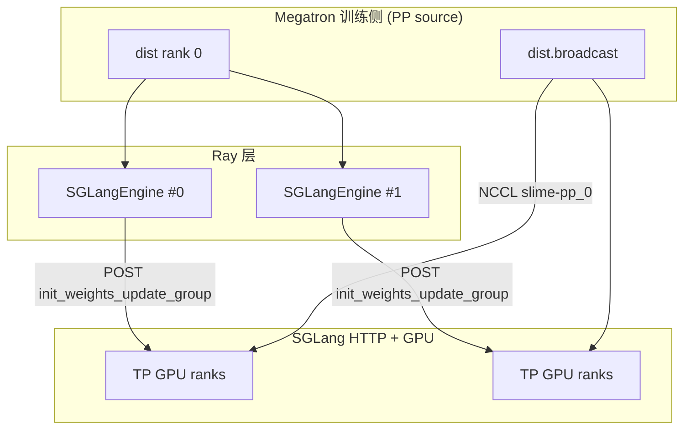
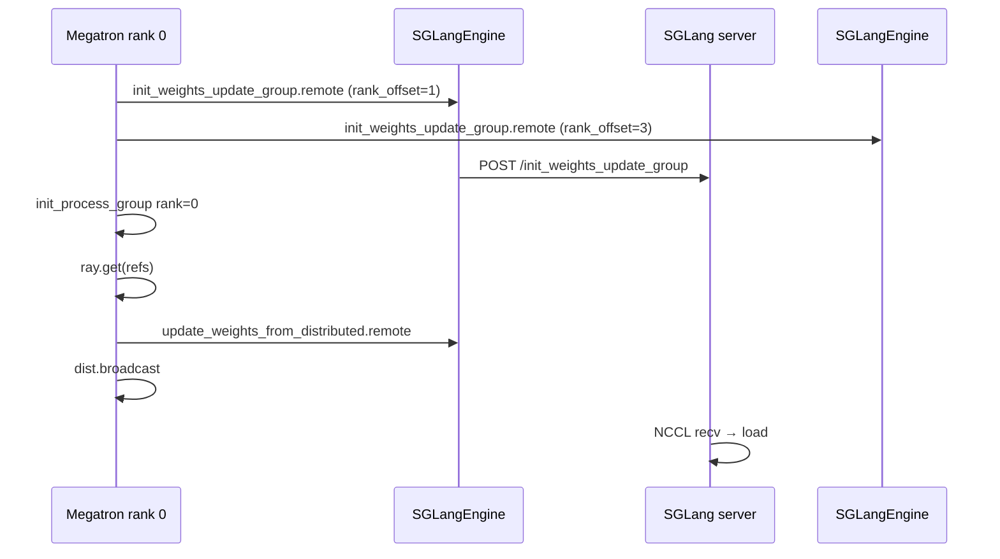

# SGLang Engine · 数据流与交互

> **本模块独有焦点：** 权重更新 **NCCL ProcessGroup 建立**——训练 rank 0 与各 SGLang engine GPU 如何 join 同一 `slime-pp_{pp_rank}` 组。

---

## 1. 架构位置



---

## 2. 输入 / 输出

| 方向 | 类型 | 说明 |
|------|------|------|
| 输入 | `master_address`, `master_port`, `rank_offset`, `world_size` | NCCL 组 bootstrap |
| 输入 | `names`, `dtypes`, `shapes`, `group_name` | broadcast 元数据 |
| 输出 | HTTP JSON | SGLang handler 响应 |
| 输出 | NCCL recv | GPU 上 in-place 权重 |

---

## 3. NCCL Group 建立 — 完整时序

### 步骤 1 — 训练侧 `connect_rollout_engines`

**Explain：** 仅 Megatron PP source（DP=0 且 TP=0）建组；组名 `slime-pp_{pp_rank}`。

**Code：**

```python
# 来源：slime/backends/megatron_utils/update_weight/update_weight_from_distributed.py L75-L92
        self._is_pp_src_rank = (
            mpu.get_data_parallel_rank(with_context_parallel=True) == 0
            and mpu.get_tensor_model_parallel_rank() == 0
        )
        pp_rank = mpu.get_pipeline_model_parallel_rank()
        if self._is_pp_src_rank:
            self._group_name = f"slime-pp_{pp_rank}"
            self._model_update_groups = connect_rollout_engines_from_distributed(
                self.args,
                self._group_name,
                rollout_engines,
                engine_gpu_counts=engine_gpu_counts,
            )
```

---

### 步骤 2 — rank 布局与并行 init

**Explain：** rank 0 = 训练 broadcast 源；每个 engine 占 `engine_gpu_counts[i]` 个连续 rank。

**Code：**

```python
# 来源：slime/backends/megatron_utils/update_weight/update_weight_from_distributed.py L281-L314
    master_address = ray._private.services.get_node_ip_address()
    with socket.socket() as sock:
        sock.bind(("", 0))
        master_port = sock.getsockname()[1]
    world_size = sum(engine_gpu_counts) + 1

    cumulative = [0]
    for c in engine_gpu_counts:
        cumulative.append(cumulative[-1] + c)

    refs = [
        engine.init_weights_update_group.remote(
            master_address=master_address,
            master_port=master_port,
            rank_offset=cumulative[i] + 1,
            world_size=world_size,
            group_name=group_name,
            backend="nccl",
        )
        for i, engine in enumerate(rollout_engines)
    ]
    model_update_groups = init_process_group(
        backend="nccl",
        init_method=f"tcp://{_wrap_ipv6(master_address)}:{master_port}",
        world_size=world_size,
        rank=0,
        group_name=group_name,
    )
    ray.get(refs)
```

**Comment：**

- 顺序：fire engine remotes → 训练 `init_process_group` → `ray.get(refs)` 全员就绪。
- heterogeneous TP：`engine_gpu_counts=[2,4]` → ranks 1–2 与 3–6，world_size=7。
- `master_port` 与 SGLang `nccl_port`（推理 TP）**无关**。

**Rank 布局（2 engines × TP=2）：**

| rank | 角色 |
|------|------|
| 0 | Megatron PP-source（broadcast 源） |
| 1–2 | Engine #0 TP ranks |
| 3–4 | Engine #1 TP ranks |

---

### 步骤 3 — Engine HTTP 桥

**Code：**

```python
# 来源：slime/backends/sglang_utils/sglang_engine.py L439-L450
    def init_weights_update_group(self, master_address, master_port, rank_offset, world_size, group_name, backend):
        return self._make_request(
            "init_weights_update_group",
            {
                "master_address": master_address,
                "master_port": master_port,
                "rank_offset": rank_offset,
                "world_size": world_size,
                "group_name": group_name,
                "backend": backend,
            },
        )
```

**Comment：**

- Slime Ray actor **不**直接 `torch.distributed.init_process_group`；SGLang 子进程内 join。
- 仅 `node_rank==0` 发 HTTP；多 node engine 的其他 node 由 SGLang 内部协调。

---

### 步骤 4 — bucket broadcast

**Code：**

```python
# 来源：slime/backends/megatron_utils/update_weight/update_weight_from_distributed.py L326-L355
def update_weights_from_distributed(group_name, group, weight_version, rollout_engines, converted_named_tensors, ...):
    refs = [
        engine.update_weights_from_distributed.remote(
            names=[name for name, _ in converted_named_tensors],
            dtypes=[param.dtype for _, param in converted_named_tensors],
            shapes=[param.shape for _, param in converted_named_tensors],
            group_name=group_name,
            weight_version=str(weight_version),
        )
        for engine in rollout_engines
    ]
    handles = []
    for _, param in converted_named_tensors:
        handles.append(dist.broadcast(param.data, 0, group=group, async_op=True))
    for handle in handles:
        handle.wait()
    return refs
```

**Code — Engine 侧 payload：**

```python
# 来源：slime/backends/sglang_utils/sglang_engine.py L474-L487
        payload = {
            "names": names,
            "dtypes": [str(dtype).replace("torch.", "") for dtype in dtypes],
            "shapes": shapes,
            "group_name": group_name,
            "flush_cache": flush_cache,
        }
        return self._make_request("update_weights_from_distributed", payload)
```

**Comment：**

- 先 POST metadata（SGLang 分配 recv buffer）→ 再 NCCL broadcast → `ray.get(refs)`。
- `rollout_engine_lock` 防止并发 bucket broadcast 死锁（见 `_update_bucket_weights_from_distributed`）。

---

### 步骤 5 — update 前后流量控制

**Code：**

```python
# 来源：slime/backends/megatron_utils/update_weight/update_weight_from_distributed.py L109-L134
        if dist.get_rank() == 0:
            ray.get([engine.pause_generation.remote() for engine in self.rollout_engines])
            ray.get([engine.flush_cache.remote() for engine in self.rollout_engines])
        dist.barrier(group=get_gloo_group())
        # ... _send_weights ...
        if dist.get_rank() == 0:
            ray.get([engine.continue_generation.remote() for engine in self.rollout_engines])
```

**Comment：**

- pause + flush 必须在 NCCL broadcast 之前，清空 in-flight decode。
- `server_control.abort_servers_until_idle` 可作为补充（async rollout 场景）。

---

## 4. 序列图



---

## 5. 上下游

| 模块 | 交互 |
|------|------|
| `rollout.py` | `engine.init.remote` 启动 HTTP（与 NCCL 组独立） |
| `update_weight_from_distributed.py` | 建组 + broadcast orchestration |
| `server_control.py` | async abort 辅助清空请求 |
| SGLang HTTP | 实际 NCCL init / weight load |

---

## 6. 断开连接

**Code：**

```python
# 来源：update_weight_from_distributed.py L317-L323
# 来源：sglang_engine.py L452-L462
    refs = [engine.destroy_weights_update_group.remote(group_name) for engine in rollout_engines]
    dist.destroy_process_group(model_update_groups)
    ray.get(refs)

    def destroy_weights_update_group(self, group_name):
        try:
            return self._make_request("destroy_weights_update_group", {"group_name": group_name})
        except requests.exceptions.RequestException:
            pass
```

---

## 7. 两种 NCCL 通道对比

| 通道 | 端口 | 参与者 | 用途 |
|------|------|--------|------|
| SGLang 推理 TP | `nccl_port`（init 传入） | 同 engine 多 GPU | forward |
| 权重 update group | 随机 `master_port` | 训练 rank 0 + 全部 engine GPU | RL sync |
