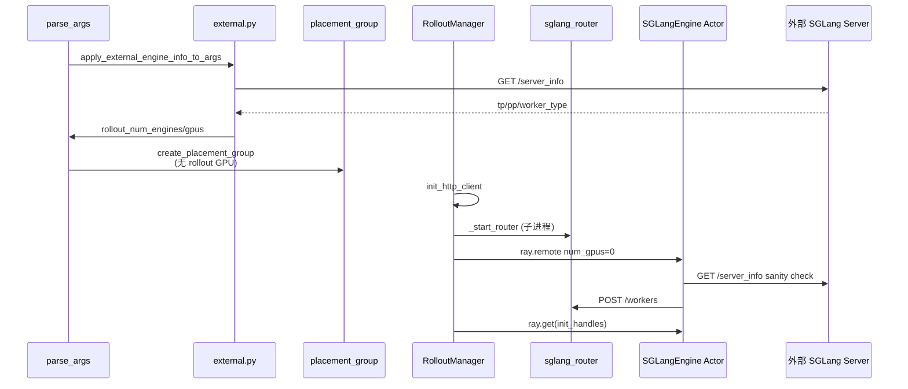
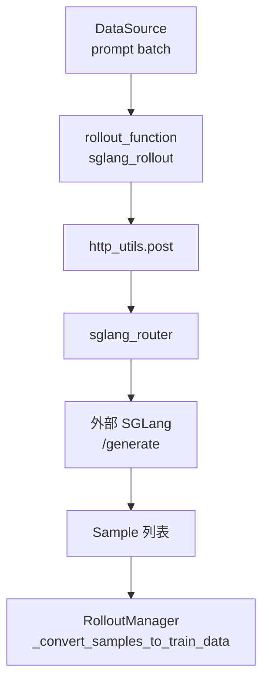
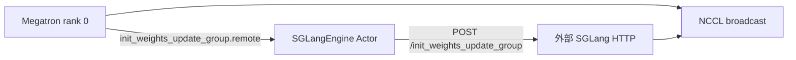

# External Engines · 数据流与交互

---

## 1. 启动时序总览



---

## 2. RolloutManager 构造路径

**Explain：** external 与内置 engine 共用 `RolloutManager.__init__` 入口；分支仅在 `start_rollout_servers` 内部。

**Code：**

```python
# 来源：slime/ray/rollout.py L430-L454
        rollout_init_handles: list[Any] = []
        if self.args.debug_train_only:
            self.servers: dict[str, Any] = {}
        else:
            init_http_client(args)
            self.servers, rollout_init_handles = start_rollout_servers(args, pg)

        # ... data_source / rollout_function 加载 ...

        if rollout_init_handles:
            ray.get(rollout_init_handles)
```

**Comment：**

- `init_http_client` **必须先于** `start_rollout_servers`（注释 L1100-L1101）。
- `ray.get(init_handles)` 阻塞直到所有 external engine 完成 Router 注册。

---

## 3. Generate 数据流（HTTP 路径）



**Explain：** generate 不经过 Ray actor 的 GPU forward；`http_utils.post` 向 Router 发请求，Router 负载均衡到已注册的 external worker。

**Code：**

```python
# 来源：slime/utils/http_utils.py L291-L309
async def post(url, payload, max_retries=60, headers=None):
    # If distributed mode is enabled and actors exist, dispatch via Ray.
    if _distributed_post_enabled and _post_actors:
        try:
            actor = _next_actor()
            if actor is not None:
                obj_ref = actor.do_post.remote(url, payload, max_retries, headers=headers)
                return await obj_ref
        except Exception as e:
            logger.info(f"[http_utils] Distributed POST failed, falling back to local: {e} (url={url})")

    return await _post(_http_client, url, payload, max_retries, headers=headers)
```

**Comment：**

- URL 通常指向 `http://{router_ip}:{router_port}/generate` 或 OpenAI 兼容端点（见批次 12）。
- external 模式下 Router 在 **训练 job 所在机器** 启动，须确保训练节点到外部 SGLang 的网络可达。

---

## 4. 权重同步数据流

### 4.1 NCCL 路径（默认同集群）



**Explain：** 与内置 engine 相同——训练侧 `UpdateWeightFromDistributed` 通过 Ray actor 转 HTTP 在 SGLang 侧建 NCCL group，然后 broadcast HF 权重。external 只改变 **SGLang 进程归属**，不改变 NCCL 协议。

### 4.2 Disk 路径（跨集群 / 异构 GPU）

**Explain：** Trainer 写完整 HF checkpoint 或 delta 到共享 FS；Slime 通过 HTTP 调 `update_weights_from_disk`，外部 SGLang 热加载。

**Code：**

```bash
# 来源：docs/en/advanced/external-rollout-engines.md L62-L68
--update-weight-mode full
--update-weight-transport disk
--update-weight-disk-dir /shared/fs/full-updates
```

**Comment：**

- **trainer 与 engine 必须看到相同路径**——仅 trainer 可写不够。
- delta 模式还需 engine 侧 `--update-weight-local-checkpoint-dir` 存放本地 materialized base。

---

## 5. Health Monitor 与 Offload 交互（内置对比）

**Explain：** 内置 engine 在 `generate`/`eval` 前 `health_monitoring_resume()`，offload 时 `pause()`。external 模式 `_health_monitors` 为空列表，这些调用为 no-op。

**Code：**

```python
# 来源：slime/ray/rollout.py L546-L549, L578-L581
    def generate(self, rollout_id):
        # ...
        self.health_monitoring_resume()

    def offload(self):
        self.health_monitoring_pause()
        for srv in self.servers.values():
            srv.offload()
```

```python
# 来源：slime/ray/rollout.py L464-L470
        self._health_monitors = []
        if not self.args.debug_train_only and self.args.use_fault_tolerance:
            for srv in self.servers.values():
                for group in srv.server_groups:
                    monitor = RolloutHealthMonitor(group, args)
```

**Comment：**

- `ExternalRolloutServer.server_groups` 默认为 `[]` → 跳过 monitor 创建。
- `ExternalRolloutServer.offload()` 返回 `[]`——external engine 内存不由 Slime 管理。

---

## 6. ExternalEngineInfo 数据结构

**Explain：** 发现阶段的不可变 dataclass，是后续所有模块的拓扑 SSOT。

**Code：**

```python
# 来源：slime/backends/sglang_utils/external.py L14-L29
@dataclasses.dataclass(frozen=True)
class ExternalEngineInfo:
    url: str
    host: str
    port: int
    worker_type: str
    num_gpus: int
    disaggregation_bootstrap_port: int | None = None
    server_info: dict = dataclasses.field(default_factory=dict)

    @property
    def is_pd_worker(self) -> bool:
        return self.worker_type in ("prefill", "decode")

    def to_dict(self) -> dict:
        return dataclasses.asdict(self)
```

**Comment：**

- `is_pd_worker` 驱动 Router PD 模式与 `external_engine_init_kwargs` 的 bootstrap port。
- `to_dict()` 序列化后存入 `args.rollout_external_engine_infos`。

---

## 7. Router 子进程启动

**Explain：** `_start_router` 在训练节点 spawn daemon 进程；PD 模式禁用 circuit breaker 避免 RDMA 超时误杀 decode worker。

**Code：**

```python
# 来源：slime/ray/rollout.py L1048-L1056
    if has_pd_disaggregation:
        router_args.pd_disaggregation = True
        router_args.disable_circuit_breaker = True

    # We will not use the health check from router.
    router_args.disable_health_check = True
```

**Comment：**

- external PD fleet：`has_pd_disaggregation=True` 当任一 engine 为 prefill/decode。
- Slime 自建 health check 在 `RolloutHealthMonitor`（仅内置 engine）。

---

## 8. 上下游模块边界

| 上游 | 交互 | 下游 |
|------|------|------|
| `arguments.py` | 设置 `rollout_external`、探测拓扑 | `placement_group.py` |
| `placement_group.py` | PG 不含 rollout GPU | `RolloutManager` |
| `RolloutManager` | `init_http_client` + `start_external_rollout_servers` | `sglang_rollout.py` |
| `SGLangEngine` | sanity check + Router 注册 | 外部 SGLang HTTP |
| `MegatronTrainRayActor` | `update_weights` | 外部 SGLang NCCL/disk |
| `http_utils` | async POST generate | sglang_router |

---

## 9. 环境变量与网络

| 变量 | 作用 |
|------|------|
| `SLIME_HOST_IP` | 覆盖 Router 绑定 IP |
| `SLIME_PREFER_IPV6` | 严格 IPv6 解析模式 |
| `no_proxy` / `NO_PROXY` | 须包含 external engine host（见 external_pd 测试） |

**Explain：** 跨主机 external 部署时，训练 job 的 proxy 环境常导致 `/server_info` 探测失败；测试用例显式设置 no_proxy。

**Code：**

```python
# 来源：tests/test_qwen3_4B_external_pd.py L361-L362（测试配置摘录）
                "no_proxy": f"127.0.0.1,localhost,{external_host}",
                "NO_PROXY": f"127.0.0.1,localhost,{external_host}",
```
