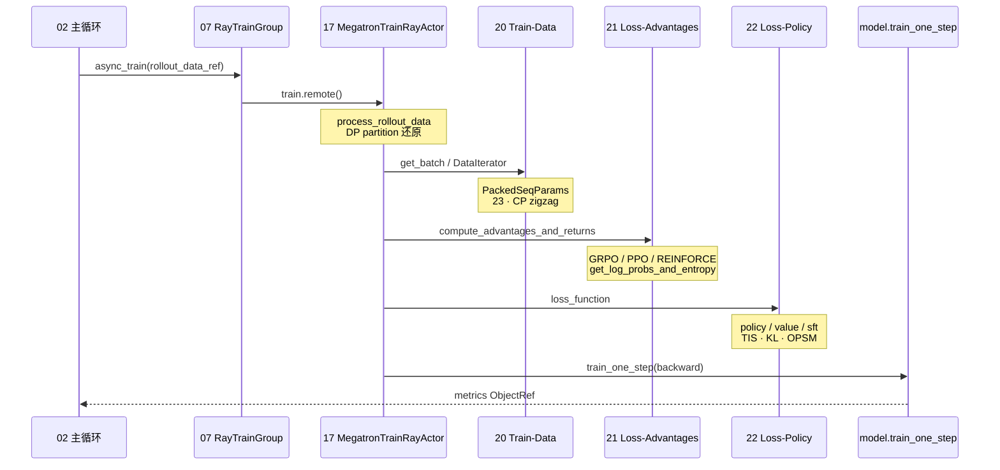

# 阶段 IV · 训练后端（rollout_data → backward）

> **你只需阅读本目录，不必打开 `slime/` 源码。**
> 内嵌代码对应 slime Git commit `22cdc6e1`。

---

## 本阶段解决什么问题

阶段 III 讲清了「Rollout 如何产出 `Sample` / `rollout_data_ref`」。阶段 IV 回答：**Megatron Actor 如何反序列化 rollout 数据、重算 log-prob、计算 advantage，并完成 PPO/GRPO 等 policy backward？**

七个专题覆盖训练后端全链路：

| 模块 | 角色 | 一句话 |
|------|------|--------|
| [[17-Megatron-Actor-Init-00-MOC|17 Megatron-Actor-Init]] | Actor 启动 | `MegatronTrainRayActor.init`、dist + mpu + sleep/wake |
| [[18-Model-Init-00-MOC|18 Model-Init]] | 模型构建 | GPTModel、optimizer、checkpoint 恢复 |
| [[19-Train-Step-00-MOC|19 Train-Step]] | 训练步 | `train()` → `train_actor` / `train_critic` → backward |
| [[20-Train-Data-00-MOC|20 Train-Data]] | 数据管线 | RolloutBatch → DP 分区 → CP-ready micro-batch |
| [[21-Loss-Advantages-00-MOC|21 Loss-Advantages]] | 优势计算 | GRPO/PPO/REINFORCE 估计器、logprob 重算 |
| [[22-Loss-Policy-00-MOC|22 Loss-Policy]] | 策略损失 | PPO clip、GSPO、CISPO、value/SFT loss |
| [[23-CP-RoutingReplay-00-MOC|23 CP-RoutingReplay]] | CP 与 MoE | zigzag 切分、routing replay 四阶段 |

---

## 端到端时序（阶段 IV 验收图）

满足阶段 IV 验收：「`async_train(rollout_id, rollout_data_ref)` 从数据反序列化到 backward 的调用栈」。

**Explain：** 训练步在 **每个 GPU rank 内** 完成数据还原 → advantage → loss → backward；driver 侧 `ray.get` 聚合 metrics。Critic 启用时先跑 value forward/backward，再把 CPU values 传给 actor。

---

## 零基础一句话

**像「加工厂」：** 20 把 rollout 原料切配成 micro-batch，21 算「这批货值多少钱」（advantage），22 决定「怎么调价」（policy loss），19 是流水线总控，17/18 是开机与装模具。

---

## 推荐阅读顺序

严格按专题顺序 17 → 18 → 19 → 20 → 21 → 22 → 23。若时间紧，最低闭环：**19 → 21 → 22**。

| 顺序 | 文档 | 必读理由 |
|------|------|----------|
| 1 | [[17-Megatron-Actor-Init-02-源码走读|17/02-源码走读]] | Actor init 与 offload sleep/wake |
| 2 | [[19-Train-Step-02-源码走读|19/02-源码走读]] | `train()` 主路径与 critic 分支 |
| 3 | [[20-Train-Data-04-关键问题|20/04-关键问题]] | dynamic batch vs static mbs |
| 4 | [[21-Loss-Advantages-02-源码走读|21/02-源码走读]] | 四条 advantage_estimator 分支 |
| 5 | [[22-Loss-Policy-02-源码走读|22/02-源码走读]] | PPO/GSPO/CISPO policy 分支 |
| 6 | [[23-CP-RoutingReplay-01-核心概念|23/01-核心概念]] | CP 布局与 routing replay 状态机 |

---

## 阶段衔接

| 方向 | 模块 | 衔接点 |
|------|------|--------|
| ← 上一阶段 | 08–16 Rollout 生成 | `rollout_data_ref` → `async_train` |
| → 下一阶段 | 24–26 权重同步 | train 完成 → `update_weights` |
| → Ray 层 | 07 RayTrainGroup | `async_train` / `update_weights` API |
| → 启动 | 02 训练主循环 | sync/async 主循环调用 train |
| → Megatron 对照 | [[11-ModelRunner-00-MOC]] | forward/backward 内核（SGLang 侧） |

---

## 验证建议（零基础可试）

1. **loss 分支：** 对照 [[21-Loss-Advantages-01-核心概念]]，说明 `--advantage-estimator grpo` 与 `ppo` 的数据依赖差异。
2. **train 栈：** 在 [[19-Train-Step-03-数据流与交互]] 时序图上，口述 critic-only step 的分支。
3. **CP 路径：** 若启用 `--context-parallel-size > 1`，阅读 [[23-CP-RoutingReplay-04-关键问题]] 确认 logprob 如何 `all_gather_with_cp`。

---

## 模块导航

| 模块 | 目录 | 状态 |
|------|------|------|
| 17 | [[17-Megatron-Actor-Init-00-MOC|Megatron-Actor-Init]] | ✅ |
| 18 | [[18-Model-Init-00-MOC|Model-Init]] | ✅ |
| 19 | [[19-Train-Step-00-MOC|Train-Step]] | ✅ |
| 20 | [[20-Train-Data-00-MOC|Train-Data]] | ✅ |
| 21 | [[21-Loss-Advantages-00-MOC|Loss-Advantages]] | ✅ |
| 22 | [[22-Loss-Policy-00-MOC|Loss-Policy]] | ✅ |
| 23 | [[23-CP-RoutingReplay-00-MOC|CP-RoutingReplay]] | ✅ |

← [[03-Rollout生成-00-MOC|Rollout 生成]] · → [[05-权重同步-00-MOC|阶段 V：权重同步]]
