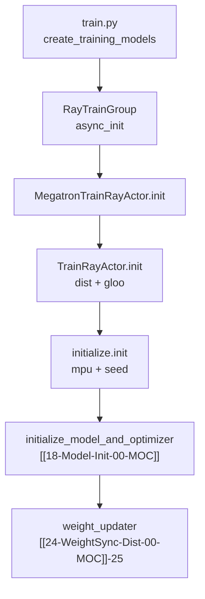

# Megatron Actor 初始化

> **源码范围：** `slime/backends/megatron_utils/actor.py`（`init` / `sleep` / `wake_up` / `debug_rollout_only`）、`initialize.py`（`init()`）

---

## 本模块在架构中的位置

`MegatronTrainRayActor.init()` 是 Slime RL 训练侧 **GPU 进程内 Megatron 栈的启动入口**：Ray 已分配 GPU 并创建 Actor 后，每个 rank 依次完成 torch.distributed、Megatron 并行组、模型/优化器加载、权重备份器与权重同步器装配。若开启 `--offload-train`，init 末尾会立刻 `sleep()` 把训练显存还给 Rollout 引擎。



---

## 零基础一句话

**像「开机自检 + 装驱动 + 加载游戏存档」**：Ray 把 GPU 房间钥匙交给 Actor 后，`init()` 按固定顺序接通 NCCL、Megatron 并行拓扑、HF tokenizer、Megatron checkpoint，并选好「怎么把权重推给 SGLang」的路径；若 `--offload-train`，装完立刻关机（`sleep`）等 Rollout 用完 GPU 再 `wake_up` 训练。

---

## 六件套阅读顺序

| 顺序 | 文件 | 一句话说明 |
|------|------|------------|
| 01 | [[17-Megatron-Actor-Init-01-核心概念]] | init 阶段术语、debug 模式、offload 生命周期 |
| 02 | [[17-Megatron-Actor-Init-02-源码走读]] | `init` / `sleep` / `wake_up` / `initialize.init` 逐步精读 |
| 03 | [[17-Megatron-Actor-Init-03-数据流与交互]] | 从 `create_training_models` 到各 rank 返回 `start_rollout_id` |
| 04 | [[17-Megatron-Actor-Init-04-关键问题]] | debug 互斥、colocate 约束、critic 分支 |
| ✓ | [[17-Megatron-Actor-Init-05-checkpoint]] | 验收：能否口述 init 十步 |

---

## 核心源码锚点

**Explain：** `init()` 被 `@with_defer` 包裹以计入 `train_wait` 计时；`debug_rollout_only` 时跳过全部 Megatron 初始化，仅保存 `args` 并返回 0，供纯 Rollout 调试。

**Code：**

```python
## 来源：slime/backends/megatron_utils/actor.py L46-L62
# 提交版本：22cdc6e1
class MegatronTrainRayActor(TrainRayActor):
    @with_defer(lambda: Timer().start("train_wait"))
    def init(
        self,
        args: Namespace,
        role: str,
        with_ref: bool = False,
        with_opd_teacher: bool = False,
    ) -> int | None:
        if args.debug_rollout_only:
            self.args = args
            return 0

        monkey_patch_torch_dist()
        super().init(args, role, with_ref, with_opd_teacher)

        init(args)
```

**Comment：**

- 继承 [[07-RayTrainGroup-00-MOC]] 调度的 `TrainRayActor`，先走父类 `dist.init_process_group`
- `monkey_patch_torch_dist()` 为后续 `reload_process_groups` / offload 做准备（见[[19-Train-Step-00-MOC]] Checkpoint-Offload）
- `init(args)` 来自同目录 `initialize.py`，建立 Megatron `mpu` 并行组
- 正常路径返回值是 `loaded_rollout_id + 1`，供 `args.start_rollout_id` 对齐 checkpoint

---

## 衔接专题

| 方向 | 专题 | 关系 |
|------|------|------|
| 上游 | [[07-RayTrainGroup-00-MOC]] | `async_init` → `actor.init.remote` |
| 下游 | [[18-Model-Init-00-MOC]] | `initialize_model_and_optimizer` 细节 |
| 下游 | [[19-Train-Step-00-MOC]] | `train()` 内 `wake_up` → 训练 → `sleep` |
| 下游 | [[24-WeightSync-Dist-00-MOC]] | `weight_updater` 选型与 `update_weights` |

---

## 验收标准

- 能按顺序说明 actor `init` 的 10+ 个关键步骤
- 能解释 `debug_rollout_only` / `offload_train` / `role=critic` 三条分支
- 能说明 `initialize.init()` 与 `TrainRayActor.init()` 的分工
