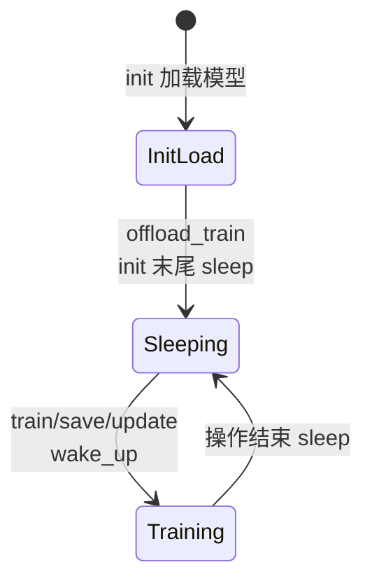

# Megatron Actor 初始化 · 核心概念

---

## 1. 架构位置

Slime 训练后端采用 **Ray Actor + Megatron-LM** 组合：每个 GPU 一个 `MegatronTrainRayActor` 进程。初始化分两層：

| 层次 | 函数 | 职责 |
|------|------|------|
| Ray / PyTorch 分布式 | `TrainRayActor.init` | `MASTER_ADDR`、NCCL process group、Gloo 辅助组 |
| Megatron 栈 | `initialize.init` | `mpu.initialize_model_parallel`、随机种子、Megatron tokenizer 占位 |
| Slime 业务 | `MegatronTrainRayActor.init` | HF config/tokenizer、模型加载、权重备份、weight updater |

在 RL 闭环 `generate → train → update_weights` 中，本专题覆盖 **train 侧进程第一次就绪** 之前的一切；权重推送发生在 init 之后的 `update_weights()`（首次在 `train.py` 主循环前调用）。

---

## 2. 核心术语

| 术语 | 含义 |
|------|------|
| `role` | `"actor"` 或 `"critic"`；critic 在 init 末尾可提前 `sleep` 且不建 `weight_updater` |
| `with_ref` | 是否加载 ref 模型 checkpoint（KL / ref logprob） |
| `with_opd_teacher` | Megatron 版 OPD 是否加载 teacher checkpoint |
| `start_rollout_id` | `loaded_rollout_id + 1`，与 checkpoint 步数对齐 |
| `weights_backuper` | CPU/GPU 多 tag 权重快照（actor / ref / teacher / old_actor / rollout_actor） |
| `weight_updater` | 向 SGLang 推权重的策略类（tensor / disk / distributed / delta） |
| `offload_train` | 用 `torch_memory_saver` 在 train 间隙释放训练显存 |
| `debug_rollout_only` | 跳过 Megatron init，仅跑 Rollout 链路 |

---

## 3. 设计动机

### 3.1 为何 HF tokenizer 在 init 里按 node 串行读？

多 rank 并发写 HF cache 可能损坏文件；代码用 **「每 node 一个 rank 读 + gloo barrier」** 规避竞态。

**Explain：** 按 `rank % num_gpus_per_node` 轮转，同一时刻每个 node 只有一个 rank 读磁盘。

**Code：**

```python
## 来源：slime/backends/megatron_utils/actor.py L69-L76
for i in range(args.num_gpus_per_node):
    if i == dist.get_rank() % args.num_gpus_per_node:
        self.hf_config = AutoConfig.from_pretrained(args.hf_checkpoint, trust_remote_code=True)
        self.tokenizer = AutoTokenizer.from_pretrained(self.args.hf_checkpoint, trust_remote_code=True)
    dist.barrier(group=get_gloo_group())

dist.barrier(group=get_gloo_group())
```

**Comment：**

- 使用 Gloo 而非 NCCL barrier，避免尚未完成 mpu 初始化时的通信假设
- `hf_config` 用于 `weight_updater` 的 `model_name` 与 `quantization_config`

### 3.2 为何 critic init 更短？

Critic 不参与向 SGLang 推权重；在 offload 场景下 init 完即 sleep，把 GPU 让给 actor / rollout。

**Explain：** `role == "critic"` 时跳过 `weights_backuper` 与 `weight_updater` 整段逻辑。

**Code：**

```python
## 来源：slime/backends/megatron_utils/actor.py L103-L106
if role == "critic":
    if self.args.offload_train:
        self.sleep()
    return start_rollout_id
```

**Comment：**

- critic 仍执行 `initialize_model_and_optimizer`，模型权重已加载
- `create_training_models` 以 critic 返回的 `start_rollout_id` 为准（当 `use_critic`）

---

## 4. TrainRayActor 基类 init

**Explain：** 父类负责 Ray Actor 进程内的 **PyTorch 分布式环境**，与 Megatron 无关；所有 Train 后端（Megatron / 未来扩展）共用。

**Code：**

```python
## 来源：slime/ray/train_actor.py L50-L70
def init(self, args, role, with_ref=False, with_opd_teacher=False):
    self.args = args
    self.role = role
    self.with_ref = with_ref
    self.with_opd_teacher = with_opd_teacher

    torch.serialization.add_safe_globals([slime.utils.eval_config.EvalDatasetConfig])

    local_rank = int(os.environ.get("LOCAL_RANK", 0))
    torch.cuda.set_device(f"cuda:{local_rank}")

    backend = args.distributed_backend

    dist.init_process_group(
        backend=backend,
        timeout=timedelta(minutes=args.distributed_timeout_minutes),
    )
    init_gloo_group()

    args.rank = dist.get_rank()
    args.world_size = dist.get_world_size()
```

**Comment：**

- `LOCAL_RANK` 由 Ray Actor 构造时写入（见 `TrainRayActor.__init__`）
- `init_gloo_group()` 供 CPU tensor 集合通信与 barrier（如 HF 文件读、Ray 协调）
- NUMA affinity 等可选优化在同函数后续分支

---

## 5. Megatron initialize.init 概览

**Explain：** Slime 对 Megatron 官方 `initialize` 的精简封装：设置全局 args、建并行组、种子、microbatch 计算器（满足 Megatron 校验）。

**Code：**

```python
## 来源：slime/backends/megatron_utils/initialize.py L56-L86
def init(args):
    set_args(args)
    if args.enable_experimental:
        logger.info("Enable megatron experimental")
        set_experimental_flag(True)

    # Pytorch distributed.
    _initialize_distributed(args)

    assert np.__version__.startswith("1."), "Megatron does not support numpy 2.x"

    if args.rank == 0:
        logger.info(f"> setting random seeds to {args.seed} ...")
    _set_random_seed(
        args.seed,
        args.data_parallel_random_init,
        args.te_rng_tracker,
        args.inference_rng_tracker,
    )
    _build_tokenizer(args)
    init_num_microbatches_calculator(
        args.rank,
        args.rampup_batch_size,
        args.global_batch_size,
        args.micro_batch_size,
        args.data_parallel_size,
        args.decrease_batch_size_if_needed,
    )
```

**Comment：**

- **注意**：此处 `_initialize_distributed` 调用 `mpu.initialize_model_parallel`，与父类 `dist.init_process_group` 互补
- `_build_tokenizer` 主要为 Megatron 内部校验；实际 RL 训练多用上面加载的 HF tokenizer
- `custom_megatron_init_path` 可插入用户自定义 hook（见 [[17-Megatron-Actor-Init-04-关键问题]]）

---

## 6. is_megatron_main_rank

**Explain：** 选定 **唯一** 做 tracking（wandb 等）的 rank：DP=0、TP=0、PP 最后一 stage。

**Code：**

```python
## 来源：slime/backends/megatron_utils/initialize.py L108-L113
def is_megatron_main_rank():
    return (
        mpu.get_data_parallel_rank(with_context_parallel=True) == 0
        and mpu.get_tensor_model_parallel_rank() == 0
        and mpu.get_pipeline_model_parallel_rank() == mpu.get_pipeline_model_parallel_world_size() - 1
    )
```

**Comment：**

- PP 最后一 stage 通常持有 loss 输出，与日志语义一致
- `init_tracking(args, primary=False, role=role)` 仅在 main rank 执行

---

## 7. offload 生命周期（概念）



- `sleep`：`destroy_process_groups` + `torch_memory_saver.pause()`
- `wake_up`：`torch_memory_saver.resume` + `reload_process_groups` + 恢复 actor 权重 tag

详见 [[17-Megatron-Actor-Init-02-源码走读]] §5–§6。
