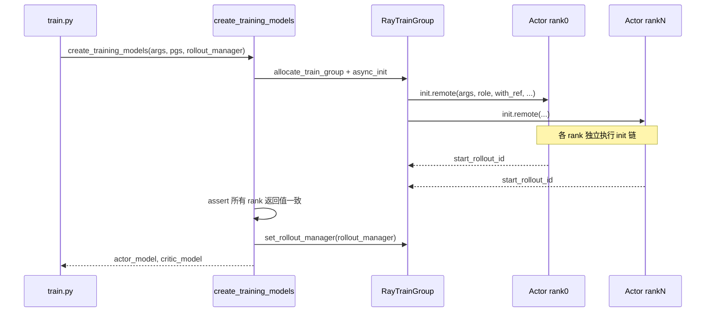
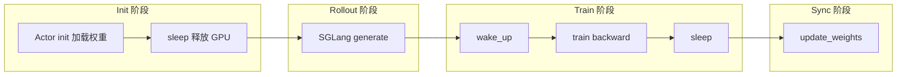

# Megatron Actor 初始化 · 数据流与交互

---

## 1. 端到端：train.py → init 完成



**Explain：** `create_training_models` 先 critic（若启用）再 actor init；所有 worker 必须返回相同 `start_rollout_id`。

**Code：**

```python
# 来源：slime/ray/placement_group.py L189-L210
critic_start_rollout_ids = ray.get(critic_model.async_init(critic_model.args, role="critic", with_ref=False))

actor_start_rollout_ids = ray.get(
    actor_model.async_init(
        actor_args,
        role="actor",
        with_ref=actor_args.kl_coef != 0 or actor_args.use_kl_loss,
        with_opd_teacher=actor_args.use_opd and actor_args.opd_type == "megatron",
    )
)
if args.use_critic:
    start_rollout_ids = critic_start_rollout_ids
else:
    start_rollout_ids = actor_start_rollout_ids

assert len(set(start_rollout_ids)) == 1

if args.start_rollout_id is None:
    args.start_rollout_id = start_rollout_ids[0]

actor_model.set_rollout_manager(rollout_manager)
```

**Comment：**

- `with_ref` 由 KL 相关参数推导，无需用户单独传
- `set_rollout_manager` 在 init 之后，供 `update_weights` 获取 SGLang engine 列表

---

## 2. RayTrainGroup.async_init

**Explain：** 对每个 Ray Actor handler 并发 `init.remote`，返回 ObjectRef 列表供 `ray.get`。

**Code：**

```python
# 来源：slime/ray/actor_group.py L121-L128
def async_init(self, args, role, with_ref=False, with_opd_teacher=False):
    self.args = args
    return [
        actor.init.remote(args, role, with_ref=with_ref, with_opd_teacher=with_opd_teacher)
        for actor in self._actor_handlers
    ]
```

**Comment：**

- world_size = num_nodes × num_gpus_per_node；每个 handler 对应一个 Megatron rank
- rank0 在 Actor 构造时广播 `MASTER_ADDR` / `MASTER_PORT`（见 `_allocate_gpus_for_actor`）

---

## 3. offload 环境变量注入

**Explain：** Megatron + offload 时 Ray runtime_env 预加载 `torch_memory_saver` 动态库。

**Code：**

```python
# 来源：slime/ray/actor_group.py L64-L84
if self.args.offload_train and self.args.train_backend == "megatron":
    import torch_memory_saver
    for path in [
        "torch_memory_saver_hook_mode_preload_cu12.abi3.so",
        "torch_memory_saver_hook_mode_preload.abi3.so",
    ]:
        dynlib_path = os.path.join(
            os.path.dirname(os.path.dirname(torch_memory_saver.__file__)),
            path,
        )
        if os.path.exists(dynlib_path):
            break
    else:
        raise FileNotFoundError(...)

    env_vars["LD_PRELOAD"] = dynlib_path
    env_vars["TMS_INIT_ENABLE"] = "1"
    env_vars["TMS_INIT_ENABLE_CPU_BACKUP"] = "1"
```

**Comment：**

- 必须在 **Actor 创建前** 设置 `LD_PRELOAD`，否则 `pause`/`resume` 无效
- 与 init 内 `memory_margin_bytes` 配合控制释放后残留显存

---

## 4. init 阶段 IO 与消息

| 方向 | 数据 | 机制 |
|------|------|------|
| 磁盘 → Actor | HF config/tokenizer | `AutoConfig` / `AutoTokenizer` + node 级 barrier |
| 磁盘 → Actor | Megatron checkpoint | `initialize_model_and_optimizer` → `load_checkpoint` |
| 磁盘 → Actor | ref/teacher/old_actor | `load_other_checkpoint` 临时改 args.load |
| Actor → 全局 | `start_rollout_id` | 各 rank 返回 int，`ray.get` 聚合 |
| Actor ↔ Rollout | rollout_manager 引用 | `set_rollout_manager`（init 后） |

无 Ray object store 大对象传输发生在 **init 本身**；rollout 数据在 [[19-Train-Step]] 的 `train()` 才经 `rollout_data_ref` 传入。

---

## 5. 训练步内的 sleep / wake 环

**Explain：** 每次 `train()` 在 offload 模式下形成 wake → 计算 → sleep 环；与 init 末尾的 sleep 衔接。

**Code：**

```python
# 来源：slime/backends/megatron_utils/actor.py L380-L400
def train(self, rollout_id: int, rollout_data_ref: Box, external_data=None):
    if self.args.debug_rollout_only:
        return None

    if self.args.offload_train:
        self.wake_up()

    with timer("data_preprocess"):
        rollout_data = self._get_rollout_data(rollout_data_ref)
    ...
    if self.args.offload_train:
        del rollout_data
        self.sleep()

    return result
```

**Comment：**

- init 结束时已 sleep，第一次 train 首先 wake_up
- critic 路径同样在 train 内 wake/sleep（critic init 后可能已 sleep）

---

## 6. RayTrainGroup 级 offload 接口

**Explain：** 集群级批量 wake/sleep，供 placement 策略或外部调度调用。

**Code：**

```python
# 来源：slime/ray/actor_group.py L159-L163
def onload(self):
    return ray.get([actor.wake_up.remote() for actor in self._actor_handlers])

def offload(self):
    return ray.get([actor.sleep.remote() for actor in self._actor_handlers])
```

**Comment：**

- 命名 `onload`/`offload` 与 `offload_train` 参数呼应
- 主训练循环默认依赖各 actor 的 `train()` 内自动 wake/sleep，不一定调用 Group 级 API

---

## 7. 与 Rollout 侧的时序（colocate / offload）



- **非 colocate**：Actor 与 Rollout 占不同 GPU，offload 主要是 **同 GPU 时间复用**（若 PG 分开则 sleep 意义在释放本 actor 占用的卡）
- **colocate**：tensor 推权重；init 中 assert delta 不可用

---

## 8. load_other_checkpoint 数据流

**Explain：** 加载 ref/teacher 等辅助权重时不加载 optimizer/RNG，并备份到独立 tag。

**Code：**

```python
# 来源：slime/backends/megatron_utils/actor.py L654-L682
def load_other_checkpoint(self, model_tag: str, path: str) -> None:
    old_args = self.args.load, self.args.no_load_optim, self.args.no_load_rng, self.args.finetune
    self.args.load = path
    self.args.no_load_optim = True
    self.args.no_load_rng = True
    self.args.finetune = True
    ...
    _, _ = load_checkpoint(
        self.model,
        None,
        None,
        checkpointing_context={},
        skip_load_to_model_and_opt=False,
    )
    self.args.load, self.args.no_load_optim, self.args.no_load_rng, self.args.finetune = old_args
    ...
    self.weights_backuper.backup(model_tag)
    self._active_model_tag = model_tag
```

**Comment：**

- 加载后 `_active_model_tag` 指向最后加载的模型；init 后续会 `_switch_model("actor")` 或在 train 中切换
- ref/teacher 路径由 `with_ref` / `with_opd_teacher` 与 args 中的 load 路径决定
