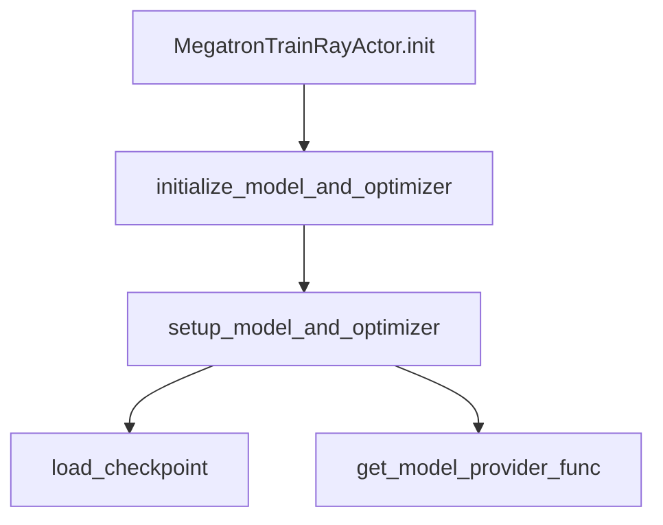

# Megatron Model 与 Optimizer 初始化

> **源码范围：** `model_provider.py`（GPTModel 构建 / critic 头 / 自定义 provider）、`model.py`（`setup_model_and_optimizer`、`initialize_model_and_optimizer`、`forward_only`）

---

## 本模块在架构中的位置

`initialize_model_and_optimizer` 在 [[17-Megatron-Actor-Init-00-MOC]] 的 `MegatronTrainRayActor.init` 中被调用：每个 GPU rank 构建 DDP 包裹的 GPTModel、Megatron optimizer、LR scheduler，并从 checkpoint 恢复 iteration。



---

## 零基础一句话

**像「按图纸搭模型 + 装优化器 + 读存档」**：`model_provider` 决定用 Megatron-Core GPTModel 还是 Bridge/自定义结构；critic 把 output_layer 换成标量 value 头；然后 `load_checkpoint` 对齐 `--load` 或 `--pretrained-checkpoint`。

---

## 六件套阅读顺序

| 顺序 | 文件 | 一句话说明 |
|------|------|------------|
| 01 | [[18-Model-Init-01-核心概念]] | provider 三分支、critic 头、freeze |
| 02 | [[18-Model-Init-02-源码走读]] | setup / initialize / forward_only |
| 03 | [[18-Model-Init-03-数据流与交互]] | init 返回值与 ref/OPD 模型 |
| 04 | [[18-Model-Init-04-关键问题]] | bridge vs legacy、stateless adam |
| ✓ | [[18-Model-Init-05-checkpoint]] | 验收 |

---

## 核心源码锚点

**Explain：** `initialize_model_and_optimizer` 是 rank-local 同步函数（非 Ray API）；返回 `loaded_rollout_id` 供 Slime 对齐 `start_rollout_id`。

**Code：**

```python
## 来源：slime/backends/megatron_utils/model.py L968-L1007
# 提交版本：22cdc6e1
def initialize_model_and_optimizer(
    args: Namespace, role: str = "actor"
) -> tuple[list[DDP], MegatronOptimizer, OptimizerParamScheduler, int]:
    model, optimizer, opt_param_scheduler = setup_model_and_optimizer(args, role)
    model[0].role = role
    reinit_critic_output_layer = _critic_output_layer_needs_reinit(args, model, role)
    clear_memory()
    iteration, _ = load_checkpoint(
        model, optimizer, opt_param_scheduler,
        checkpointing_context={},
        skip_load_to_model_and_opt=False,
    )
    if reinit_critic_output_layer:
        _reinitialize_critic_output_layer(args, model)
    return model, optimizer, opt_param_scheduler, iteration
```

**Comment：**

- iteration 来自 Megatron checkpoint tracker
- actor.init 返回 `loaded_rollout_id + 1`

---

## 衔接专题

| 方向 | 专题 | 关系 |
|------|------|------|
| 上游 | [[17-Megatron-Actor-Init-00-MOC]] | init 内调用本模块 |
| 下游 | [[19-Train-Step-00-MOC]] | `train()` / `forward_only` 消费 model |
| 下游 | [[21-Loss-Advantages-00-MOC]] | forward_only 算 log_probs/values |
| 下游 | [[24-WeightSync-Dist-00-MOC]] | named_params 来自已初始化 model |
