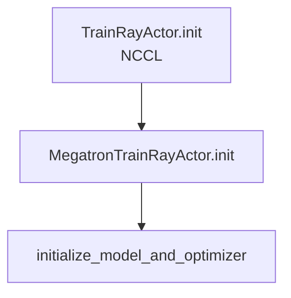

# Model 初始化 · 数据流与交互

---

## 1. init 链：TrainRayActor → model



**Explain：** 每个 rank **独立** 调用 `initialize_model_and_optimizer`；Megatron 内部 broadcast 保证权重一致。

**Code：**

```python
## 来源：slime/backends/megatron_utils/actor.py L83-L85
# 提交版本：22cdc6e1
self.model, self.optimizer, self.opt_param_scheduler, loaded_rollout_id = initialize_model_and_optimizer(
    args, role
)
```

---

## 2. checkpoint → start_rollout_id

**Explain：** `load_checkpoint` 返回 Megatron iteration；actor.init 返回 `loaded_rollout_id + 1` 给 driver 写 `args.start_rollout_id`。

**Code：**

```python
## 来源：slime/backends/megatron_utils/model.py L994-L1000
# 提交版本：22cdc6e1
iteration, _ = load_checkpoint(
    model, optimizer, opt_param_scheduler,
    checkpointing_context={},
    skip_load_to_model_and_opt=False,
)
```

**Comment：**

- Slime 用 rollout_id 语义覆盖纯 iteration（RL 步进）
- resume 时需 [[06-PlacementGroup-00-MOC]] 的 global dataset load

---

## 3. ref model / OPD teacher 的 forward_only

**Explain：** init 末尾对 ref（`with_ref`）或 OPD teacher（`with_opd_teacher`）跑 `forward_only` 预计算 log probs，写入 rollout batch 字段。


**Code：**

```python
## 来源：slime/backends/megatron_utils/model.py L345-L353
# 提交版本：22cdc6e1
def forward_only(
    f: Callable[..., dict[str, list[torch.Tensor]]],
    args: Namespace,
    model: Sequence[DDP],
    data_iterator: Sequence[DataIterator],
    num_microbatches: Sequence[int],
    store_prefix: str = "",
    use_rollout_top_p_replay: bool = False,
) -> dict[str, list[torch.Tensor]]:
```

**Comment：**

- 实现在 actor.py init 后半（[[17-Megatron-Actor-Init-00-MOC]] 文档）
- KL loss / OPD 依赖此数据

---

## 4. model_provider → weight_updater

**Explain：** init 完成后 actor 从 `named_params_and_buffers(model)` 构建 weight updater；provider 决定的 param 名/shape 直接影响 sync。

**Code：**

```python
## 来源：slime/backends/megatron_utils/model_provider.py L268-L269
# 提交版本：22cdc6e1
def get_model_provider_func(args, role="actor"):
    return wrap_model_provider_with_freeze(_get_model_provider_func(args, role), args)
```

**Comment：**

- Bridge 与 legacy 权重命名可能不同；updater 按 runtime named_parameters 迭代
- 见 [[24-WeightSync-Dist-00-MOC]]

---

## 5. critic value head 与 PPO

**Explain：** critic `setup_model_and_optimizer(role="critic")` 构建 value 头；训练时 `forward_only(get_values)` 产出 values 供 GAE。

**Code：**

```python
## 来源：slime/backends/megatron_utils/model_provider.py L110-L119
# 提交版本：22cdc6e1
if role == "critic":
    def _critic_provide(pre_process=True, post_process=True, vp_stage=None):
        model = _original_provide(...)
        if post_process:
            model.output_layer = LinearForLastLayer(
                input_size=model.config.hidden_size, output_size=1, config=model.config
            )
        return model
```

**Comment：**

- critic train 返回 `{"values": ...}`（RayTrainGroup async_train）
- 见 [[21-Loss-Advantages-00-MOC]]

---

## 6. forward_only 与 RolloutBatch 字段对齐

**Explain：** `get_batch` 从 DataIterator 读 RolloutBatch 张量；keys 必须与 [[10-Sample-Contracts-00-MOC]] 转换输出一致。

**Code：**

```python
## 来源：slime/backends/megatron_utils/model.py L384-L390
# 提交版本：22cdc6e1
batch_keys = [
    "tokens",
    "loss_masks",
    "multimodal_train_inputs",
    "total_lengths",
    "response_lengths",
]
```

**Comment：**

- train 路径 batch_keys 更多（log_probs、advantages 等）见 `train_one_step`
- multimodal 字段透传 forward_kwargs

---

## 7. role 标记与 logging

**Explain：** `model[0].role = role` 供 train loop 打 log 前缀（actor vs critic）。

**Code：**

```python
## 来源：slime/backends/megatron_utils/model.py L991
# 提交版本：22cdc6e1
model[0].role = role
```

**Comment：**

- `train()` 内 `role_tag = "" if role == "actor" else f"{role}-"`
- wandb key 如 `train/critic-ppo_loss`
