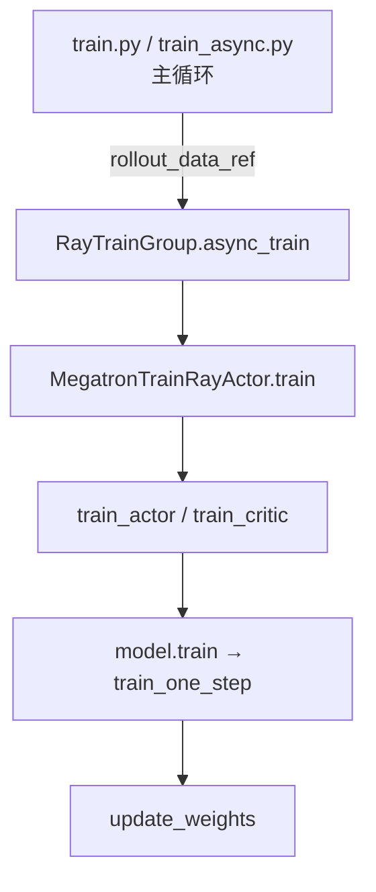

# Train Step 训练步

> **阶段 IV · 训练后端** | Git：`22cdc6e1`  
> **源码范围：** `slime/backends/megatron_utils/actor.py`（`train` / `train_actor` / `train_critic`）、`model.py`（`train` / `train_one_step`）、`slime/ray/actor_group.py`（`async_train`）

---

## 本模块在架构中的位置

一次 **train step** 是 RL 闭环中 `generate` 之后、`update_weights` 之前的 Megatron 训练阶段：Ray 主循环把 `rollout_data_ref` 交给 `MegatronTrainRayActor.train()`，Actor 侧完成 log-prob 重算、advantage 计算与 policy backward；若启用 Critic，则先跑 value forward + value backward，再把 CPU values 传给 Actor。



---

## 零基础一句话

**像考试改卷 + 补课**：Rollout 已经交卷（tokens + reward），Train Step 先核对标准答案（ref log-prob / values），算出该加多少分（advantages），再按 PPO/GRPO 规则更新模型参数。

---

## 六件套阅读顺序

| 顺序 | 文件 | 一句话说明 |
|------|------|------------|
| 01 | [[19-Train-Step-01-核心概念]] | train step、actor/critic 分工、Megatron PP 多步训练 |
| 02 | [[19-Train-Step-02-源码走读]] | **主文档**：async_train → train → train_actor/critic → train_one_step |
| 03 | [[19-Train-Step-03-数据流与交互]] | rollout_data 字段、Ray ref 传递、external_data values |
| 04 | [[19-Train-Step-04-关键问题]] | critic-only 预热、log-prob 复用、offload wake/sleep |
| ✓ | [[19-Train-Step-05-checkpoint]] | 验收：能否追踪一次 PPO train step 全链路 |

---

## 核心源码锚点

**Explain：** `train.py` 每个 rollout 先 `generate`，再按是否启用 Critic 决定训练顺序。Critic 的 `async_train` 返回含 CPU values 的 Ray ref 列表，Actor 在 `external_data` 中消费这些 values 计算 advantage。

**Code：**

```python
## 来源：slime/train.py L62-L89
# 提交版本：22cdc6e1
    for rollout_id in range(args.start_rollout_id, args.num_rollout):
        rollout_data_ref = ray.get(rollout_manager.generate.remote(rollout_id))

        if args.offload_rollout:
            ray.get(rollout_manager.offload.remote())

        actor_trains_this_step = (not args.use_critic) or rollout_id >= args.num_critic_only_steps

        if args.use_critic:
            value_refs = critic_model.async_train(rollout_id, rollout_data_ref)
            if actor_trains_this_step:
                ray.get(actor_model.async_train(rollout_id, rollout_data_ref, external_data=value_refs))
            else:
                ray.get(value_refs)
        else:
            ray.get(actor_model.async_train(rollout_id, rollout_data_ref))

        offload_train(actor_trains_this_step)
        if args.offload_rollout:
            ray.get(rollout_manager.onload_weights.remote())
        actor_model.update_weights()
```

**Comment：** `async_train` 只是 Ray 包装（见 [[19-Train-Step-02-源码走读]] §1）；真正逻辑在 `MegatronTrainRayActor.train`。PPO 端到端验证见 `tests/test_qwen3_4B_ppo.py`（colocate + critic + `--advantage-estimator ppo`）。

---

## 上下游衔接

| 方向 | 模块 | 关系 |
|------|------|------|
| 上游 | [[17-Megatron-Actor-Init-00-MOC]] | `init` 建好 model/optimizer/weight_updater |
| 上游 | [[18-Model-Init-00-MOC]] | `forward_only` 供 log-prob / value 前向 |
| 并行 | [[20-Train-Data-00-MOC]] | `get_data_iterator` / `process_rollout_data` 喂数据 |
| 并行 | [[21-Loss-Advantages-00-MOC]] | `compute_advantages_and_returns` / `loss_function` |
| 下游 | [[24-WeightSync-Dist-00-MOC]] | train 结束后 `update_weights` 推权重到 SGLang |

---

## 验证建议

```bash
# CI 级 PPO 训练（8 GPU，含 critic + colocate）
pytest slime/tests/test_qwen3_4B_ppo.py
```

关键断言：`train/ppo_kl`、`train/kl_loss` 在 step 0 应接近 0（见 `model.py` CI 检查）。
