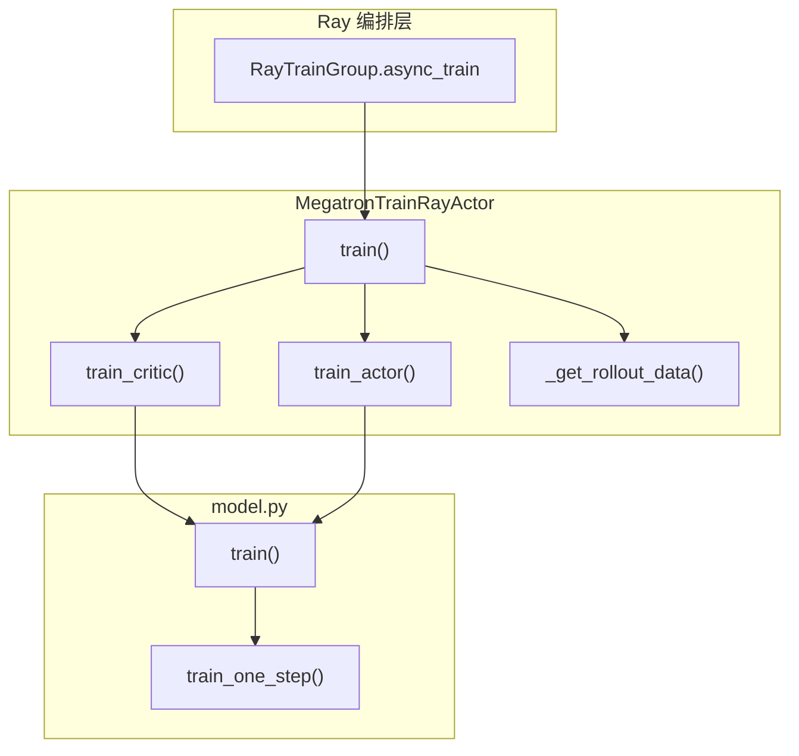

# Train Step · 核心概念

---

## 1. 术语表

| 术语 | 含义 |
|------|------|
| **train step** | 单个 rollout 内的一次 Megatron forward-backward + optimizer step（`train_one_step`） |
| **rollout train** | 一个 rollout 可能含多个 train step（动态 batch / 多段 microbatch 列表） |
| **async_train** | Ray 层异步调用：返回 `actor.train.remote(...)` 的 ObjectRef 列表，非 Megatron 异步 |
| **train_actor** | Actor 路径：重算 log-prob → advantage → policy/value backward |
| **train_critic** | Critic 路径：value forward → advantage → value_loss backward，返回 CPU values |
| **external_data** | Actor 从 Critic Ray ref 解析出的 `{"values": [...]}`，用于 PPO advantage |
| **num_microbatches** | 每个 train step 的 microbatch 数；与 PP/VPP 配置相关 |
| **global_batch_sizes** | 每 step 的 rollout 计数（DP 全局），用于 loss 归一化与 LR scheduler |

---

## 2. 设计动机

### 2.1 为何 Actor 要重算 log-prob？

Rollout 阶段 SGLang 已产出 `rollout_log_probs`，但训练侧通常仍用 Megatron **同一套权重布局**重算，以便：

- 与 ref / teacher / old_actor 模型切换后 log-prob 对齐
- 支持 routing replay（MoE 专家路径一致）
- 计算 mismatch metrics（rollout vs train log-prob 差）

**Code：**

```python
# 来源：slime/backends/megatron_utils/actor.py L466-L493
                self._switch_model("old_actor" if self.args.keep_old_actor else "actor")
                can_reuse_log_probs_in_loss = (
                    len(num_microbatches) == 1
                    and self.args.loss_type == "policy_loss"
                    and self.args.kl_coef == 0
                    and not self.args.use_rollout_logprobs
                    and not self.args.get_mismatch_metrics
                    and not self.args.use_critic
                    and not self.args.keep_old_actor
                    and not self.args.use_opd
                    and not self.args.use_routing_replay
                    and self.args.advantage_estimator != "gspo"
                )
                if (
                    not self.args.use_rollout_logprobs or self.args.get_mismatch_metrics
                ) and not can_reuse_log_probs_in_loss:
                    rollout_data.update(
                        self.compute_log_prob(
                            data_iterator,
                            num_microbatches,
                            store_prefix="",
                        )
                    )
```

**Comment：** 条件极严的 `can_reuse_log_probs_in_loss` 允许在纯 GRPO 且无 ref/critic 时跳过 duplicate forward，把 rollout log-prob 直接喂 loss（批次 21 详述）。

### 2.2 Critic 与 Actor 为何分两次 train？

PPO 需要 **old values** 算 GAE。Critic 先 forward 得到 values，算 advantage 后做 value_loss backward；Actor 再用同一 advantage 做 policy_loss backward。values 经 Ray 从 Critic last-PP stage 传到 Actor last-PP stage。

**Code：**

```python
# 来源：slime/backends/megatron_utils/actor.py L402-L428
    def train_critic(self, rollout_id: int, rollout_data: RolloutBatch):
        """Train critic and return CPU values (used as old-values for the next actor train)."""
        data_iterator = get_data_iterator(rollout_data)
        num_microbatches = rollout_data["num_microbatches"]
        global_batch_sizes = rollout_data["global_batch_sizes"]

        rollout_data.update(forward_only(get_values, self.args, self.model, data_iterator, num_microbatches))

        compute_advantages_and_returns(self.args, rollout_data)

        self.args.loss_type = "value_loss"
        train(
            rollout_id,
            self.model,
            self.optimizer,
            self.opt_param_scheduler,
            data_iterator,
            num_microbatches,
            global_batch_sizes,
        )

        if mpu.is_pipeline_last_stage() and "values" in rollout_data:
            from slime.backends.megatron_utils.data import tensors_to_cpu

            return {"values": tensors_to_cpu(rollout_data["values"])}
        return {}
```

---

## 3. 架构位置



Train Step 横跨 **Ray 远程调用**、**Actor 业务编排**、**Megatron PP 引擎** 三层；Loss 细节在批次 21–22，数据切分在批次 20。

---

## 4. Megatron `train` vs `train_one_step`

| 函数 | 粒度 | 职责 |
|------|------|------|
| `train()` | 整个 rollout | 重置 iterator、配置 grad overlap、循环调用 `train_one_step`、wandb 日志 |
| `train_one_step()` | 单个 step | 一次 `forward_backward_func` + `optimizer.step` + scheduler increment |

**Code：**

```python
# 来源：slime/backends/megatron_utils/model.py L704-L731（docstring 节选）
def train(
    rollout_id: int,
    model: Sequence[DDP],
    optimizer: MegatronOptimizer,
    opt_param_scheduler: OptimizerParamScheduler,
    data_iterator: Sequence[DataIterator],
    num_microbatches: Sequence[int],
    global_batch_sizes: Sequence[int],
) -> None:
    """Run training over a rollout consisting of multiple steps.

    The model is switched to train mode, training hooks are configured, and
    ``train_one_step`` is invoked for each step in the rollout.
    """
```

**Comment：** `len(num_microbatches) == len(global_batch_sizes)` 是动态 batch 下「一步一 gbs」的契约； uneven step 会在日志里打 `train/global_batch_size`。
