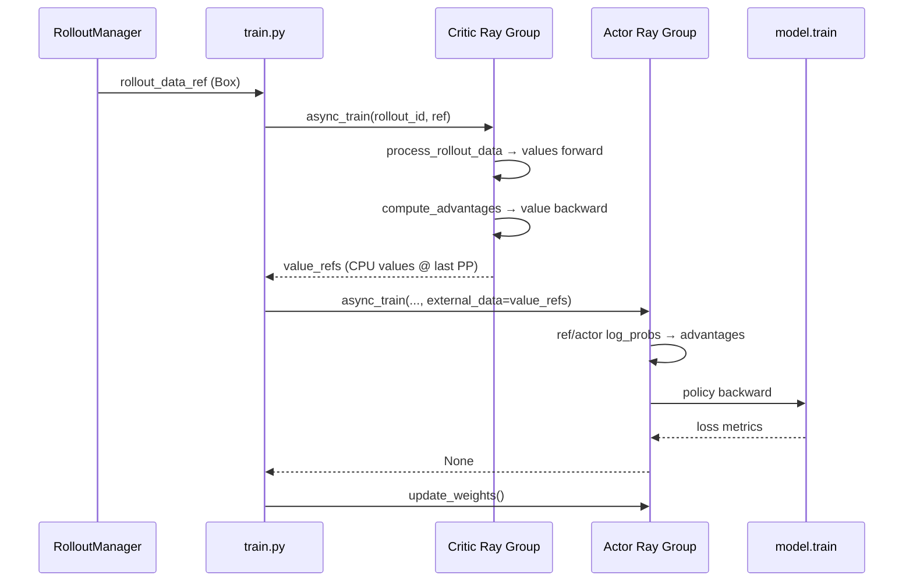

# Train Step · 数据流与交互

---

## 1. 端到端数据流（PPO + Critic）



---

## 2. `rollout_data_ref` → `RolloutBatch`

**Explain：** `Box` 包装 Ray object store 引用；每个 Megatron DP rank 调用 `process_rollout_data` 得到本地切片。Train Step 消费的核心字段如下。

| 字段 | 类型 | 消费点 |
|------|------|--------|
| `tokens` | `list[Tensor]` | `get_batch` → model forward |
| `loss_masks` | `list[Tensor]` | loss 掩码 |
| `total_lengths` / `response_lengths` | `list[int]` | log-prob 切片、packed seq |
| `rewards` / `raw_reward` | 标量或 list | advantage（批次 21） |
| `rollout_log_probs` | `list[Tensor]` | 可选直接作 old log-prob |
| `num_microbatches` | `list[int]` | 每 step microbatch 数 |
| `global_batch_sizes` | `list[int]` | loss 归一化 + LR step |
| `values` | `list[Tensor]` | Critic 产出 / Actor 注入 |

**Code：**

```python
# 来源：slime/train.py L67-L77
        rollout_data_ref = ray.get(rollout_manager.generate.remote(rollout_id))

        actor_trains_this_step = (not args.use_critic) or rollout_id >= args.num_critic_only_steps

        if args.use_critic:
            value_refs = critic_model.async_train(rollout_id, rollout_data_ref)
            if actor_trains_this_step:
                ray.get(actor_model.async_train(rollout_id, rollout_data_ref, external_data=value_refs))
```

**Comment：** 同一 `rollout_data_ref` 传给 Critic 和 Actor；各 rank 独立 `process_rollout_data`，无需再 broadcast 大 tensor。

---

## 3. Critic → Actor：`external_data` 传递

**Explain：** Critic `train.remote` 返回的 ref 在 Actor 侧作为 `external_data` 传入。仅 **pipeline last stage** 把 CPU values 拷回 GPU；其他 stage 收到空 dict。

**Code：**

```python
# 来源：slime/backends/megatron_utils/actor.py L497-L505
                if self.args.use_critic:
                    if external_data is not None and mpu.is_pipeline_last_stage():
                        values = external_data.get("values")
                        if values is not None:
                            from slime.backends.megatron_utils.data import tensors_to_gpu

                            rollout_data["values"] = tensors_to_gpu(values)
```

**Comment：** values 必须与 `rollout_data` 样本顺序一致；Critic/Actor 使用相同 `get_data_iterator` 顺序保证对齐。

---

## 4. Iterator 与 Megatron PP 交互

**Explain：** `get_data_iterator` 返回与 VPP 阶段数相同的 iterator 列表；`forward_only` 和 `train` 共用同一组 iterator，中间多次 `reset()`。

**Code：**

```python
# 来源：slime/backends/megatron_utils/actor.py L431-L434
        data_iterator = get_data_iterator(rollout_data)
        num_microbatches = rollout_data["num_microbatches"]
        global_batch_sizes = rollout_data["global_batch_sizes"]
```

**Comment：** `fill_routing_replay` 在 actor 路径开头也会 reset iterator；routing replay 与 train 共用 microbatch 边界（批次 23）。

---

## 5. `forward_only` vs `train` 数据流差异

| 模式 | 函数 | `forward_only` 参数 | 产出写入 |
|------|------|---------------------|----------|
| log-prob | `compute_log_prob` | `True` | `rollout_data["log_probs"]` 等 |
| value | `train_critic` 内 | `True` | `rollout_data["values"]` |
| policy/value loss | `train` → `train_one_step` | `False` | optimizer 更新权重 |

**Code：**

```python
# 来源：slime/backends/megatron_utils/actor.py L362-L377
    def compute_log_prob(
        self,
        data_iterator: list[DataIterator],
        num_microbatches: list[int],
        store_prefix: str = "",
    ) -> dict[str, list[torch.Tensor]]:
        with timer(f"{store_prefix}log_probs"):
            return forward_only(
                get_log_probs_and_entropy,
                self.args,
                self.model,
                data_iterator,
                num_microbatches,
                store_prefix=store_prefix,
                use_rollout_top_p_replay=True,
            )
```

**Comment：** `store_prefix` 区分 ref_/teacher_/默认 actor log-prob 字段名。

---

## 6. Offload 模式下的资源交互

**Explain：** `--offload-train` 时 train 前后 `wake_up`/`sleep`；Critic+Actor 非 colocate 时 update_weights 可能额外 wake Critic actor。

**Code：**

```python
# 来源：slime/backends/megatron_utils/actor.py L384-L398
        if self.args.offload_train:
            self.wake_up()

        with timer("data_preprocess"):
            rollout_data = self._get_rollout_data(rollout_data_ref)
        # ... train_critic / train_actor ...
        if self.args.offload_train:
            del rollout_data
            self.sleep()
```

**Comment：** `train_async.py` **不支持** colocate（assert），因 async 重叠 generate 与 train，GPU 分时策略不同。

---

## 7. 与 `train_async.py` 的数据流差异

**Explain：** 异步训练提前 launch `generate(rollout_id+1)`，当前 rollout 用 `rollout_data_curr_ref`；train 调用栈与 sync 相同。

**Code：**

```python
# 来源：slime/train_async.py L31-L49
    rollout_data_next_future = rollout_manager.generate.remote(args.start_rollout_id)
    for rollout_id in range(args.start_rollout_id, args.num_rollout):
        if rollout_data_next_future is not None:
            rollout_data_curr_ref = ray.get(rollout_data_next_future)

        if rollout_id + 1 < args.num_rollout:
            rollout_data_next_future = rollout_manager.generate.remote(rollout_id + 1)

        if args.use_critic:
            value_refs = critic_model.async_train(rollout_id, rollout_data_curr_ref)
            if actor_trains_this_step:
                ray.get(actor_model.async_train(rollout_id, rollout_data_curr_ref, external_data=value_refs))
```

**Comment：** Train Step 模块本身不感知 async；差异仅在主循环如何 prefetch rollout。

---

## 8. 上下游边界

| 上游 | 交接物 | 本模块 |
|------|--------|--------|
| RolloutManager.generate | `Box(rollout_batch)` | `_get_rollout_data` |
| 批次 20 Train-Data | `num_microbatches` 等 | iterator / get_batch |
| 批次 21 Loss | advantage / loss 闭包 | train_one_step |
| 下游 update_weights | 最新 actor 权重 | `weights_backuper.backup("actor")` 后读取 |
