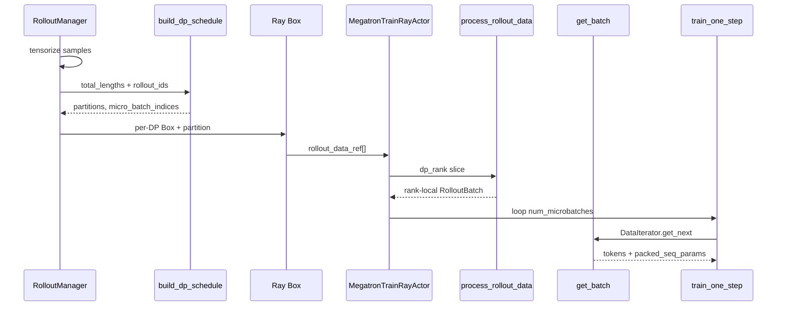
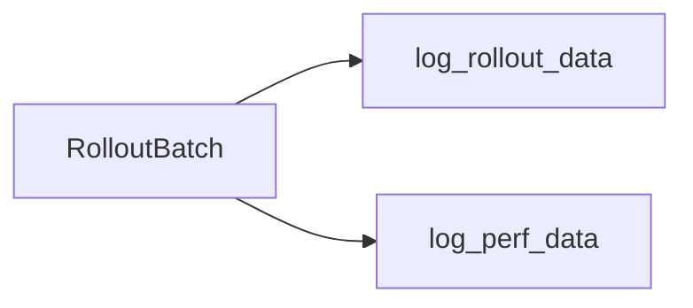

# Train Data · 数据流与交互

---

## 1. RolloutBatch 调度相关字段

**Explain：** 本批字段在 RolloutManager tensorize 后、Actor `train()` 前写入。与 [[21-Loss-Advantages-03-数据流与交互]] 的 loss 字段互补。

| 键 | 写入方 | 消费方 |
|----|--------|--------|
| `tokens` | RolloutManager | `get_batch` |
| `total_lengths` | split 前全局；Actor 按 `partition` 重排 | schedule / loss |
| `response_lengths` | RolloutManager | loss_mask 对齐 |
| `loss_masks` | RolloutManager | `get_batch` → `full_loss_masks` |
| `rollout_ids` | `Sample.index` | `build_dp_schedule` |
| `partition` | `_split_train_data_by_dp` | `process_rollout_data`（pop） |
| `micro_batch_indices` | `build_dp_schedule` | `DataIterator` |
| `num_microbatches` | 每 step 每 rank mbs 数 | `train_one_step` 循环 |
| `global_batch_sizes` | 每 step rollout 数 | loss 归一化分母 |
| `rollout_mask_sums` | RolloutManager | `get_sum_of_sample_mean` |

**Code：**

```python
# 来源：types.py — RolloutBatch 为 dict 别名
RolloutBatch = dict[str, Any]
```

---

## 2. 端到端序列图



---

## 3. RolloutManager._split_train_data_by_dp

**Explain：** 生成侧在 `generate_rollouts` 末尾调用；为每个 DP rank 构造独立 dict，含 `partition=r` 的全局下标列表，其余字段仍是 **全局** list（Actor 只重排 `total_lengths`）。

**Code：**

```python
# 来源：ray/rollout.py L829-L851（节选）
    def _split_train_data_by_dp(self, data):
        dp_size = self.train_parallel_config["dp_size"]
        total_lengths = [len(t) for t in data["tokens"]]
        data["total_lengths"] = total_lengths

        partitions, micro_batch_indices, num_microbatches, global_batch_sizes = build_dp_schedule(
            self.args,
            self.train_parallel_config,
            total_lengths,
            global_batch_size=self.args.global_batch_size,
            rollout_indices=data["rollout_ids"],
        )
        data["micro_batch_indices"] = micro_batch_indices
        data["num_microbatches"] = num_microbatches
        data["global_batch_sizes"] = global_batch_sizes
        # 按 partitions[r] 打包 Ray Box ...
```

---

## 4. Actor.train 入口

**Explain：** `MegatronTrainRayActor.train` 先 `process_rollout_data`，再 `get_data_iterator`；`num_microbatches` / `global_batch_sizes` 是 **list**（多 training step 时逐步消费）。

**Code：**

```python
# 来源：actor.py L225-L232（节选）
        rollout_data = process_rollout_data(
            self.args, rollout_data_ref, dp_rank, dp_size
        )
        data_iterator = get_data_iterator(rollout_data)
        num_microbatches = rollout_data["num_microbatches"]
        global_batch_sizes = rollout_data["global_batch_sizes"]
```

---

## 5. forward_step 与 get_batch 衔接

**Explain：** `model.py` 的 `forward_step` 从 `data_iterator` 取 batch keys（含 `tokens`、`loss_masks`、`total_lengths` 等），调用 `get_batch(..., allgather_cp=args.allgather_cp)`。返回的 `full_loss_masks` 供 loss 使用。

**Code：**

```python
# 来源：slime/backends/megatron_utils/model.py L327-L351（节选）
    def forward_step(data_iterator: DataIterator, model: GPTModel, return_schedule_plan: bool = False):
        batch = get_batch(
            data_iterator,
            _with_rollout_top_p_token_keys(
                args,
                [
                    "tokens",
                    "multimodal_train_inputs",
                    "packed_seq_params",
                    "total_lengths",
                    "response_lengths",
                    "loss_masks",
                    ...
                ],
            ),
            args.data_pad_size_multiplier,
            args.allgather_cp,
        )
```

---

## 6. 多 step 训练与 num_microbatches

**Explain：** 当 `num_rollouts > global_batch_size` 时，`build_dp_schedule` 产生多个 step；`num_microbatches` 与 `global_batch_sizes` 等长。`train_one_step` 每 step 重置 iterator 并传入对应 `step_global_batch_size`。

**Comment：** uneven DP 下各 rank 样本数可不同，但 **每 step 各 rank mbs 数仍相同**——PP 同步硬约束。

---

## 7. 与 CP / VPP 的交互

| 并行维 | 本批影响点 |
|--------|-----------|
| CP | `max_per_bin *= cp_size`；`get_batch` 切片 |
| VPP | `get_data_iterator` 返回 `vpp_size` 份 iterator |
| PP | `log_rollout_data` 仅 last stage |
| TP | logging 仅 rank 0 |

---

## 8. 性能与 observability

**Explain：** `log_perf_data` 用 `Timer().seq_lens`（全局 total_lengths）算 FLOPs；`log_passrate` / `log_multi_turn_data` 为可选分支。



---

## 9. 下游衔接

- [[21-Loss-Advantages-00-MOC]]：`unconcat_tokens`、`rollout_mask_sums`
- [[23-CP-RoutingReplay-00-MOC]]：`slice_with_cp`、`allgather_cp`
- [[19-Train-Step-00-MOC]]：`train_one_step` 循环
