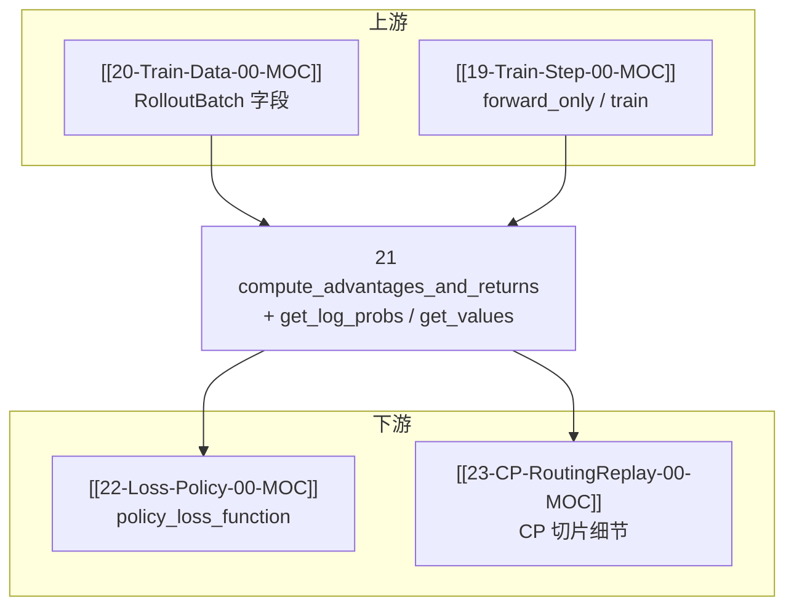

---
type: module-moc
module: 21-Loss-Advantages
batch: "21"
doc_type: moc
title: "Loss · Advantages · 专题概述"
tags:
  - slime/batch/21
  - slime/module/loss-advantages
  - slime/doc/moc
updated: 2026-07-02
---

# Loss · Advantages · 专题概述

> 源码主文件：`slime/backends/megatron_utils/loss.py`（优势/回报计算 + logprob/value 提取）

---

## 本专题目标

读完本专题六件套后，读者应能：

1. 说明 `compute_advantages_and_returns` 在 actor/critic 训练前的位置，以及它如何从 `RolloutBatch` 就地写入 `advantages` / `returns`
2. 对比 **GRPO / PPO(GAE) / REINFORCE++ / REINFORCE++-baseline** 四条 `advantage_estimator` 分支的数据依赖
3. 解释 `get_log_probs_and_entropy` 为何在 **整段 `[T,V]` logits** 上算 logprob 再切片，以及 rollout top-p replay 如何影响 keep-mask
4. 说明 `get_values` 与 `get_responses` 的关系，以及 `allgather_cp` 下 value 张量的重分布
5. 理解 **OPD（On-Policy Distillation）** 如何通过 `apply_opd_kl_to_advantages` 在优势上叠加 reverse KL 惩罚

---

## 文档导航

| 文档 | 内容 |
|------|------|
| [[21-Loss-Advantages-01-核心概念]] | 术语、估计器选型、CP/DP 归一化 |
| [[21-Loss-Advantages-02-源码走读]] | **主文档**：四函数 + 关键 helper 精读 |
| [[21-Loss-Advantages-03-数据流与交互]] | RolloutBatch 字段、actor 调用栈 |
| [[21-Loss-Advantages-04-关键问题]] | FAQ、配置互斥、debug 路径 |
| [[21-Loss-Advantages-05-checkpoint]] | 验收清单 |

---

## 源码范围

| 优先级 | 符号 | 行号（约） | 本专题覆盖 |
|--------|------|-----------|---------|
| P0 | `compute_advantages_and_returns` | L661–828 | ✅ 全文 |
| P0 | `get_log_probs_and_entropy` | L470–561 | ✅ 全文 |
| P0 | `get_values` | L564–617 | ✅ 全文 |
| P0 | `apply_opd_kl_to_advantages` | L620–658 | ✅ 全文 |
| P1 | `_build_shifted_tokens` | L230–279 | 02 走读 |
| P1 | `_extract_per_sample` | L389–467 | 02 走读 |
| P1 | `_allgather_cp_redistribute` | L151–227 | 02 走读 |
| 延后 | `policy_loss_function` | L881+ | [[22-Loss-Policy-00-MOC]] |
| 依赖 | `ppo_utils.get_grpo_returns` 等 | — | 01/02 引用 |

**本专题内嵌源码热点：≥ 400 行**（四主函数 + helper 片段，见 [[21-Loss-Advantages-02-源码走读]]）。

---

## 入口代码：actor 训练前如何调用

**Explain：** `MegatronTrainRayActor.train_actor` 在 `forward_only` 收集 `log_probs` / `ref_log_probs` / `teacher_log_probs` 与 critic `values` 之后，于 **policy backward 之前** 调用 `compute_advantages_and_returns`。该函数只在 pipeline last stage 上执行，结果写回 `rollout_data` 供后续 `policy_loss_function`（[[22-Loss-Policy-00-MOC]]）消费。

**Code：**

```python
## 来源：slime/backends/megatron_utils/actor.py L440-L509（节选）
            if self.args.compute_advantages_and_returns:
                if "ref" in self.weights_backuper.backup_tags:
                    self._switch_model("ref")
                    rollout_data.update(
                        self.compute_log_prob(data_iterator, num_microbatches, store_prefix="ref_")
                    )
                if "teacher" in self.weights_backuper.backup_tags:
                    self._switch_model("teacher")
                    rollout_data.update(
                        self.compute_log_prob(data_iterator, num_microbatches, store_prefix="teacher_")
                    )
                self._switch_model("old_actor" if self.args.keep_old_actor else "actor")
                # ... 条件性 compute_log_prob 收集 log_probs ...
                if self.args.use_critic:
                    # external_data["values"] 来自上一轮 train_critic
                    ...
                compute_advantages_and_returns(self.args, rollout_data)
```

**Comment：**

- `compute_advantages_and_returns` 与 loss 计算 **解耦**：优势在整批 rollout 上一次性算完，便于 `normalize_advantages` 做 DP 级 whitening
- critic 路径：`train_critic` 先 `forward_only(get_values)` 再调用同一函数（L408–411）
- OPD 时 teacher logprob 在 `store_prefix="teacher_"` 阶段写入，KL 惩罚在优势阶段叠加而非 reward 阶段

---

## 衔接关系



---

## 阶段验收点

- [ ] 能口述 `advantage_estimator` 六选一（含 `gspo`/`cispo` 与 GRPO 同分支）各自需要的输入字段
- [ ] 能说明 `kl_coef==0` 时为何仍构造零 KL 张量
- [ ] 能解释 `use_opd` 时 `teacher_log_probs` 从哪来、如何改 advantages

---

## 相关测试

- `tests/test_chunked_gae.py` — GAE / advantage 分块与 CP 行为
- `tests/test_loss_cp_invariance.py` — CP 下 loss 不变性（与[[23-CP-RoutingReplay-00-MOC]] 共用）
