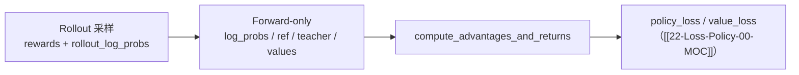

# Loss · Advantages · 核心概念

> 本专题聚焦 **训练前** 从 rollout 张量推导 `advantages` / `returns`，以及从模型 logits 提取 response 对齐的 logprob / value。Policy loss 本身见 [[22-Loss-Policy-01-核心概念]]。

---

## 1. 在 RL 闭环中的位置

Slime 单步训练可简化为：



**Explain：** Rollout 侧给 **标量 reward**（及可选 `rollout_log_probs`）；训练侧用当前或 frozen 权重重算 **per-token logprob**，与 **ref** 算近似 KL；critic 给出 **per-token value**。`compute_advantages_and_returns` 把这些合成 **per-token advantage**，供 clipped policy gradient 使用。

---

## 2. 核心术语

| 术语 | 含义 | 在 `RolloutBatch` 中的键 |
|------|------|-------------------------|
| **log_probs** | 训练策略（或 old actor）对 response token 的 log π(a\|s) | `log_probs` 或 `rollout_log_probs` |
| **ref_log_probs** | 参考策略 logprob，用于 KL 惩罚 | `ref_log_probs` |
| **teacher_log_probs** | OPD 教师 logprob | `teacher_log_probs` |
| **values** | Critic 对 response 每 token 的 V(s) | `values` |
| **kl** | 近似 KL(log_probs ∥ ref_log_probs)，per-token | 函数内写入 `rollout_data["kl"]` |
| **advantages** | 策略梯度权重 A_t | 函数内写入 |
| **returns** | 价值目标 G_t 或 GRPO 的 broadcast reward | 函数内写入 |
| **loss_masks** | response 上哪些 token 参与 loss / 统计 | `loss_masks` |

---

## 3. Advantage 估计器选型

配置项：`--advantage-estimator` → `args.advantage_estimator`。

| 估计器 | 需要 critic | 核心思想 | 实现入口 |
|--------|------------|----------|----------|
| `grpo` / `gspo` / `cispo` | 否 | 序列级 reward 广播到每个 token（减 KL 在 loss 侧处理） | `get_grpo_returns` |
| `ppo` | 是（`use_critic`） | GAE(γ, λ) + token 级 reward 含 KL | `get_advantages_and_returns_batch` |
| `reinforce_plus_plus` | 否 | 折扣回报，末 token 加 reward | `get_reinforce_plus_plus_returns` |
| `reinforce_plus_plus_baseline` | 否 | 组内 baseline 后的 broadcast advantage | `get_reinforce_plus_plus_baseline_advantages` |

**Explain：** `gspo` / `cispo` 与 `grpo` **共用同一 advantage 分支**；差异在[[22-Loss-Policy-00-MOC]] 的 `policy_loss_function`（序列级 KL vs CISPO clip）。

**Code：**

```python
## 来源：slime/backends/megatron_utils/loss.py L720-L764（分支骨架）
    elif args.advantage_estimator in ["grpo", "gspo", "cispo"]:
        rewards = torch.tensor(rewards, dtype=torch.float32, device=kl[0].device)
        returns = get_grpo_returns(rewards, kl)
        advantages = [r for r in returns]

    elif args.advantage_estimator == "ppo":
        ...
        advantages, returns = get_advantages_and_returns_batch(
            total_lengths, response_lengths, values, rewards, args.gamma, args.lambd
        )

    elif args.advantage_estimator == "reinforce_plus_plus":
        returns = get_reinforce_plus_plus_returns(...)
        advantages = [r for r in returns]

    elif args.advantage_estimator == "reinforce_plus_plus_baseline":
        advantages = get_reinforce_plus_plus_baseline_advantages(...)
        returns = advantages
```

**Comment：**

- PPO 分支先把标量 reward 加到 **CP rank 0 的末 token** 的 KL 塑形 reward 上（L731–735）
- GRPO 类方法 **不在 advantage 阶段减 KL**；KL 主要在 policy loss 或 `kl_coef` 塑形中出现
- `reinforce_plus_plus*` 强制 `normalize_advantages=True`（arguments 校验）

---

## 4. 近似 KL 与 logprob 来源

**Explain：** `compute_approx_kl` 支持 k1/k2/k3/low_var_kl 等 Schulman 近似。`kl_coef==0` 时不跑 ref forward，但仍用 `log_probs` 或 `values` 的形状构造 **零 KL 列表**，避免下游分支空指针。

**Code：**

```python
## 来源：slime/utils/ppo_utils.py L11-L51（节选）
@torch.compile(dynamic=True)
def compute_approx_kl(log_probs, log_probs_base, kl_loss_type, importance_ratio=None):
    log_ratio = log_probs.float() - log_probs_base.float()
    if kl_loss_type == "k1":
        kl = log_ratio
    elif kl_loss_type == "k2":
        kl = log_ratio**2 / 2.0
    elif kl_loss_type in ["k3", "low_var_kl"]:
        log_ratio = -log_ratio
        kl = log_ratio.exp() - 1 - log_ratio
    ...
    return kl
```

**logprob 二选一：** `args.use_rollout_logprobs` 为真时用 rollout 引擎返回的 `rollout_log_probs`，否则用训练侧 `forward_only(get_log_probs_and_entropy)` 写入的 `log_probs`。

---

## 5. get_log_probs_and_entropy 的设计动机

**Explain：** 若在 per-sample 循环里对 logits 做 backward，会多次遍历 `[T,V]`。Slime 在 **packed 序列** 上一次性调用 `calculate_log_probs_and_entropy`，再 `_extract_per_sample` 切 response 段。额外处理：

- **rollout_temperature**：与 rollout 时温度对齐
- **rollout top-p replay**：对 logprob 施加 nucleus keep-mask，entropy 仍用未 mask logits
- **Context Parallel**：zigzag / allgather 两种布局下的 token 对齐与 `_allgather_cp_redistribute`

---

## 6. OPD（On-Policy Distillation）

**Explain：** 纯蒸馏时 rollout reward 可为 0；学习信号来自 **reverse KL**：`student_logp - teacher_logp`，以 `opd_kl_coef` 从 advantage 中扣除。与 advantage 估计器 **正交**，在归一化之前应用。

**Code：**

```python
## 来源：slime/rollout/on_policy_distillation.py L32-L43（注释）
# For pure on-policy distillation without task rewards, we return 0.0 for each sample.
# The actual learning signal comes from the OPD KL penalty applied in compute_advantages_and_returns.
```

Teacher logprob 来源：Rollout 侧 `post_process_rewards` 从 RM/teacher server 响应解析，经 [[20-Train-Data-00-MOC]] 进入 `RolloutBatch["teacher_log_probs"]`；Megatron 路径也可 `store_prefix="teacher_"` 重算。

---

## 7. Advantages 归一化（DP whitening）

**Explain：** `normalize_advantages=True` 时，将所有 sample 的 advantage 与 **loss_mask** 拼接，在 **data parallel group** 上做 `distributed_masked_whiten`（减均值、除标准差，仅 mask 内 token 参与统计）。Context Parallel > 1 时 mask 需按 CP 切片对齐到本地 chunk，否则 advantage/mask 长度不一致。

---

## 8. Pipeline 与 last stage

**Explain：** `compute_advantages_and_returns` 开头 `if not mpu.is_pipeline_last_stage(): return`。非 last PP rank 不持有完整 rollout 列表，避免重复写 `rollout_data`；logprob forward 仍各 stage 协作，advantage 只在最后 stage 汇总。
