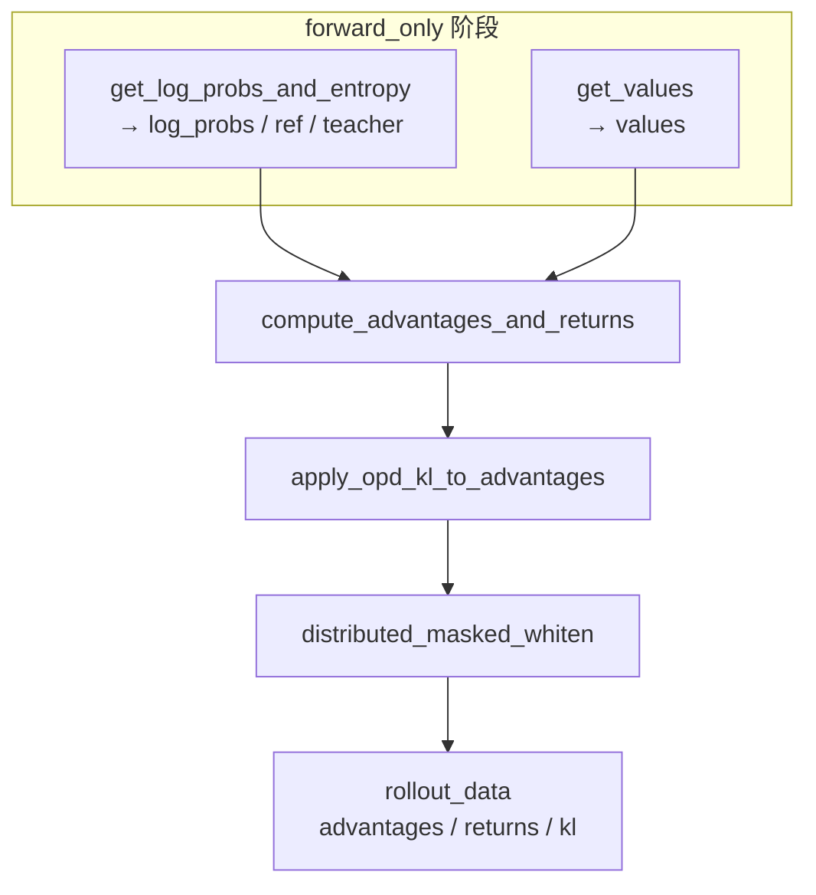

# Loss · Advantages · 源码走读

> 走读顺序：`get_log_probs_and_entropy` → `get_values` → `compute_advantages_and_returns` → `apply_opd_kl_to_advantages`  
> 文件：`slime/backends/megatron_utils/loss.py`（基线 `22cdc6e1`）

---

## 1. get_log_probs_and_entropy

### 1.1 函数签名与返回值约定

**Explain：** 与 Megatron `forward_step` 集成时，loss 函数常返回 `(dummy_tensor, aux_dict)`。此处第一个返回值是 **空 tensor**，真正结果在 `res` 字典：`log_probs`（必选）与 `entropy`（可选）。

**Code：**

```python
# 来源：loss.py L470–481
def get_log_probs_and_entropy(
    logits: torch.Tensor,
    *,
    args: Namespace,
    unconcat_tokens: list[torch.Tensor],
    total_lengths: list[int],
    response_lengths: list[int],
    with_entropy: bool = False,
    non_loss_data: bool = True,
    top_p_token_ids: list[list[int]] | None = None,
    top_p_token_offsets: list[list[int]] | None = None,
) -> dict[str, list[torch.Tensor]]:
    """Compute per-token log-probabilities (and optionally entropy) on responses."""
```

### 1.2 温度缩放与整段计算

**Explain：** 去掉 batch 维 `[1,T,V]` → `[T,V]`；除以 `rollout_temperature` 与 rollout 引擎一致。`with_entropy_grad` 在 `entropy_coef==0` 时关闭 entropy 的 backward 激活以省显存。

**Code：**

```python
# 来源：loss.py L491–508
    assert non_loss_data
    assert logits.dtype == torch.float32, f"{logits.dtype}"
    logits = logits.squeeze(0)

    rollout_temperature = getattr(args, "rollout_temperature", 1.0)
    if rollout_temperature != 1.0:
        logits = logits / rollout_temperature
    logits = logits.contiguous()
    T = logits.size(0)
    device = logits.device
    tp_group = mpu.get_tensor_model_parallel_group()
    chunk_size = args.log_probs_chunk_size
    with_entropy_grad = with_entropy and getattr(args, "entropy_coef", 0.0) != 0
```

### 1.3 构造 shifted target tokens

**Explain：** logprob 需要的是 **预测下一 token**，故对 packed 序列构建 `full_tokens[t] = original[t+1]`。CP 下分 zigzag 与 allgather 两套布局（详见 [[23-CP-RoutingReplay-02-源码走读]]）。

**Code：**

```python
# 来源：loss.py L510–511, L230–279（_build_shifted_tokens 核心）
    full_tokens = _build_shifted_tokens(T, device, unconcat_tokens, total_lengths, response_lengths, args.allgather_cp)

    # _build_shifted_tokens 内（cp1 / allgather 路径）：
    T_global = sum(total_lengths) if allgather_cp else T
    full_tokens = torch.zeros(T_global, dtype=torch.long, device=device)
    offset = 0
    for tokens, total_length in zip(unconcat_tokens, total_lengths, strict=False):
        full_tokens[offset : offset + total_length - 1] = tokens[1:total_length]
        offset += total_length
    if allgather_cp:
        cp_rank = mpu.get_context_parallel_rank()
        chunk_start = cp_rank * T
        ...
        return full_tokens[chunk_start:chunk_end].contiguous()
    return full_tokens
```

### 1.4 Rollout top-p keep-mask

**Explain：** 当 `rollout_top_p != 1.0` 时，rollout 阶段记录每个 response token 的 nucleus token id；训练重算 logprob 时 **把 nucleus 外 vocab  mask 掉**，使 train logprob 与 rollout 采样分布可比。Entropy **不**应用该 mask。

**Code：**

```python
# 来源：loss.py L513–525, L40–51
    top_p_keep_mask = None
    if top_p_token_ids is not None and top_p_token_offsets is not None:
        top_p_keep_mask = _build_topp_keep_mask(
            T, logits.size(-1), device,
            top_p_token_ids, top_p_token_offsets,
            total_lengths, response_lengths, args.allgather_cp,
        )

def get_rollout_top_p_logprob_kwargs(args, batch):
    if args.rollout_top_p == 1.0:
        return {}
    top_p_token_ids = batch.get("rollout_top_p_token_ids")
    top_p_token_offsets = batch.get("rollout_top_p_token_offsets")
    if top_p_token_ids is None or top_p_token_offsets is None:
        raise ValueError("rollout_top_p != 1.0 requires rollout_top_p_token_ids and rollout_top_p_token_offsets.")
    return {"top_p_token_ids": top_p_token_ids, "top_p_token_offsets": top_p_token_offsets}
```

### 1.5 调用 ppo_utils 与 per-sample 切片

**Code：**

```python
# 来源：loss.py L527–546
    log_prob_full, entropy_full = calculate_log_probs_and_entropy(
        logits,
        full_tokens,
        tp_group,
        with_entropy=with_entropy,
        with_entropy_grad=with_entropy_grad,
        chunk_size=chunk_size,
        log_prob_keep_mask=top_p_keep_mask,
    )
    log_prob_full = log_prob_full.squeeze(-1)  # [T, 1] -> [T]

    log_probs_list, entropy_list = _extract_per_sample(
        log_prob_full,
        entropy_full,
        total_lengths,
        response_lengths,
        args.allgather_cp,
    )

    res = {"log_probs": log_probs_list}
    if with_entropy:
        res["entropy"] = entropy_list
```

### 1.6 allgather-CP 重分布

**Explain：** allgather CP 下各 rank 持有 **连续** 全局片段；下游 loss 期望 **zigzag ring-attn** 布局。`_allgather_cp_redistribute` 对 logprob/entropy 做 differentiable all-reduce 再 `slice_log_prob_with_cp`。

**Code：**

```python
# 来源：loss.py L552–561, L216–227（_allgather_cp_redistribute 尾部）
    if args.allgather_cp:
        _allgather_cp_redistribute(
            res,
            logits_local_len=T,
            total_lengths=total_lengths,
            response_lengths=response_lengths,
        )

    return torch.empty((0,), device=device), res

        # _allgather_cp_redistribute 内：
        all_cat = torch.cat(full_resps, dim=0)
        all_cat = dist.nn.all_reduce(all_cat, group=cp_group)
        for full_resp, total_length, response_length in zip(
            all_cat.split(response_lengths, dim=0), total_lengths, response_lengths, strict=False
        ):
            new_values.append(slice_log_prob_with_cp(full_resp, total_length, response_length))
        res[key] = new_values
```

### 1.7 _extract_per_sample（cp1 路径）

**Code：**

```python
# 来源：loss.py L456–465
    else:
        # cp1
        offset = 0
        for total_length, response_length in zip(total_lengths, response_lengths, strict=False):
            end = offset + total_length
            start = end - response_length
            log_probs_list.append(log_prob_full[start - 1 : end - 1])
            if entropy_full is not None:
                entropy_list.append(entropy_full[start - 1 : end - 1])
            offset += total_length
    return log_probs_list, entropy_list
```

---

## 2. get_values

### 2.1 从 value head logits 提取 response 段

**Explain：** Value head 输出 `[1,T,1]`。复用 `get_responses` 迭代器按 sample 切 response 对齐 chunk，**不做 temperature 缩放**。

**Code：**

```python
# 来源：loss.py L564–617
def get_values(
    logits: torch.Tensor,
    *,
    args: Namespace,
    unconcat_tokens: list[torch.Tensor],
    total_lengths: list[int],
    response_lengths: list[int],
    with_entropy: bool = False,
    non_loss_data: bool = True,
) -> dict[str, list[torch.Tensor]]:
    value_list = []
    for logits_chunk, _ in get_responses(
        logits,
        args=args,
        unconcat_tokens=unconcat_tokens,
        total_lengths=total_lengths,
        response_lengths=response_lengths,
        apply_temperature=False,
    ):
        assert logits_chunk.size(-1) == 1, f"{logits_chunk.shape}"
        value_list.append(logits_chunk.squeeze(-1))

    res = {"values": value_list}

    if args.allgather_cp:
        _allgather_cp_redistribute(
            res,
            logits_local_len=logits.size(1),
            total_lengths=total_lengths,
            response_lengths=response_lengths,
        )

    return torch.empty((0,), device=logits.device), res
```

**Comment：**

- `with_entropy` / `non_loss_data` 仅为与 `get_log_probs_and_entropy` **签名兼容**，value 路径未使用
- Critic 训练：`train_critic` 先 forward 得到 `values`，再 `compute_advantages_and_returns`；actor 使用上一轮 critic 输出的 CPU values（`external_data`）

---

## 3. compute_advantages_and_returns

### 3.1 输入抽取与 early return

**Code：**

```python
# 来源：loss.py L661–713
def compute_advantages_and_returns(args: Namespace, rollout_data: RolloutBatch) -> None:
    rollout_log_probs: list[torch.Tensor] | None = rollout_data.get("rollout_log_probs")
    log_probs: list[torch.Tensor] | None = (
        rollout_log_probs if args.use_rollout_logprobs else rollout_data.get("log_probs")
    )
    ref_log_probs: list[torch.Tensor] = rollout_data.get("ref_log_probs")
    rewards: list[float] = rollout_data.get("rewards")
    values: None | list[torch.Tensor] = rollout_data.get("values")
    response_lengths: list[int] = rollout_data.get("response_lengths")
    loss_masks: list[torch.Tensor] = rollout_data.get("loss_masks")
    total_lengths: list[int] = rollout_data.get("total_lengths")

    if not mpu.is_pipeline_last_stage():
        return

    if args.kl_coef == 0 or not log_probs:
        xs = log_probs or rollout_log_probs or values
        kl = [torch.zeros_like(x, dtype=torch.float32, device=x.device) for x in xs]
    else:
        kl = [
            compute_approx_kl(
                log_probs[i],
                ref_log_probs[i],
                kl_loss_type=args.kl_loss_type,
            )
            for i in range(len(log_probs))
        ]
    rollout_data["kl"] = kl
```

**Comment：**

- `not log_probs` 且非 rollout 模式：用零 KL，对应 intermediate pipeline 或仅 value forward 场景
- `ref_log_probs` 在 `kl_coef>0` 时必须已由 ref forward 填充

### 3.2 自定义 advantage 函数

**Code：**

```python
# 来源：loss.py L715–718
    if args.custom_advantage_function_path is not None:
        custom_adv_fn = load_function(args.custom_advantage_function_path)
        custom_adv_fn(args, rollout_data)
        advantages, returns = rollout_data["advantages"], rollout_data["returns"]
```

### 3.3 GRPO / GSPO / CISPO 分支

**Code：**

```python
# 来源：loss.py L720–724, ppo_utils.py L361–368
    elif args.advantage_estimator in ["grpo", "gspo", "cispo"]:
        rewards = torch.tensor(rewards, dtype=torch.float32, device=kl[0].device)
        returns = get_grpo_returns(rewards, kl)
        advantages = [r for r in returns]

def get_grpo_returns(rewards: torch.Tensor, kl: list[torch.Tensor]):
    returns = []
    for i in range(len(rewards)):
        returns.append(torch.ones_like(kl[i]) * rewards[i])
    return returns
```

**Comment：** 每个 token 的 return/advantage 初值均为 **标量 reward 广播**；KL 不在这里减，policy loss 侧再处理。

### 3.4 PPO + GAE 分支

**Code：**

```python
# 来源：loss.py L726–738
    elif args.advantage_estimator == "ppo":
        old_rewards = rewards
        rewards = []
        kl_coef = -args.kl_coef
        cp_rank = mpu.get_context_parallel_rank()
        for reward, k in zip(old_rewards, kl, strict=False):
            k *= kl_coef
            if cp_rank == 0:
                k[-1] += reward
            rewards.append(k)
        advantages, returns = get_advantages_and_returns_batch(
            total_lengths, response_lengths, values, rewards, args.gamma, args.lambd
        )
```

**Comment：** Token 级 reward 为 **负 KL 系数 × KL**；仅 CP rank 0 在 **response 末 token** 加环境 reward，避免 CP 重复计奖。

### 3.5 REINFORCE++ 分支

**Code：**

```python
# 来源：loss.py L740–761
    elif args.advantage_estimator == "reinforce_plus_plus":
        rewards = torch.tensor(rewards, dtype=torch.float32, device=kl[0].device)
        returns = get_reinforce_plus_plus_returns(
            rewards=rewards,
            kl=kl,
            loss_masks=loss_masks,
            response_lengths=response_lengths,
            total_lengths=total_lengths,
            kl_coef=args.kl_coef,
            gamma=args.gamma,
        )
        advantages = [r for r in returns]

    elif args.advantage_estimator == "reinforce_plus_plus_baseline":
        rewards = torch.tensor(rewards, dtype=torch.float32, device=kl[0].device)
        advantages = get_reinforce_plus_plus_baseline_advantages(
            rewards=rewards,
            kl=kl,
            loss_masks=loss_masks,
            kl_coef=args.kl_coef,
        )
        returns = advantages
```

### 3.6 OPD KL 叠加

**Code：**

```python
# 来源：loss.py L766–773
    if args.use_opd:
        apply_opd_kl_to_advantages(
            args=args,
            rollout_data=rollout_data,
            advantages=advantages,
            student_log_probs=log_probs,
        )
```

### 3.7 Advantages 归一化

**Code：**

```python
# 来源：loss.py L776–825
    if args.normalize_advantages:
        all_advs = torch.cat(advantages)
        cp_size = mpu.get_context_parallel_world_size()
        if cp_size == 1:
            all_masks = torch.cat(loss_masks)
        else:
            mask_chunks = []
            for i in range(len(advantages)):
                total_len = total_lengths[i]
                response_len = response_lengths[i]
                prompt_len = total_len - response_len
                _, _, _, token_offsets = get_logits_and_tokens_offset_with_cp(total_len, response_len)
                s0, e0 = token_offsets[0]
                s1, e1 = token_offsets[1]
                res_s0, res_e0 = max(0, s0 - prompt_len), max(0, e0 - prompt_len)
                res_s1, res_e1 = max(0, s1 - prompt_len), max(0, e1 - prompt_len)
                local_mask_parts = []
                full_mask = loss_masks[i]
                if res_e0 > res_s0:
                    local_mask_parts.append(full_mask[res_s0:res_e0])
                if res_e1 > res_s1:
                    local_mask_parts.append(full_mask[res_s1:res_e1])
                local_mask_chunk = (
                    torch.cat(local_mask_parts)
                    if local_mask_parts
                    else torch.tensor([], device=all_advs.device, dtype=full_mask.dtype)
                )
                mask_chunks.append(local_mask_chunk)
            all_masks = torch.cat(mask_chunks)

        if all_masks.numel() > 0:
            dp_group = mpu.get_data_parallel_group()
            whitened_advs_flat = distributed_masked_whiten(
                all_advs, all_masks, process_group=dp_group, shift_mean=True,
            )
            chunk_lengths = [chunk.size(0) for chunk in advantages]
            advantages = list(torch.split(whitened_advs_flat, chunk_lengths))

    rollout_data["advantages"] = advantages
    rollout_data["returns"] = returns
```

---

## 4. apply_opd_kl_to_advantages

**Explain：** Reverse KL = `student - teacher`（per token）。从 advantage **减去** `opd_kl_coef * reverse_kl`，并写入 `opd_reverse_kl` 供 policy loss metrics 聚合。

**Code：**

```python
# 来源：loss.py L620–658
def apply_opd_kl_to_advantages(
    args: Namespace,
    rollout_data: RolloutBatch,
    advantages: list[torch.Tensor],
    student_log_probs: list[torch.Tensor] | None,
) -> None:
    if student_log_probs is None:
        return

    teacher_log_probs = rollout_data.get("teacher_log_probs")
    if teacher_log_probs is None:
        raise ValueError(f"OPD with opd_type='{args.opd_type}' requires teacher_log_probs, but it is missing.")

    device = student_log_probs[0].device
    teacher_log_probs = [t.to(device=device) for t in teacher_log_probs]

    reverse_kls = []
    for i, adv in enumerate(advantages):
        reverse_kl = student_log_probs[i] - teacher_log_probs[i]
        advantages[i] = adv - args.opd_kl_coef * reverse_kl
        reverse_kls.append(reverse_kl)

    rollout_data["opd_reverse_kl"] = reverse_kls
```

**Comment：**

- `student_log_probs` 即 `compute_advantages_and_returns` 中的 `log_probs`（或 rollout 版）
- Teacher 与 student 必须 **token 对齐、同长度**；通常来自同一 response 切片
- 在 `normalize_advantages` **之前**修改 advantage，使 whitening 作用于 OPD 调整后的信号

---

## 5. 调用关系小结



| 步骤 | 函数 | 输出键 |
|------|------|--------|
| 1 | `get_log_probs_and_entropy` | `log_probs`, `entropy`（可选） |
| 2 | `get_values` | `values` |
| 3 | `compute_advantages_and_returns` | `kl`, `advantages`, `returns` |
| 4 | `apply_opd_kl_to_advantages` | 就地改 `advantages`；`opd_reverse_kl` |
