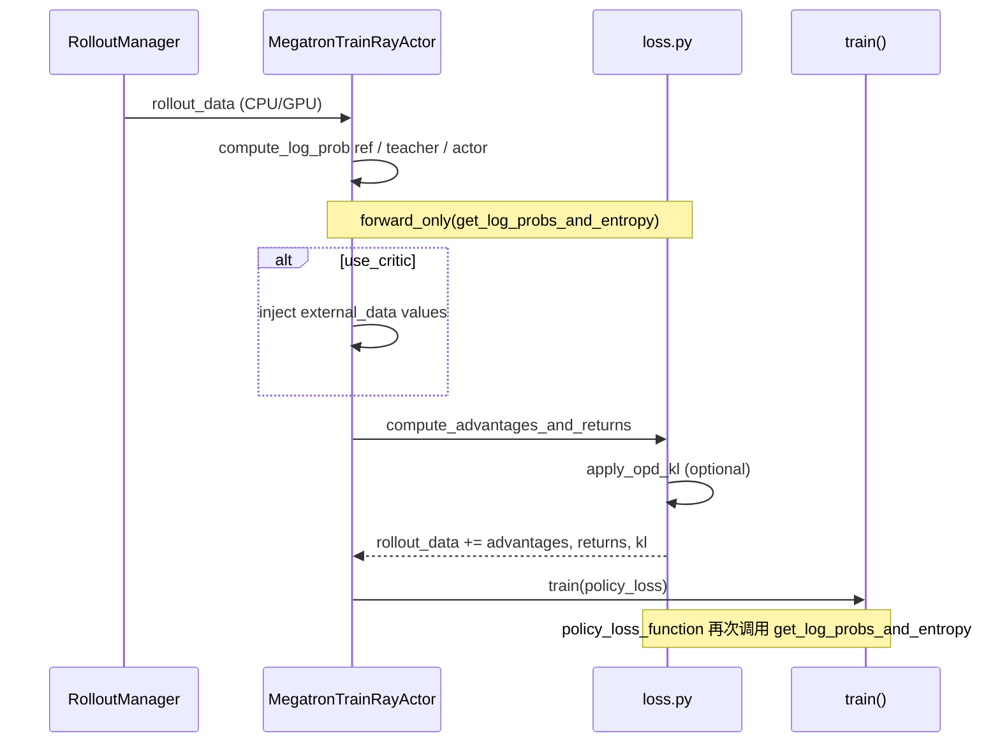
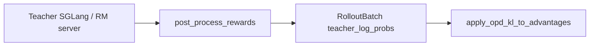

# Loss · Advantages · 数据流与交互

---

## 1. RolloutBatch 相关字段

**Explain：** `RolloutBatch` 是 `dict[str, Any]` 别名（`slime/utils/types.py`）。本模块 **读取** 与 **写入** 的键如下。

| 键 | 方向 | 形状/类型 | 来源 |
|----|------|-----------|------|
| `rewards` | 读 | `list[float]` | Rollout / RM |
| `response_lengths` | 读 | `list[int]` | 数据管线 |
| `total_lengths` | 读 | `list[int]` | prompt+response |
| `loss_masks` | 读 | `list[Tensor[R]]` | 有效 response token |
| `unconcat_tokens` | 读 | `list[Tensor]` | packed 训练 batch |
| `rollout_log_probs` | 读 | `list[Tensor[R]]` | SGLang rollout |
| `log_probs` | 读 | `list[Tensor[R]]` | `compute_log_prob` |
| `ref_log_probs` | 读 | `list[Tensor[R]]` | ref 模型 forward |
| `teacher_log_probs` | 读 | `list[Tensor[R]]` | OPD teacher |
| `values` | 读 | `list[Tensor[R]]` | critic forward |
| `rollout_top_p_token_ids` | 读 | 可选 | top-p replay |
| `rollout_top_p_token_offsets` | 读 | 可选 | top-p replay |
| `kl` | **写** | `list[Tensor[R]]` | 本函数 |
| `advantages` | **写** | `list[Tensor[R]]` | 本函数 |
| `returns` | **写** | `list[Tensor[R]]` | 本函数 |
| `opd_reverse_kl` | **写** | `list[Tensor[R]]` | OPD 时 |

**Code：**

```python
## 来源：slime/backends/megatron_utils/loss.py L686-L695, L827–828
    rollout_log_probs: list[torch.Tensor] | None = rollout_data.get("rollout_log_probs")
    log_probs: list[torch.Tensor] | None = (
        rollout_log_probs if args.use_rollout_logprobs else rollout_data.get("log_probs")
    )
    ref_log_probs: list[torch.Tensor] = rollout_data.get("ref_log_probs")
    rewards: list[float] = rollout_data.get("rewards")
    values: None | list[torch.Tensor] = rollout_data.get("values")
    ...
    rollout_data["advantages"] = advantages
    rollout_data["returns"] = returns
```

---

## 2. Actor 训练路径（含 critic 交替）



**Explain：** Advantage 计算与 policy backward **两次** 经过 logprob：第一次 frozen/old 权重收集 KL 与 OPD；第二次 actor 权重带梯度算 policy loss（[[22-Loss-Policy-00-MOC]]）。`can_reuse_log_probs_in_loss` 极窄条件下可合并为一次。

**Code：**

```python
## 来源：slime/backends/megatron_utils/actor.py L467-L478
                can_reuse_log_probs_in_loss = (
                    len(num_microbatches) == 1
                    and self.args.loss_type == "policy_loss"
                    and self.args.kl_coef == 0
                    and not self.args.use_rollout_logprobs
                    and not self.args.get_mismatch_metrics
                    and not self.args.use_critic
                    and not self.args.keep_old_actor
                    and not self.args.use_opd
                    and not self.args.use_routing_replay
                    and self.args.advantage_estimator != "gspo"
                )
```

---

## 3. Critic 训练路径

**Code：**

```python
## 来源：slime/backends/megatron_utils/actor.py L402-L427
    def train_critic(self, rollout_id: int, rollout_data: RolloutBatch):
        data_iterator = get_data_iterator(rollout_data)
        rollout_data.update(forward_only(get_values, self.args, self.model, data_iterator, num_microbatches))
        compute_advantages_and_returns(self.args, rollout_data)
        self.args.loss_type = "value_loss"
        train(...)
        if mpu.is_pipeline_last_stage() and "values" in rollout_data:
            return {"values": tensors_to_cpu(rollout_data["values"])}
```

**Explain：** Critic step 同样跑 advantage（PPO 时 GAE 需要 returns）；返回 CPU `values` 供下一轮 actor 作 **old values**。

---

## 4. get_log_probs_and_entropy 在 forward_only 中的挂载

**Explain：** `MegatronTrainRayActor.compute_log_prob` 调用 Megatron `forward_only`，传入 `get_log_probs_and_entropy` 作为 post-process；`store_prefix` 决定写入 `ref_log_probs` / `teacher_log_probs` / `log_probs`。

**Code：**

```python
## 来源：slime/backends/megatron_utils/actor.py L34（import）
from .loss import compute_advantages_and_returns, get_log_probs_and_entropy, get_values
```

（`compute_log_prob` 实现见 [[19-Train-Step-02-源码走读]]；本专题只需知输出 merge 进 `rollout_data`。）

---

## 5. 与下游 policy loss 的接口

**Explain：** `policy_loss_function` 读取 `batch["advantages"]`（已 cat 或 list）、`batch.get("log_probs")` / `rollout_log_probs`；若 OPD 开启，metrics 含 `opd_reverse_kl`。

**Code：**

```python
## 来源：slime/backends/megatron_utils/loss.py L1105-L1108
    if "opd_reverse_kl" in batch:
        opd_reverse_kl = torch.cat(batch["opd_reverse_kl"], dim=0)
        reported_loss["opd_reverse_kl"] = sum_of_sample_mean(opd_reverse_kl).clone().detach()
```

---

## 6. 并行维度下的数据一致性

| 并行 | 影响 |
|------|------|
| **PP** | 仅 last stage 写 advantages |
| **CP** | logprob/value 切片；PPO reward 仅 rank0 末 token；whitening mask 按 CP 重组 |
| **DP** | `distributed_masked_whiten` 跨 DP rank 统计 |
| **TP** | logprob 在 `calculate_log_probs_and_entropy` 内 TP all-reduce |

---

## 7. OPD 数据从 Rollout 到 Advantage



**Code：**

```python
## 来源：slime/rollout/on_policy_distillation.py L48-L50（teacher 解析）
    teacher_log_probs = [
        torch.tensor([item[0] for item in reward["meta_info"]["input_token_logprobs"][1:]], dtype=torch.float32)
        ...
    ]
```

Megatron-teacher 路径则跳过 rollout 解析，由 `store_prefix="teacher_"` 的 forward 写入。
