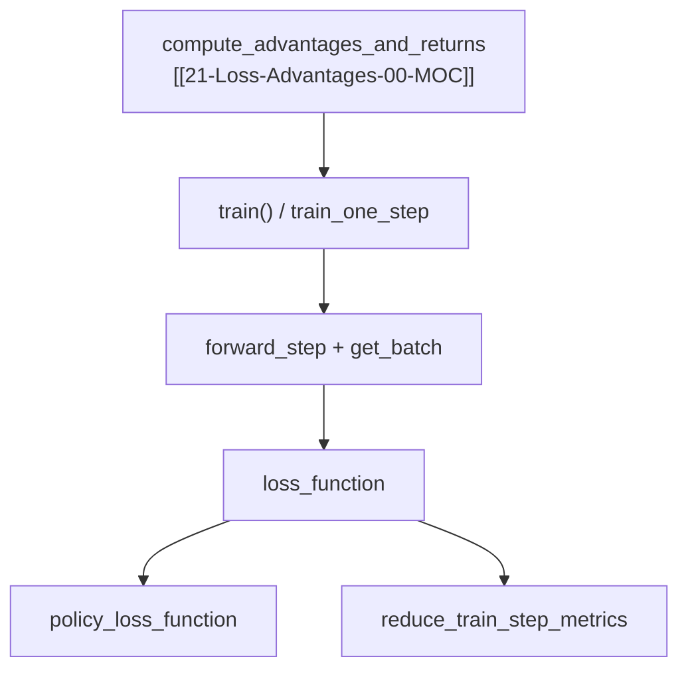

# Loss · Policy · 数据流与交互

---

## 1. Actor 训练一步中的 loss 调用栈



---

## 2. policy 路径 batch 字段依赖

| 阶段 | 必需字段 | 可选字段 |
|------|----------|----------|
| logprob 重算 | `unconcat_tokens`, `total_lengths`, `response_lengths` | top-p replay 字段 |
| PPO ratio | `advantages`, `log_probs` 或 `rollout_log_probs` | — |
| ref KL | `ref_log_probs` | `use_unbiased_kl` → IS ratio |
| TIS | `rollout_log_probs`, `log_probs` | `custom_tis_function_path` |
| entropy | `entropy_coef != 0` | — |

---

## 3. critic 路径

**Explain：** `train_critic` 设置 `loss_type=value_loss`；`batch["values"]` 来自上一轮 `forward_only(get_values)`，`returns` 来自 advantage 阶段。

---

## 4. 指标回传 Megatron → W&B

**Explain：** 每个 micro-batch 的 `logging_dict["values"]` 在 `train_one_step` 累加，最后 `reduce_train_step_metrics`（`cp_utils`）做 DP*CP all-reduce 与 per-rollout / per-token 除法。

**Code：**

```python
## 来源：slime/backends/megatron_utils/cp_utils.py L127-L168（reduce_train_step_metrics 核心）
    for x in losses_reduced:
        values = x["values"] if values is None else values + x["values"]
    dist.all_reduce(values, group=dp_with_cp_group)
    if calculate_per_token_loss:
        num_samples_or_tokens = values[0]
        cp_factor = cp_size
    else:
        num_samples_or_tokens = step_global_batch_size
        cp_factor = 1
    return {key: value * cp_factor / num_samples_or_tokens for key, value in zip(keys, values[1:], strict=False)}
```

---

## 5. recompute_loss_function

**Explain：** `checkpoint(func, ...)` 对 loss 重算以省 activation；与 policy 逻辑相同，仅 autograd 图不同。

---

## 6. custom 扩展点

| 参数 | 替换对象 |
|------|----------|
| `custom_loss_function_path` | 整个 loss（`loss_type=custom_loss`） |
| `custom_tis_function_path` | TIS 权重 |
| `custom_pg_loss_reducer_function_path` | pg_loss 聚合方式 |

---

## 7. 与 rollout 引擎的 logprob 对齐

**Explain：** `train_rollout_logprob_abs_diff` 指标比较 train 与 rollout logprob；`use_rollout_logprobs` 时 old policy 直接来自 rollout，diff 应更小。
