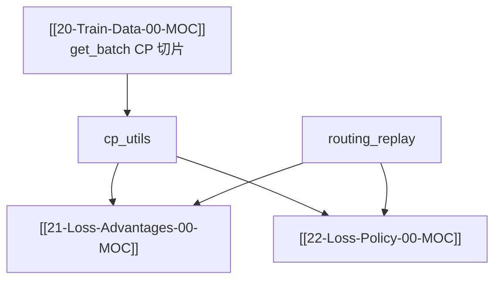

# CP · Routing Replay · 专题概述

> 源码：`slime/backends/megatron_utils/cp_utils.py`、`slime/utils/routing_replay.py`

---

## 本专题目标

1. 说明 Context Parallel **zigzag** 切分：`slice_with_cp` / `get_logits_and_tokens_offset_with_cp`
2. 解释 `all_gather_with_cp` 如何把 CP-local logprob 还原为 full response
3. 理解 `get_sum_of_sample_mean` 在 CP 下如何用 chunked loss_mask 归约
4. 说明 MoE **routing replay** 四阶段：`record` / `replay_forward` / `replay_backward` / `fallthrough`
5. 知道 `use_rollout_routing_replay` 与 rollout 侧 `rollout_routed_experts` 的数据依赖

---

## 文档导航

| 文档 | 内容 |
|------|------|
| [[23-CP-RoutingReplay-01-核心概念]] | CP 布局、replay 状态机 |
| [[23-CP-RoutingReplay-02-源码走读]] | cp_utils + routing_replay 精读 |
| [[23-CP-RoutingReplay-03-数据流与交互]] | actor / model / megatron patch |
| [[23-CP-RoutingReplay-04-关键问题]] | CI KL check、DSA allgather |
| [[23-CP-RoutingReplay-05-checkpoint]] | 验收清单 |

---

## 源码范围

| 优先级 | 符号 | 本专题覆盖 |
|--------|------|---------|
| P0 | `slice_with_cp` | ✅ |
| P0 | `get_logits_and_tokens_offset_with_cp` | ✅ |
| P0 | `all_gather_with_cp` | ✅ |
| P0 | `get_sum_of_sample_mean` | ✅ |
| P0 | `reduce_train_step_metrics` | ✅ |
| P0 | `RoutingReplay` + `get_routing_replay_compute_topk` | ✅ |
| P1 | `gather_and_reduce_log_dict` | 02 |
| 依赖 | `loss.py` allgather_cp trick | [[22-Loss-Policy-02-源码走读]] |

---

## 入口：Actor 如何切换 ROUTING_REPLAY_STAGE

**Code：**

```python
## 来源：actor.py L436-L495（节选）
        if self.args.use_rollout_routing_replay:
            self.fill_routing_replay(data_iterator, num_microbatches, rollout_data)
        ...
                    if self.args.use_routing_replay:
                        if self.args.use_rollout_routing_replay:
                            os.environ["ROUTING_REPLAY_STAGE"] = "replay_forward"
                        else:
                            os.environ["ROUTING_REPLAY_STAGE"] = "record"
        ...
                    if self.args.use_rollout_routing_replay:
                        RoutingReplay.clear_all_forward()
```

**Comment：** ref/teacher forward 用 `fallthrough`（正常 routing）；actor logprob 用 rollout 存的 expert indices。

---

## 衔接关系



---

## 相关测试

- `tests/test_loss_cp_invariance.py`
- CI R3：`use_rollout_routing_replay` 时 actor/ref logprob 不要求 bit-match
