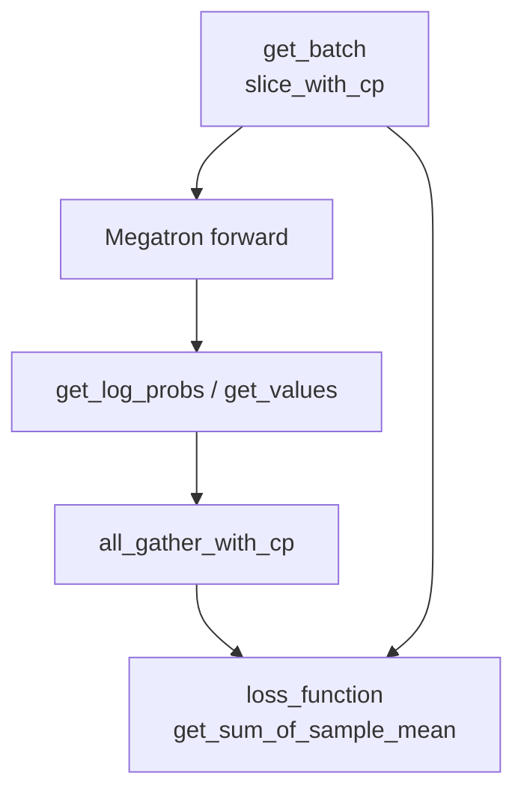
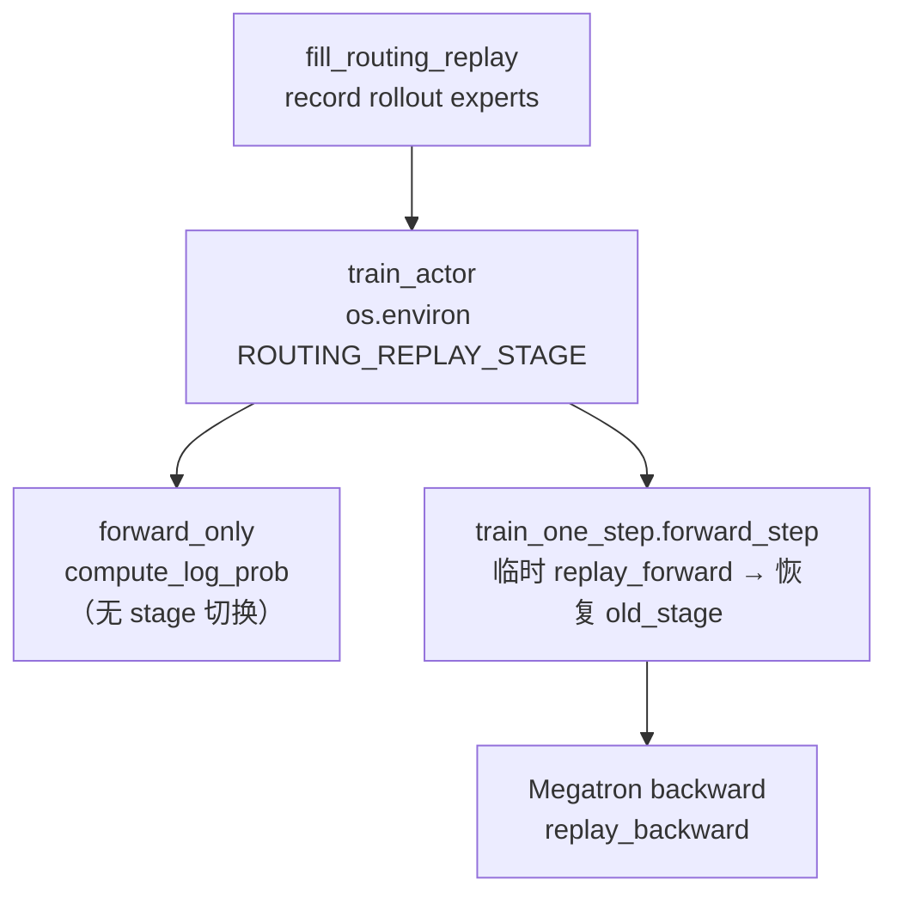

# CP · Routing Replay · 数据流与交互

---

## 1. CP 在训练链路中的位置



---

## 2. Ray 注入 ENABLE_ROUTING_REPLAY

**Explain：** `RayTrainGroup` 启动 actor 时若 `use_routing_replay`，设置 `ENABLE_ROUTING_REPLAY=1`。

**Code：**

```python
## 来源：ray/actor_group.py L88
            env_vars["ENABLE_ROUTING_REPLAY"] = "1"
```

---

## 3. train_actor 阶段表

| 阶段 | ROUTING_REPLAY_STAGE | 入口 | 模型 |
|------|---------------------|------|------|
| 预填 indices | — | `fill_routing_replay` | actor |
| ref logprob | fallthrough | `forward_only`（actor 设 env） | ref |
| teacher logprob | fallthrough | `forward_only` | teacher |
| actor logprob (rollout replay) | replay_forward | `forward_only` | actor |
| actor logprob (train record) | record | `forward_only` | actor |
| policy forward | **临时** `replay_forward` | `train_one_step` 闭包 | actor |
| policy backward | `replay_backward` | Megatron 1F1B backward | actor |

**Explain：** `use_rollout_routing_replay` 时 forward 用 rollout 存的 experts；backward 仍 replay 同一序列（`pop_backward`）。`forward_only` 本身不改 stage；policy train 的 forward/backward 分工在 `model.py` `train_one_step` 闭包内完成（见 [[23-CP-RoutingReplay-02-源码走读]] §20）。



---

## 4. fill_routing_replay

**Explain：** 从 `rollout_data["rollout_routed_experts"]` 预填各层 `RoutingReplay.top_indices_list`，跳过 record 阶段与 rollout 对齐。与 `get_batch` 相同走 `slice_with_cp` + TP/SP 切分。

**Code：**

```python
## 来源：actor.py L284-L355（节选）
    def fill_routing_replay(self, data_iterator, num_microbatches, rollout_data):
        if "rollout_routed_experts" not in rollout_data:
            raise ValueError("rollout_routed_experts is required ...")
        ...
            rollout_routed_experts = [slice_with_cp(r, pad_func) for r in rollout_routed_experts]
            rollout_routed_experts = torch.cat(rollout_routed_experts, dim=0)
            ...
            for layer_id in range(offset, offset + num_layers_to_build):
                if layer_id % config.moe_layer_freq != 0:
                    continue
                layer_routed_experts = rollout_routed_experts[:, layer_id]
                RoutingReplay.all_routing_replays[routing_replay_offset].record(layer_routed_experts)
                routing_replay_offset += 1
        del rollout_data["rollout_routed_experts"]
```

**Comment：** `record()` 在此 **预填** indices，forward 阶段设 `replay_forward` 直接 pop，无需 `old_compute_topk`。

---

## 5. model.py 与 forward_only 的分工

**Explain：** 「eval 路径」指 `compute_log_prob` → `forward_only`（[[18-Model-Init-02-源码走读]] §7）：`model.eval()` + `forward_only=True`，**不在** `model.py` 内改 `ROUTING_REPLAY_STAGE`，stage 完全由 §3 的 `train_actor` 在调用前写入。Policy train 的 stage 切换在 `train_one_step` 闭包（[[23-CP-RoutingReplay-02-源码走读]] §20）。

---

## 6. CI kl checker 与 routing replay

**Explain：** `log_rollout_data` 在 `rollout_id==0` 比较 actor/ref logprob；若 `use_rollout_routing_replay`，**跳过** bit-match（ref 用 fallthrough，actor 用 replay）。

**Code：**

```python
## 来源：data.py L350-L354
            if (
                rollout_id == 0
                and not getattr(args, "use_rollout_routing_replay", False)
                ...
            ):
                assert abs(reduced_log_dict["rollout/log_probs"] - reduced_log_dict["rollout/ref_log_probs"]) < 1e-8
```

---

## 7. Rollout 侧

**Explain：** `sglang_rollout.py` / `sglang_engine.py` 在 `use_rollout_routing_replay` 时收集 routed experts 写入 sample metadata，最终进入 `RolloutBatch`。

---

## 8. 衔接

- [[20-Train-Data-03-数据流与交互]] — CP batch 构造
- [[21-Loss-Advantages-03-数据流与交互]] — GAE all_gather
- [[22-Loss-Policy-03-数据流与交互]] — GSPO/OPSM/metrics
