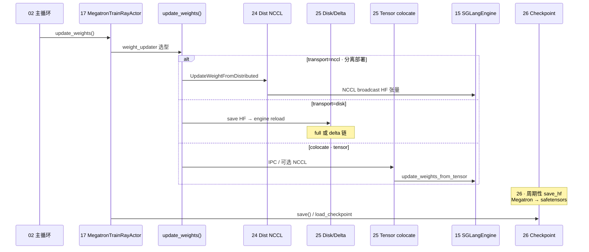

# 阶段 V · 权重同步（train → SGLangEngine）

> **你只需阅读本目录，不必打开 `slime/` 源码。**
> 内嵌代码对应 slime Git commit `22cdc6e1`。
> SGLang 交叉对照：[[12-ModelLoader-00-MOC]]、[[32-CheckpointEngine-00-MOC]]、[[15-SGLang-Engine-00-MOC]]。

---

## 本阶段解决什么问题

阶段 IV 讲清了「Megatron 如何完成一次 train step」。阶段 V 回答：**训练后的 actor 权重如何推送到 SGLang Rollout 引擎——nccl / disk / delta / tensor（colocate）四条路径各适用什么场景？**

三个专题覆盖权重同步与 checkpoint 全链路：

| 模块 | 角色 | 一句话 |
|------|------|--------|
| [[24-WeightSync-Dist-00-MOC|24 WeightSync-Dist]] | NCCL 广播 | `UpdateWeightFromDistributed`、PP source → engine GPU |
| [[25-WeightSync-Disk-00-MOC|25 WeightSync-Disk]] | 磁盘 / tensor | full disk、delta disk、colocate IPC tensor |
| [[26-Checkpoint-M2HF-00-MOC|26 Checkpoint-M2HF]] | 存取与转换 | `load_checkpoint`、`save_hf`、Megatron→HF 管线 |

---

## 端到端时序（阶段 V 验收图）

满足阶段 V 验收：「对比 nccl / disk / delta / tensor 四种权重同步路径的数据流」。

**Explain：** `update_weights` 在 **每个 train step 末尾**（或 `update_weights_interval` 间隔）执行；transport 由 `--update-weight-transport` 与 colocate 状态共同决定，与 [[25-WeightSync-Disk-00-MOC]] 的 delta/tensor 模式正交组合。

---

## 零基础一句话

**像「总部给分店换菜单」：** 24 是实时对讲机（NCCL 直传），25 是快递/full 或 delta 增量包，25-tensor 是同城闪送（colocate IPC），26 是存档与格式翻译（Megatron ↔ HF）。

---

## 推荐阅读顺序

严格按专题顺序 24 → 25 → 26。若时间紧，最低闭环：**24 → 25/01-核心概念**。

| 顺序 | 文档 | 必读理由 |
|------|------|----------|
| 1 | [[24-WeightSync-Dist-01-核心概念|24/01-核心概念]] | NCCL 组命名、PP source rank |
| 2 | [[24-WeightSync-Dist-02-源码走读|24/02-源码走读]] | `UpdateWeightFromDistributed` 主路径 |
| 3 | [[25-WeightSync-Disk-01-核心概念|25/01-核心概念]] | full / delta / tensor 模式矩阵 |
| 4 | [[25-WeightSync-Disk-04-关键问题|25/04-关键问题]] | delta 链与 colocate 分工 |
| 5 | [[26-Checkpoint-M2HF-02-源码走读|26/02-源码走读]] | `save_hf` 与 megatron_to_hf 管线 |

---

## 阶段衔接

| 方向 | 模块 | 衔接点 |
|------|------|--------|
| ← 上一阶段 | 17–23 训练后端 | train 完成 → `update_weights` |
| → 下一阶段 | 27–28 高级特性 | Agent / customization 不影响 sync 主路径 |
| → Rollout | 15 SGLang-Engine | engine `init_weights_update_group` / reload |
| → 启动工具 | 05 Tools-DataPrep | HF ↔ torch_dist 与 `--load` / `--ref-load` |
| → SGLang 对照 | [[32-CheckpointEngine-00-MOC]] | SGLang 侧 checkpoint 热更新 |

---

## 验证建议（零基础可试）

1. **transport 矩阵：** 对照 [[25-WeightSync-Disk-01-核心概念]]，列出 colocate + nccl vs 分离 + disk 的组合。
2. **delta 约束：** 确认 `--update-weight-mode=delta` 必须 `--update-weight-transport=disk` 的原因（见 [[25-WeightSync-Disk-04-关键问题]]）。
3. **save 路径：** 追踪 [[26-Checkpoint-M2HF-03-数据流与交互]] 中 `--save-hf` 产出目录结构与 SGLang `--model-path` 的对应关系。

---

## 模块导航

| 模块 | 目录 | 状态 |
|------|------|------|
| 24 | [[24-WeightSync-Dist-00-MOC|WeightSync-Dist]] | ✅ |
| 25 | [[25-WeightSync-Disk-00-MOC|WeightSync-Disk]] | ✅ |
| 26 | [[26-Checkpoint-M2HF-00-MOC|Checkpoint-M2HF]] | ✅ |

← [[04-训练后端-00-MOC|训练后端]] · → [[06-高级特性-00-MOC|阶段 VI：高级特性]]
