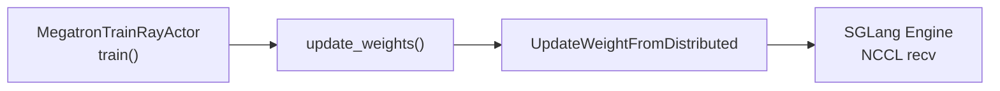

# NCCL 分布式权重同步（WeightSync-Dist）

> **阶段 V · 权重同步** | 状态：已完成 | Git：`22cdc6e1`  
> **源码范围：** `actor.py`（`update_weights`）、`update_weight/common.py`、`update_weight_from_distributed.py`、`hf_weight_iterator_direct.py`

---

## 本模块在架构中的位置

Megatron 训练完成后，Actor 必须把最新权重推送到 SGLang Rollout 引擎。当 `--update-weight-transport=nccl` 且非 colocate 时，Slime 选用 **UpdateWeightFromDistributed**：训练侧 PP source rank 通过 NCCL 组 `slime-pp_{pp_rank}` 向各引擎 GPU broadcast HF 格式张量。



---

## 零基础一句话

**像快递分拣中心：** 训练集群先把各卡上的「半张」权重拼成完整 HF 张量（TP/EP all-gather + convert_to_hf），再由 rank 0 通过 NCCL 广播给所有推理 GPU。

---

## 用户场景

**Persona：** RL 工程师小陈在 8 卡训练 + 4 卡 SGLang 推理的分离部署中，需要理解为何只有 PP source（DP=0 且 TP=0）发起 broadcast，以及 `--update-weight-buffer-size` 如何控制单次 NCCL 传输粒度。

---

## 六件套阅读顺序

| 顺序 | 文件 | 一句话说明 |
|------|------|------------|
| 01 | [[24-WeightSync-Dist-01-核心概念]] | NCCL 路径选型、并行维度、HF 转换 |
| 02 | [[24-WeightSync-Dist-02-源码走读]] | actor → common → distributed 调用链 |
| 03 | [[24-WeightSync-Dist-03-数据流与交互]] | NCCL 组网、Ray 锁、双通道 metadata |
| 04 | [[24-WeightSync-Dist-04-关键问题]] | NCCL vs disk、MoE EP、量化后处理 |
| ✓ | [[24-WeightSync-Dist-05-checkpoint]] | 验收清单 |

---

## 核心源码锚点

**Explain：** `MegatronTrainRayActor.init` 在非 colocate、full 模式、nccl transport 下实例化 `UpdateWeightFromDistributed`；主循环每轮 `update_weights()` 编排引擎连接、暂停生成、分桶广播、恢复生成。

**Code：**

```python
# 来源：slime/backends/megatron_utils/actor.py L154-L161
            assert self.args.update_weight_mode == "full"
            if self.args.update_weight_transport == "disk":
                update_weight_cls = UpdateWeightFromDisk
            else:
                assert (
                    self.args.update_weight_mode == "full" and self.args.update_weight_transport == "nccl"
                ), f"unsupported weight sync mode/transport: {self.args.update_weight_mode!r}/{self.args.update_weight_transport!r}"
                update_weight_cls = UpdateWeightFromDistributed
```

**Comment：**

- colocate 走 `UpdateWeightFromTensor`（CUDA IPC，见批次 25）
- delta 模式强制 disk transport（见 [[25-WeightSync-Disk-00-MOC]]）
- `weight_updater` 在 init 创建，`update_weights()` 每 rollout 调用

---

## 关键 CLI

| 参数 | 作用 |
|------|------|
| `--update-weight-transport nccl` | 启用本批次路径 |
| `--update-weight-buffer-size` | 单次 broadcast 字节上限（默认见 arguments） |
| `--megatron-to-hf-mode raw\|bridge` | HF 转换策略；`raw` 时 `HfWeightIteratorDirect` 用于 checkpoint 等 |
| `--colocate` | **禁用** NCCL 路径，改走 tensor IPC |

---

## 验证建议

1. **日志：** 观察 `[slime-pp_0] Update weights` tqdm 进度与 bucket 数。
2. **CI：** `--ci-test` 时 actor 随机抽查 engine `weight_version` 与 updater 一致。
3. **对比：** 同模型切换 `--update-weight-transport disk` 对比延迟（批次 25）。

---

## 阅读路径

← [[17-Megatron-Actor-Init-00-MOC]]（Actor 初始化） · [[15-SGLang-Engine-00-MOC]]（引擎侧 recv）  
→ [[25-WeightSync-Disk-00-MOC]]（disk / delta / colocate 路径）
