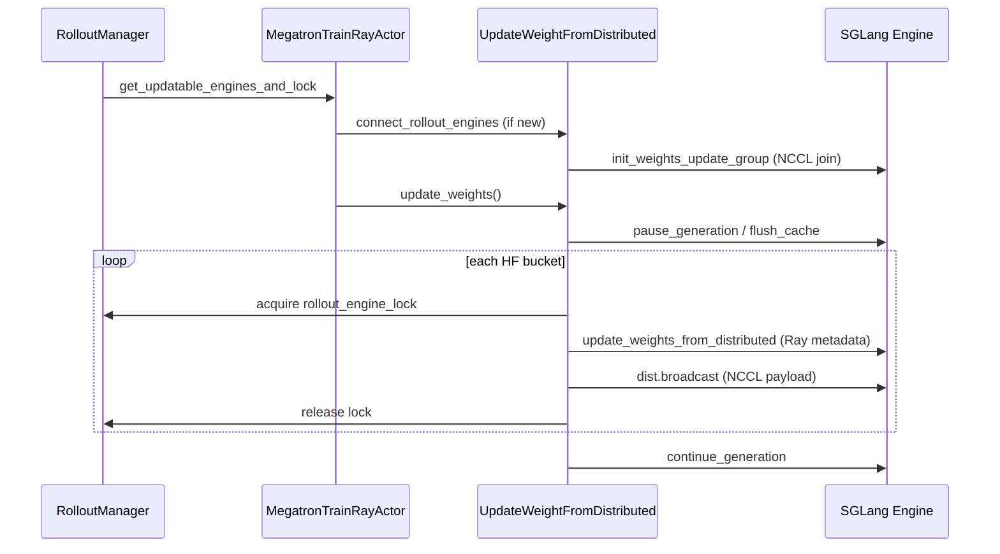
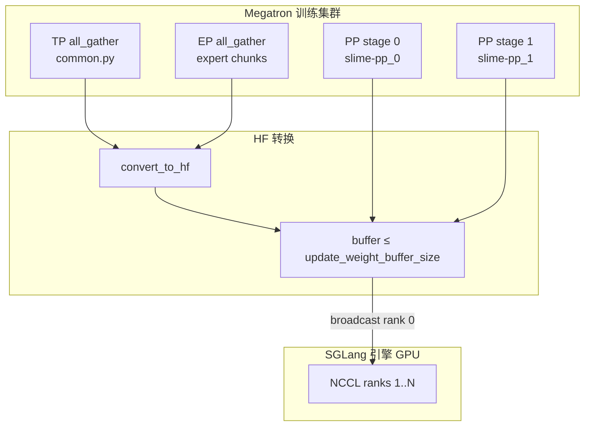
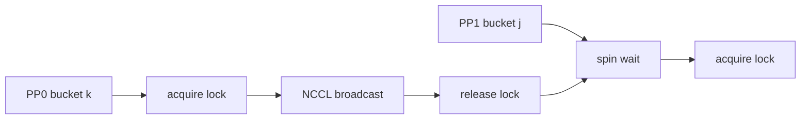

# NCCL 权重同步 · 数据流与交互

## 1. 闭环中的位置



**Explain：** 控制面（pause/lock/Ray RPC）与数据面（NCCL broadcast）分离；同一 bucket 内 metadata 必须先于 broadcast 到达引擎，否则 recv 会 hang。

---

## 2. 训练侧并行维度参与关系



**Explain：**

- **TP：** 所有 rank 参与 `all_gather_param`；仅 PP source 做 HF convert 与 broadcast
- **PP：** 每个 stage 独立 NCCL 组，引擎按 PP 分片接收对应层
- **EP：** expert 权重第二趟单独 EP gather，避免与非 expert 混桶导致 oversized broadcast

---

## 3. NCCL 组 rank 布局

**Explain：** 训练侧 broadcast source 固定 **rank 0**。引擎 `i` 的 GPU 占据 `[cumulative[i]+1, cumulative[i]+engine_gpu_counts[i]]`。

**Code：**

```python
# 来源：update_weight/update_weight_from_distributed.py L290-L304
    cumulative = [0]
    for c in engine_gpu_counts:
        cumulative.append(cumulative[-1] + c)
    refs = [
        engine.init_weights_update_group.remote(
            master_address=master_address,
            master_port=master_port,
            rank_offset=cumulative[i] + 1,
            world_size=world_size,
            group_name=group_name,
            backend="nccl",
        )
        for i, engine in enumerate(rollout_engines)
    ]
```

**ASCII 示例（2 引擎，各 2 GPU）：**

```
rank 0: Megatron PP source (broadcast src)
rank 1-2: Engine 0 TP group
rank 3-4: Engine 1 TP group
world_size = 5
```

---

## 4. 双通道：Ray metadata + NCCL tensor

| 通道 | 内容 | 接口 |
|------|------|------|
| Ray RPC | names, dtypes, shapes, group_name, weight_version | `SGLangEngine.update_weights_from_distributed` |
| NCCL | 实际 tensor payload | `dist.broadcast(param.data, 0, group=group)` |

**Explain：** 引擎 HTTP handler 按 metadata 预分配 recv buffer，再在相同 `group_name` 的 NCCL group 上 recv。`weight_version` 字符串化传递，供引擎侧版本校验与 metrics。

**Code：**

```python
# 来源：slime/backends/sglang_utils/sglang_engine.py L464-L488
    def update_weights_from_distributed(
        self,
        names,
        dtypes,
        shapes,
        group_name,
        flush_cache=False,
        weight_version: str | None = None,
        load_format: str | None = None,
    ):
        payload = {
            "names": names,
            "dtypes": [str(dtype).replace("torch.", "") for dtype in dtypes],
            "shapes": shapes,
            "group_name": group_name,
            "flush_cache": flush_cache,
            ...
        }
        return self._make_request("update_weights_from_distributed", payload)
```

**Comment：** SGLang 侧实现见 [[15-SGLang-Engine-03-数据流与交互]]（权重热更新 API）。

---

## 5. rollout_engine_lock 时序

**Explain：** 多 PP stage 可能并发完成 convert；若同时 broadcast 到共享引擎 NCCL group，引擎 recv 顺序错乱 → 死锁。RolloutManager 提供的 Ray lock 序列化 bucket 级别的 `update_weights_from_distributed`。



---

## 6. HfWeightIteratorDirect 与 NCCL 路径的数据流对比

| 阶段 | UpdateWeightFromDistributed | HfWeightIteratorDirect |
|------|----------------------------|------------------------|
| 参数来源 |  live `self.model` | `megatron_local_weights` dict |
| PP 补齐 | 仅 all_gather TP（PP source 持有本地层） | `broadcast` from `ParamInfo.src_rank` |
| EP 补齐 | `_ep_gather_and_convert` 批量 | `_get_megatron_full_params` 内 EP broadcast |
| TP 补齐 | `all_gather_param` 同步 | `all_gather_params_async` |
| 输出 | NCCL broadcast 到引擎 | `yield hf_named_tensors`（写盘 / 其他消费者） |

**Explain：** 两者共享 `named_params_and_buffers` 与 `convert_to_hf`，分桶阈值均来自 `--update-weight-buffer-size`。

**Code：**

```python
# 来源：update_weight/hf_weight_iterator_direct.py L66-L77
    if pp_size > 1:
        handles = []
        for info, param in zip(megatron_local_param_infos, params, strict=False):
            if info.src_rank in dist.get_process_group_ranks(mpu.get_pipeline_model_parallel_group()):
                handles.append(
                    torch.distributed.broadcast(
                        param, src=info.src_rank, group=mpu.get_pipeline_model_parallel_group(), async_op=True
                    )
                )
        for handle in handles:
            handle.wait()
```

---

## 7. offload_train 交互

**Explain：** critic + offload 分离部署时，`update_weights` 前 `wake_up()` 恢复 Megatron process group 并 reconnect 引擎 NCCL；完成后 `sleep()` 再次 destroy groups。`torch_memory_saver.disable()` 包裹实际 broadcast，避免 weight tensor 被错误 offload。

**Code：**

```python
# 来源：slime/backends/megatron_utils/actor.py L601-L611
        reconnect_rollout_engines = self.args.offload_train and self.args.use_critic and not self.args.colocate
        if reconnect_rollout_engines:
            self.wake_up()
        elif self.args.offload_train:
            reload_process_groups()
```

---

## 8. 量化模型额外往返

**Explain：** `quantization_config.quant_method == "compressed-tensors"` 时，load 前 `restore_weights_before_load=True`，load 后 `post_process_quantization=True`，各触发一轮 `post_process_weights` Ray 调用。

**Code：**

```python
# 来源：update_weight/update_weight_from_distributed.py L358-L374
def post_process_weights(
    restore_weights_before_load: bool,
    post_process_quantization: bool,
    rollout_engines: Sequence[ActorHandle],
):
    ray.get([
        engine.post_process_weights.remote(
            restore_weights_before_load=restore_weights_before_load,
            post_process_quantization=post_process_quantization,
        )
        for engine in rollout_engines
    ])
```

---

## 9. pop_metrics 回传训练日志

**Explain：** `UpdateWeightFromDistributed` 维护 `update_weight_metrics` dict；`train_actor` 末尾 `log_perf_data(..., extra_metrics=self.weight_updater.pop_metrics())`  drained 到 rollout step 日志。

**Code：**

```python
# 来源：update_weight/update_weight_from_distributed.py L50-L55
    def pop_metrics(self) -> dict[str, float]:
        out, self.update_weight_metrics = self.update_weight_metrics, {}
        return out
```

**Comment：** 子类可在 `_on_chunk` 或 broadcast 路径写入 timing 类 metrics。
