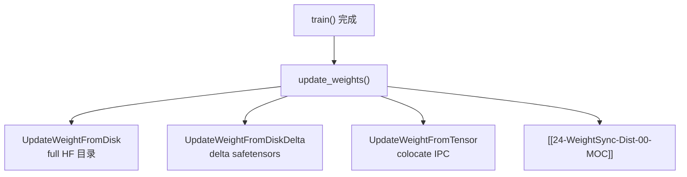

# 磁盘权重同步 · 专题概述

> 源码：`update_weight_from_disk.py`、`update_weight_from_disk_delta.py`、`update_weight_from_tensor.py`、`utils/disk_delta.py`

---

## 本专题目标

1. 对比三种 transport：**full disk**、**delta disk**、**tensor（colocate IPC + 可选 NCCL）**
2. 说明 `UpdateWeightFromDisk.update_weights` 的 pause → save HF → engine reload 流程
3. 解释 delta 链：`xor`/`overwrite` 编码、zstd 压缩、checksum、`apply_deltas`
4. 理解 `UpdateWeightFromTensor` 与 [[24-WeightSync-Dist-00-MOC]] 的分工（colocate vs 分离）
5. 知道 `--update-weight-mode=delta` 必须 `--update-weight-transport=disk`

---

## 文档导航

| 文档 | 内容 |
|------|------|
| [[25-WeightSync-Disk-01-核心概念]] | 模式矩阵、delta 版本链 |
| [[25-WeightSync-Disk-02-源码走读]] | 三 updater + disk_delta |
| [[25-WeightSync-Disk-03-数据流与交互]] | actor 选型、engine reload |
| [[25-WeightSync-Disk-04-关键问题]] | colocate 限制、密度 metric |
| [[25-WeightSync-Disk-05-checkpoint]] | 验收清单 |

---

## 源码范围

| 类 / 模块 | 场景 |
|-----------|------|
| `UpdateWeightFromDisk` | full + disk transport |
| `UpdateWeightFromDiskDelta` | delta + disk |
| `UpdateWeightFromTensor` | colocate full（IPC） |
| `disk_delta.apply_deltas` | 引擎侧本地 checkpoint 增量 |

---

## 入口：actor 如何选择 updater

**Code：**

```python
## 来源：actor.py L140-L161
        if self.args.colocate:
            assert self.args.update_weight_mode == "full"
            update_weight_cls = UpdateWeightFromTensor
        elif self.args.update_weight_mode == "delta":
            assert self.args.update_weight_transport == "disk"
            update_weight_cls = UpdateWeightFromDiskDelta
        else:
            if self.args.update_weight_transport == "disk":
                update_weight_cls = UpdateWeightFromDisk
            else:
                update_weight_cls = UpdateWeightFromDistributed
```

---

## 衔接关系



---

## 相关文档

- Slime docs: `docs/en/advanced/delta-weight-sync.md`
- [[26-Checkpoint-M2HF-00-MOC]] — `save_hf_model_to_path` 共用
