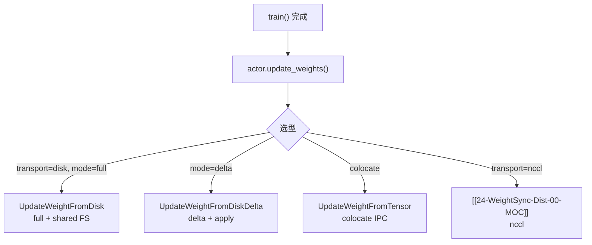
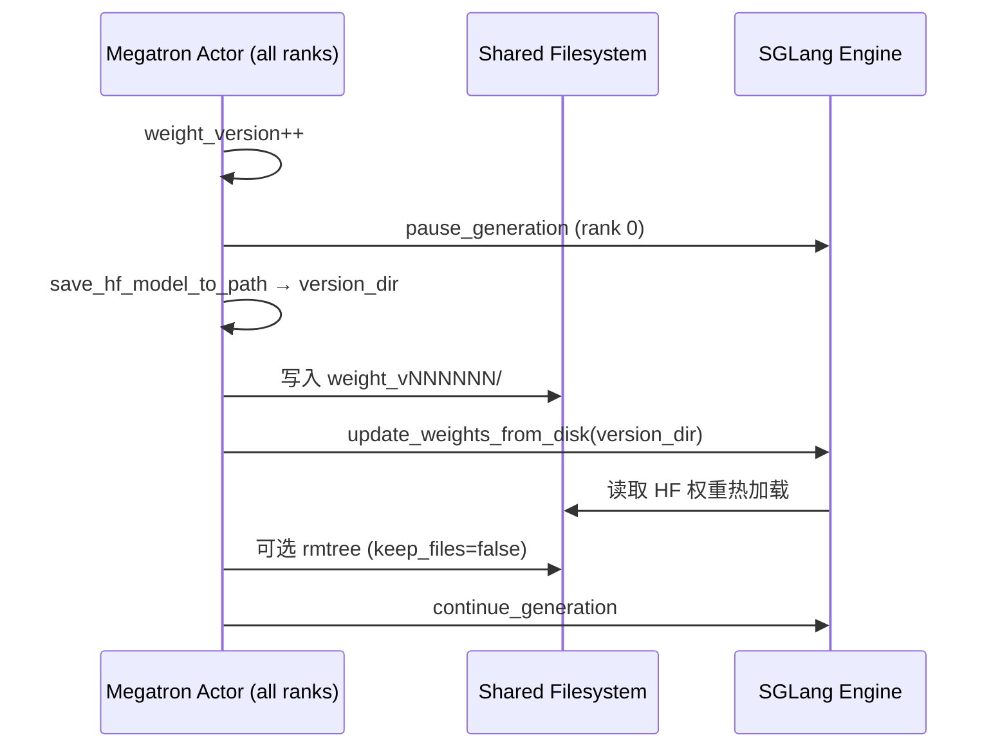
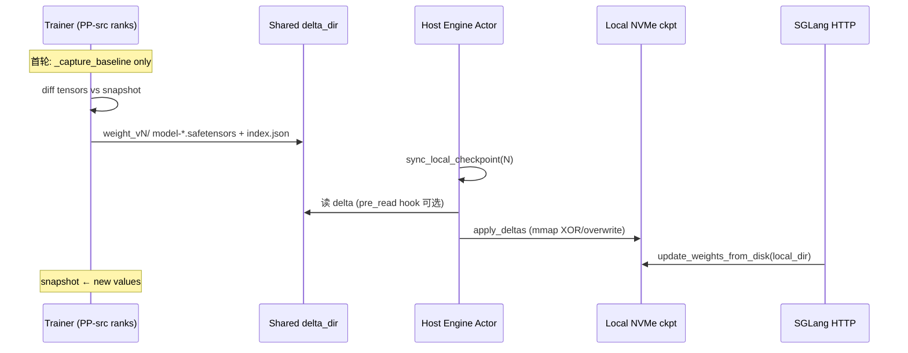
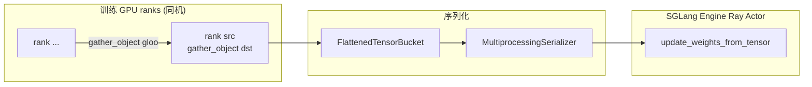

# 磁盘权重同步 · 数据流与交互

---

## 1. 闭环中的三条 transport 分支



---

## 2. Full Disk 时序



**Explain：** 控制面（pause/continue）经 Ray；数据面经共享 FS。所有训练 rank 参与 save collective，仅 rank 0 触发 engine RPC。

**Code：**

```python
## 来源：slime/backends/megatron_utils/update_weight/update_weight_from_disk.py L76-L97
        save_hf_model_to_path(self.args, version_dir, self.model, ...)
        dist.barrier(group=get_gloo_group())
        if dist.get_rank() == 0:
            refs = [engine.update_weights_from_disk.remote(model_path=str(version_dir), ...) for engine in self.rollout_engines]
            ray.get(refs)
```

---

## 3. Delta Disk 时序



**Explain：** Trainer 与 Host 职责分离——trainer **publish**，各 host **apply** 自己的 `local_checkpoint_dir`，引擎 reload 始终走 vanilla disk API。

**Code：**

```python
## 来源：slime/backends/megatron_utils/update_weight/update_weight_from_disk_delta.py L174-L185
        if dist.get_rank() == 0:
            ray.get([actor.sync_local_checkpoint.remote(self.weight_version) for actor in self.all_engine_actors])
            ray.get([
                engine.update_weights_from_disk.remote(
                    model_path=self.args.update_weight_local_checkpoint_dir,
                    weight_version=str(self.weight_version),
                )
                for engine in self.rollout_engines
            ])
```

---

## 4. Colocate IPC 数据面



**Explain：** 每个 colocate engine 对应一段连续 GPU rank 区间；`ipc_gather_src` 为该区间最小 rank，收集同 engine 所有 rank 的 serialized bucket 后一次 Ray call。

**Code：**

```python
## 来源：slime/backends/megatron_utils/update_weight/update_weight_from_tensor.py L255-L287
    dist.gather_object(serialized_tensors, object_gather_list=serialized_named_tensors, dst=ipc_gather_src, group=ipc_gather_group)
    if dist.get_rank() == ipc_gather_src:
        refs.append(ipc_engine.update_weights_from_tensor.remote(
            serialized_named_tensors=serialized_tensors_for_dtype,
            load_format="flattened_bucket",
            weight_version=str(weight_version),
        ))
```

---

## 5. 混合 colocate + 远端 NCCL

**Explain：** `UpdateWeightFromTensor.connect_rollout_engines` 按 GPU offset 切分：落在 actor 节点内的 engine 走 IPC；超出部分保留 `distributed_rollout_engines` 列表，每 chunk 额外调 `update_weights_from_distributed`。

**Code：**

```python
## 来源：slime/backends/megatron_utils/update_weight/update_weight_from_tensor.py L94-L117
        self.use_distribute = len(rollout_engines) > colocate_engine_nums
        if self.use_distribute:
            self.rollout_engines = rollout_engines[:colocate_engine_nums]
            self.distributed_rollout_engines = rollout_engines[colocate_engine_nums:]
            self._model_update_groups = connect_rollout_engines_from_distributed(...)
```

---

## 6. RolloutManager 与 engine 列表

**Explain：** `update_weights()` 仍经 `get_updatable_engines_and_lock`；delta 路径额外需要 `all_engine_actors`（每 host 一个）供 `sync_local_checkpoint`。disk full 不需要 NCCL lock 争用，但 pause/continue 时序与 NCCL 路径一致。

---

## 7. 对象存储 hook 插入点

| Hook | 调用时机 | 典型用途 |
|------|----------|----------|
| `custom_delta_pre_push_path` | baseline 清空后 / 每版本 write 后 | S3 commit、Lustre flush |
| `custom_delta_pre_read_path` | `sync_local_checkpoint` apply 前 | 刷新 mount 可见性 |

**Code：**

```python
## 来源：slime/backends/megatron_utils/update_weight/update_weight_from_disk_delta.py L108-L109, L171-L172
            if self._commit_hook is not None:
                self._commit_hook(self.args, self.delta_dir, list(self.rollout_engines))
        ...
        if self._commit_hook is not None:
            self._commit_hook(self.args, self._version_dir, list(self.rollout_engines))
```

---

## 8. Megatron Server 侧 disk reload

**Explain：** 非 Ray 托管的 external engine 可走 HTTP `/update_weights_from_disk`（`megatron_server.py`）；Slime 默认 SGLang engine 用 `_make_request` 等价路径。

---

## 9. 与 train 主循环的衔接

**Explain：** `train.py` / `train_async.py` 每 rollout 在 `actor_model.train(...)` 后调 `actor_model.update_weights()`；`pop_metrics()` 合并 `perf/update_weights_*` 到 step log。offload 路径用 `torch_memory_saver.disable()` 包裹 updater（与[[24-WeightSync-Dist-00-MOC]] 相同）。

**Code：**

```python
## 来源：slime/backends/megatron_utils/actor.py L583-L624（与 NCCL 共用入口）
    def update_weights(self) -> None:
        ...
        with torch_memory_saver.disable() if self.args.offload_train else nullcontext():
            self.weight_updater.update_weights()
```

---

## 10. 模块边界总结

| 组件 | 输入 | 输出 |
|------|------|------|
| `UpdateWeightFromDisk` | Megatron model | 共享 FS HF 目录 |
| `UpdateWeightFromDiskDelta` | Megatron model + snapshot | 共享 FS delta + metrics |
| `disk_delta.apply_deltas` | delta_root + target_version | 本地 checkpoint 就地更新 |
| `SGLangEngine.sync_local_checkpoint` | target_version | apply + 可选 pre_read |
| `UpdateWeightFromTensor` | HF chunks | IPC/NCCL → engine GPU |

---

## 衔接

← [[24-WeightSync-Dist-03-数据流与交互]]（NCCL 对照）  
→ [[26-Checkpoint-M2HF-03-数据流与交互]]（save_hf_model_to_path 共用）
