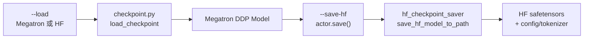

# Checkpoint 与 Megatron→HF 转换

> **阶段 V · 权重同步** | Git：`22cdc6e1`  
> **源码范围：** `checkpoint.py`、`megatron_to_hf/`、`hf_checkpoint_saver.py`

---

## 本模块在架构中的位置

训练 Actor 在 **加载** 与 **保存** 两个方向都要与 HuggingFace 格式打交道：启动时 `--load` 可能是 Megatron 原生 ckpt 或 HF 目录；周期性 `--save-hf` 要把 Megatron 分片权重转成 HF safetensors 供 SGLang / 外部工具消费。本专题覆盖 **checkpoint 路由** 与 **Megatron→HF 转换管线**。



---

## 零基础一句话

**像双语词典：** Megatron 内部用 TP/PP/EP 切分的参数名与张量布局，经 `convert_to_hf` 映射成 HuggingFace 命名；保存时要么走 **Bridge**（Megatron Bridge 一键导出），要么走 **raw**（Slime 自研分片 safetensors 写入）。

---

## 六件套阅读顺序

| 顺序 | 文件 | 一句话说明 |
|------|------|------------|
| 01 | [[26-Checkpoint-M2HF-01-核心概念]] | bridge vs raw、模型路由表、加载分支 |
| 02 | [[26-Checkpoint-M2HF-02-源码走读]] | load → convert → save 全链路 |
| 03 | [[26-Checkpoint-M2HF-03-数据流与交互]] | 与 update_weights、disk sync 的复用关系 |
| 04 | [[26-Checkpoint-M2HF-04-关键问题]] | 模式选型、大模型 ShardedTensor patch |
| ✓ | [[26-Checkpoint-M2HF-05-checkpoint]] | 验收清单 |

---

## 核心源码锚点

**Explain：** `load_checkpoint` 根据路径形态选择 Megatron 原生加载或 HF→Megatron Bridge 加载；`save_hf_model_to_path` 按 `--megatron-to-hf-mode` 分流。

**Code：**

```python
## 来源：slime/backends/megatron_utils/checkpoint.py L97-L120
def load_checkpoint(ddp_model, optimizer, opt_param_scheduler, checkpointing_context, skip_load_to_model_and_opt):
    args = get_args()
    load_path = args.load
    assert Path(load_path).exists() and _is_dir_nonempty(load_path), ...
    if _is_megatron_checkpoint(load_path):
        return _load_checkpoint_megatron(...)
    else:
        return _load_checkpoint_hf(ddp_model=ddp_model, optimizer=optimizer, args=args, load_path=load_path)
```

**Comment：**

- Megatron ckpt 判据：`latest_checkpointed_iteration.txt` 或目录名 `iter_XXXXXXX`
- HF 加载 **仅支持** `megatron_to_hf_mode == "bridge"`
- 保存 HF 时 raw 模式复用 `HfWeightIteratorDirect`（与[[24-WeightSync-Dist-00-MOC]] NCCL 同步同源）

---

## 关键 CLI

| 参数 | 作用 |
|------|------|
| `--load` | 加载路径（Megatron 或 HF 目录） |
| `--save-hf` | 周期性导出 HF 目录模板，如 `{rollout_id}` |
| `--hf-checkpoint` | HF config/tokenizer 模板目录（raw 保存必填） |
| `--megatron-to-hf-mode bridge\|raw` | 加载/保存 HF 的策略 |
| `--model-name` | raw 模式下覆盖 AutoConfig 推断的模型族 |

---

## 阅读路径

← [[25-WeightSync-Disk-00-MOC]]（disk 同步也调用 save_hf） · [[24-WeightSync-Dist-00-MOC]]（raw 迭代器）  
→ [[27-Agent-Trajectory-00-MOC]]（阶段 VI 高级特性）
