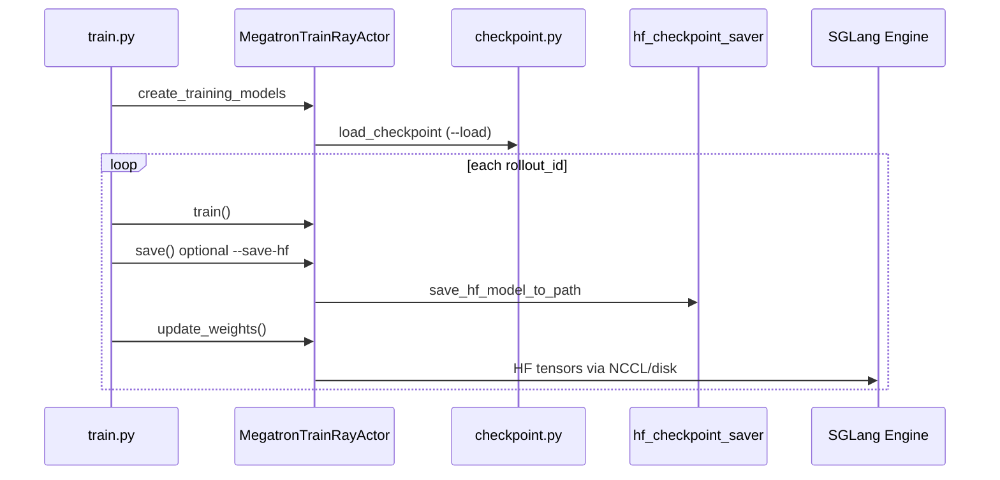
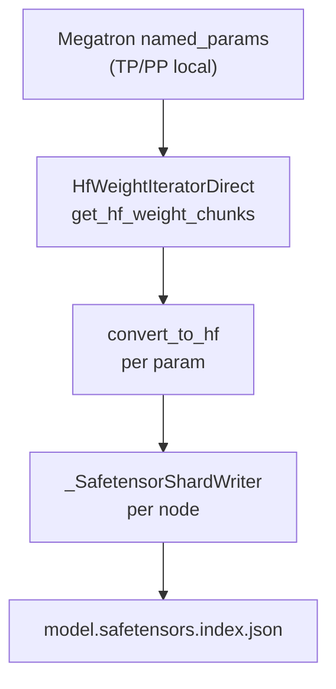

# Checkpoint M2HF · 数据流与交互

## 1. 训练闭环中的位置



**Explain：** checkpoint 模块不参与 rollout；但在 **启动加载** 与 **周期性 HF 导出** 两处与主循环交汇。`update_weights` 的 raw 模式与 `save_hf_model_direct_to_path` 共享 `HfWeightIteratorDirect` + `convert_to_hf`。

---

## 2. 加载数据流

**Explain：** 两条加载路径的输入输出对比。

| 路径 | 输入 | 输出 | 依赖 |
|------|------|------|------|
| Megatron | `iter_*` + dist ckpt | iteration, optimizer state | Megatron core |
| HF (bridge) | HF 目录 | iteration=0, 仅权重 | AutoBridge + plugins |

**Code：**

```python
## 来源：slime/backends/megatron_utils/model.py L994（调用点，语义等价）
iteration, _ = load_checkpoint(
    model, optimizer, opt_param_scheduler, checkpointing_context, skip_load_to_model_and_opt
)
```

**Comment：** `skip_load_to_model_and_opt` 用于 debug 或 partial init 场景。

---

## 3. 保存 raw 路径数据流



**Code：**

```python
## 来源：slime/backends/megatron_utils/hf_checkpoint_saver.py L107-L113
    hf_weight_iterator = HfWeightIteratorDirect(
        args=args,
        model=model,
        model_name=model_name,
        quantization_config=quantization_config,
    )
    megatron_local_weights = dict(named_params_and_buffers(args, model, convert_to_global_name=True))
```

**Comment：**

- `convert_to_global_name=True` 与 NCCL 同步一致，跨 PP/EP 全局命名
- chunk 大小受 `--update-weight-buffer-size` 等参数影响（见[[24-WeightSync-Dist-00-MOC]]）

---

## 4. 与 disk 权重同步的复用

**Explain：** `UpdateWeightFromDisk` 写临时 HF 目录后通知引擎 reload；内部调用同一 `save_hf_model_to_path`。

**Code：**

```python
## 来源：slime/backends/megatron_utils/update_weight/update_weight_from_disk.py（导入关系）
from ..hf_checkpoint_saver import save_hf_model_to_path
```

**Comment：** 改 converter 行为会同时影响 **存盘**、**disk sync**、**NCCL broadcast** 三条路径。

---

## 5. HF 资产复制边界

**Explain：** raw 保存只从 `--hf-checkpoint` 复制非权重文件（config、tokenizer、generation_config 等）。

**Code：**

```python
## 来源：slime/backends/megatron_utils/hf_checkpoint_saver.py L338-L347
def _copy_hf_assets(origin_hf_dir, output_dir):
    for item in origin.iterdir():
        if item.is_file():
            if _is_hf_weight_file(item):
                continue
            shutil.copy2(item, output_dir / item.name)
```

**Comment：** 权重全部由 Megatron 转换写入；避免 stale 权重与转换结果冲突。

---

## 6. 分布式 finalize

**Explain：** 各 writer rank 本地收集 shard 元数据，`all_gather_object` 后 rank 0 统一重命名并写 index。

**Code：**

```python
## 来源：slime/backends/megatron_utils/hf_checkpoint_saver.py L255-L265
def _finalize_distributed_shards(path, local_state):
    if dist.is_available() and dist.is_initialized():
        states = [None] * dist.get_world_size()
        dist.all_gather_object(states, local_state)
    else:
        states = [local_state]
    if _is_global_rank_zero():
        _finalize_shard_files(path, states)
```

**Comment：** 单卡 / 未 init dist 时退化为本地 finalize。

---

## 7. 上下游模块索引

| 上游 | 本模块 | 下游 |
|------|--------|------|
| [[17-Megatron-Actor-Init-00-MOC]] Actor init | load/save | [[24-WeightSync-Dist-00-MOC]] NCCL |
| [[05-Tools-DataPrep-00-MOC]] HF↔torch_dist | HF 目录格式 | [[25-WeightSync-Disk-00-MOC]] disk sync |
| `slime_plugins/megatron_bridge` | Bridge 扩展 | SGLang `--model-path` |
