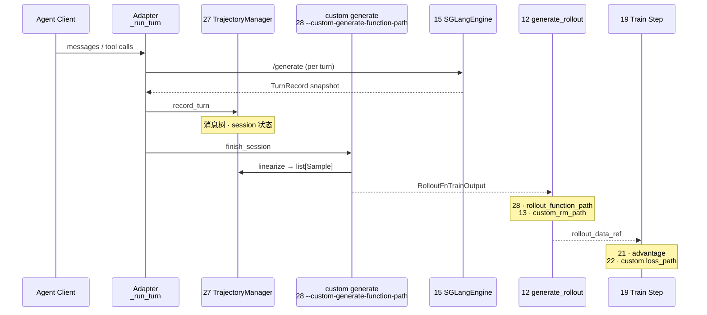

# 阶段 VI · 高级特性（Agent · Customization）

> **你只需阅读本目录，不必打开 `slime/` 源码。**
> 内嵌代码对应 slime Git commit `22cdc6e1`。

---

## 本阶段解决什么问题

阶段 I–V 讲清了 Slime **默认 RL 闭环**。阶段 VI 回答：**多轮 Agent 对话如何线性化为可训练的 `Sample`？业务逻辑如何通过 17 类 `--*-path` 扩展接口注入而不改核心代码？**

两个专题覆盖高级扩展全链路：

| 模块 | 角色 | 一句话 |
|------|------|--------|
| [[27-Agent-Trajectory-00-MOC|27 Agent-Trajectory]] | 轨迹线性化 | TrajectoryManager、TurnRecord → `list[Sample]` |
| [[28-Customization-00-MOC|28 Customization]] | 扩展接口 | 17 类 `--*-path`、`load_function`、Rollout/Train hooks |

---

## 端到端时序（阶段 VI 验收图）

满足阶段 VI 验收：「Agent 多轮对话经 TrajectoryManager 线性化为 Sample；能根据任务选用 `--custom-generate-function-path` 等扩展接口」。

**Explain：** Agentic RL 的核心矛盾是 **运行时 chat 结构 vs 训练时 token+loss_mask**；27 在中间维护 session 树并线性化，28 提供挂载点让 generate/RM/loss 均可替换。

---

## 零基础一句话

**像「多集连续剧剪辑成一条片」：** 27 把每集（turn）挂到总剧本（TrajectoryManager）上，最后剪成训练用的 Sample 片段；28 是「可换导演/编剧/评分员」的 17 个插槽。

---

## 推荐阅读顺序

严格按专题顺序 27 → 28。若时间紧，最低闭环：**28/01-核心概念 → 27/02-源码走读**。

| 顺序 | 文档 | 必读理由 |
|------|------|----------|
| 1 | [[28-Customization-01-核心概念|28/01-核心概念]] | 17 类接口总表与选型 |
| 2 | [[28-Customization-02-源码走读|28/02-源码走读]] | `load_function` 与 arguments 定义 |
| 3 | [[27-Agent-Trajectory-01-核心概念|27/01-核心概念]] | TurnRecord、linearize 术语 |
| 4 | [[27-Agent-Trajectory-02-源码走读|27/02-源码走读]] | TrajectoryManager 与 adapter 精读 |
| 5 | [[04-Arguments-TrainRollout-04-关键问题|04/04-关键问题]] | `*-path` 与 plugin_contracts 对照 |

---

## 阶段衔接

| 方向 | 模块 | 衔接点 |
|------|------|--------|
| ← 上一阶段 | 24–26 权重同步 | Agent rollout 仍走 `update_weights` |
| → 下一阶段 | 29 Plugins-Examples | search-r1 / multi_agent 样板工程 |
| → Rollout | 12 SGLang-Rollout | `--rollout-function-path` 替换默认 generate |
| → Rollout | 13 RM-FilterHub | `--custom-rm-path` / dynamic filter |
| → 训练 | 21–22 Loss | `--custom-loss-path` / advantage hooks |
| → 参数 | 04 Arguments-TrainRollout | 全部 `*-path` CLI 定义处 |

---

## 验证建议（零基础可试）

1. **接口选型：** 对照 [[28-Customization-01-核心概念]]，说明 Agent 任务需挂载 `--custom-generate-function-path` 而非仅 `--rollout-function-path` 的场景。
2. **线性化：** 在 [[27-Agent-Trajectory-03-数据流与交互]] 上，口述两轮 tool call 如何变成两个 `Sample` 的 `loss_mask`。
3. **交叉阅读：** 打开 [[28-Customization-01-核心概念]] 接口表（对照 upstream `docs/en/get_started/customization.md`），核对 17 类接口与 CLI 名一一对应。

---

## 模块导航

| 模块 | 目录 | 状态 |
|------|------|------|
| 27 | [[27-Agent-Trajectory-00-MOC|Agent-Trajectory]] | ✅ |
| 28 | [[28-Customization-00-MOC|Customization]] | ✅ |

← [[05-权重同步-00-MOC|权重同步]] · → [[07-扩展与生态-00-MOC|阶段 VII：扩展与生态]]
