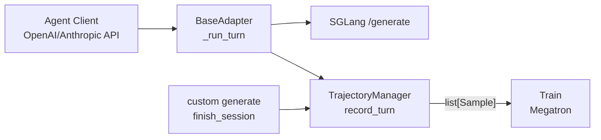

# Agent Trajectory 与 Sample 线性化

> **阶段 VI · 高级特性** | Git：`22cdc6e1`  
> **源码范围：** `slime/agent/trajectory.py`、`adapters/*`、`docs/en/get_started/agent.md`

---

## 本模块在架构中的位置

Agentic RL 的核心矛盾：**运行时**用 chat messages / tool calls 组织多轮对话，**训练时**必须用 token ids + `loss_mask` 标注可训练区间。`TrajectoryManager` 在中间维护 **per-session 消息树**，把每轮 SGLang `/generate` 快照（`TurnRecord`）挂载到树上，最终 **线性化为 `list[Sample]`**。



---

## 零基础一句话

**像 Git 分支：** 每个 session 是一棵树；相同前缀的消息走同一分支，prompt 重放若 token 漂移则 **fork** 新分支；每条可训练路径收成一条 `Sample`（含 loss_mask）。

---

## 六件套阅读顺序

| 顺序 | 文件 | 一句话说明 |
|------|------|------------|
| 01 | [[27-Agent-Trajectory-01-核心概念]] | TurnRecord、DriftKind、MessageNode |
| 02 | [[27-Agent-Trajectory-02-源码走读]] | record_turn → get_trajectory 全流程 |
| 03 | [[27-Agent-Trajectory-03-数据流与交互]] | Adapter ↔ SGLang ↔ Sample 契约 |
| 04 | [[27-Agent-Trajectory-04-关键问题]] | TITO 漂移、fan-out、session 路由 |
| ✓ | [[27-Agent-Trajectory-05-checkpoint]] | 验收清单 |

---

## 核心源码锚点

**Explain：** `record_turn` 把一轮 prompt+response 挂到 session 树；`get_trajectory` 遍历叶子链，经 `_SampleBuilder` 拼 token 并 emit `Sample`。

**Code：**

```python
## 来源：slime/agent/trajectory.py L283-L305
    def record_turn(self, sid, *, turn: TurnRecord, prompt_messages, response_message, metadata=None):
        root = self._trees.setdefault(sid, MessageNode())
        node, depth = self._find_mount_point(root, prompt_messages)
        node, depth = self._try_merge_assistant_rewrite(sid, node, prompt_messages, depth)
        node = self._mount_prompt_messages(node, prompt_messages[depth:])
        self._attach_assistant_leaf(sid, node, turn=turn, response_message=response_message, metadata=metadata)
```

**Comment：**

- Adapters 在 HTTP 响应 **flush 成功后** 才 `record_turn`（避免客户端未收到却入库）
- `get_trajectory` 消费 session 后 `_trees.pop(sid)`——二次调用返回 `[]`

---

## 与文档 / 测试

- 产品路线图：`slime/docs/en/get_started/agent.md`（内嵌于 01/03）
- 验证：`tests/test_agent/` 覆盖 drift / fork / rewrite merge

---

## 阅读路径

← [[12-SGLang-Rollout-00-MOC]]（默认单轮 generate） · [[28-Customization-00-MOC]]（custom-generate 挂接）  
→ [[29-Plugins-Examples-00-MOC]]（search-r1 / coding_agent 实例）
