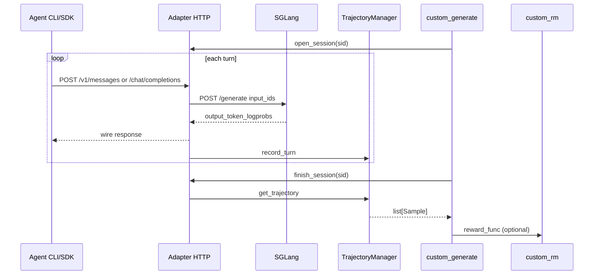
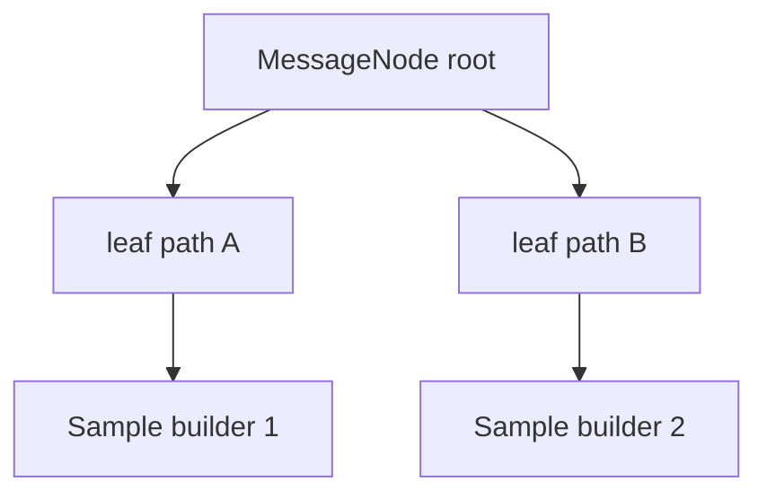

# Agent Trajectory · 数据流与交互

## 1. 端到端 Agent Rollout 时序



---

## 2. 数据结构边界

| 层 | 表示 | 训练相关字段 |
|----|------|--------------|
| Wire | OpenAI/Anthropic JSON | 无 |
| Chat template | `list[dict]` messages | 用于 mount 树 |
| SGLang | `input_ids` / logprobs | TurnRecord |
| Sample | token 序列 | tokens, loss_mask, rollout_log_probs, reward |

**Explain：** 训练目标 **必须** 保留 SGLang 采样的 token ids；环境/工具观测文本以 loss_mask=0 追加。

---

## 3. Session affinity 与 Router

**Explain：** adapter 发送 `X-SMG-Routing-Key: session_id`，配合 `--router-policy consistent_hashing` 提高多轮前缀缓存命中。

**Code：**

```python
# 来源：slime/agent/adapters/common.py L472-L472
    headers = {"X-SMG-Routing-Key": session_id} if session_id and session_id != "default" else None
```

**Comment：** 见 [[15-SGLang-Engine-03-数据流与交互]] 与 docs advanced sglang-config session-affinity 章节。

---

## 4. parse_model_output 插入点

**Explain：** raw decode 后走 SGLang reasoning parser + function call parser；失败时 XML fallback。

**Code：**

```python
# 来源：slime/agent/parsing.py L25-L56
def parse_model_output(raw_output, *, tools_schema, tool_parser_name, reasoning_parser_name):
    ...
    body_text, tool_uses, ill_formed = parse_tool_uses(body_text, tools_schema, tool_parser_name)
    return ParsedModelOutput(reasoning=reasoning, text=(body_text or "").strip(), tool_uses=tool_uses, ill_formed=ill_formed)
```

**Comment：** `ill_formed` 传入 metadata，可用于 RM 降权或 filter。

---

## 5. 与 RolloutManager 的衔接

**Explain：** `--custom-generate-function-path` 替换 `sglang_rollout` 内 per-sample generate；adapter 模式典型流程：

1. 创建 `AnthropicAdapter` / `OpenAIAdapter`
2. `aiohttp` 启动 adapter.app（或 threaded server）
3. 运行 agent harness / CLI 指向 adapter URL
4. `finish_session` → 返回 `list[Sample]`（可能 >1）

**Code（文档 fan-out 契约摘录）：**

```markdown
# 来源：docs/en/get_started/agent.md L25-L26
If one rollout splits into multiple trainable segments, return `list[Sample]` and set the same `rollout_id` on all sibling samples.
```

---

## 6. 多 leaf → 多 Sample 数据流



**Explain：** subagent 分支在树上表现为不同 leaf；每条 leaf 的 assistant 链独立 linearize。共享前缀 assistant 只训练一次（`response_trained`）。

---

## 7. 上下游索引

| 模块 | 关系 |
|------|------|
| [[12-SGLang-Rollout-00-MOC]] | 默认单轮 generate 对照 |
| [[28-Customization-00-MOC]] | `--custom-generate-function-path` 挂接 |
| [[13-RM-FilterHub-00-MOC]] | ill_formed / truncated 过滤 |
| `slime/agent/harness/*` | sandbox 内跑 CLI agent（批次 28） |
