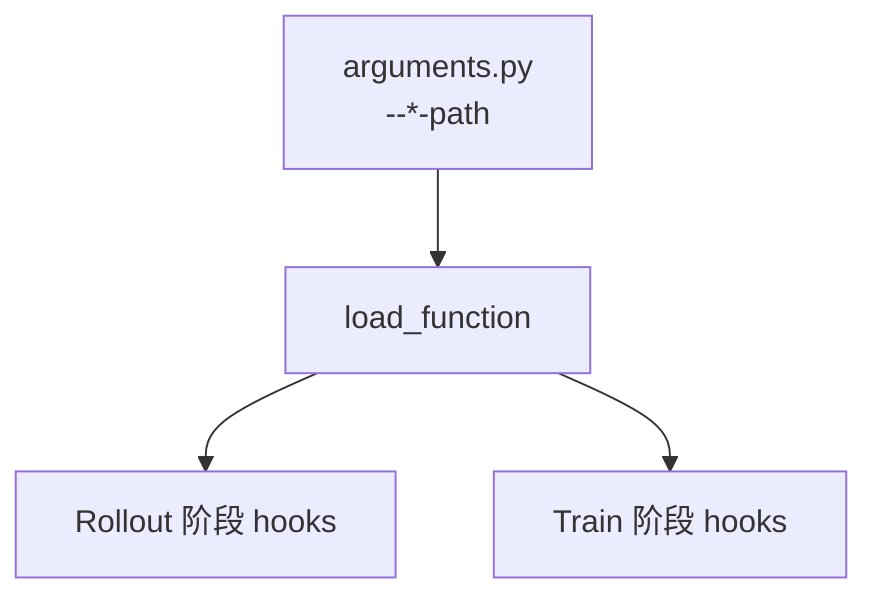

# Customization 17 类扩展接口

> **阶段 VI · 高级特性** | 状态：已完成 | Git：`22cdc6e1`  
> **源码范围：** `docs/en/get_started/customization.md`、`agent/harness/*`、`agent/parsing.py`

---

## 本模块在架构中的位置

Slime 不在核心代码里硬编码业务逻辑，而是通过 **`--*-path` CLI 参数** 在运行时 `load_function` 注入自定义函数。Agentic RL、RAG、多 agent、自定义 loss 等均走此机制。



---

## 零基础一句话

**像插件槽位：** 文档列 17+ 个槽（generate、rm、rollout、loss…），每个槽对应一个 import path；你写函数、CLI 指向它，主循环在固定点回调。

---

## 六件套阅读顺序

| 顺序 | 文件 | 一句话说明 |
|------|------|------------|
| 01 | [[28-Customization-01-核心概念]] | 17 类接口表 + load_function |
| 02 | [[28-Customization-02-源码走读]] | harness / parsing 支撑代码 |
| 03 | [[28-Customization-03-数据流与交互]] | Agentic RL 选型决策树 |
| 04 | [[28-Customization-04-关键问题]] | 契约测试、fan-out、签名 |
| ✓ | [[28-Customization-05-checkpoint]] | 验收清单 |

---

## 核心源码锚点

**Explain：** Agent 任务默认 `--custom-generate-function-path` + `--custom-rm-path`；仅当默认 rollout 循环不够时才 `--rollout-function-path`。

**Code：**

```python
# 来源：docs/en/get_started/customization.md L36-L36
For most agentic use cases, **start with `--custom-generate-function-path` plus `--custom-rm-path`**, and only override the full rollout function when the default rollout loop is insufficient.
```

**Comment：** 完整接口表见 customization.md Overview（内嵌于 01）；契约测试在 `tests/plugin_contracts/`。

---

## 阅读路径

← [[04-Arguments-TrainRollout-00-MOC]]（CLI 参数定义） · [[27-Agent-Trajectory-00-MOC]]  
→ [[29-Plugins-Examples-00-MOC]]（search-r1 / multi_agent 实例）
