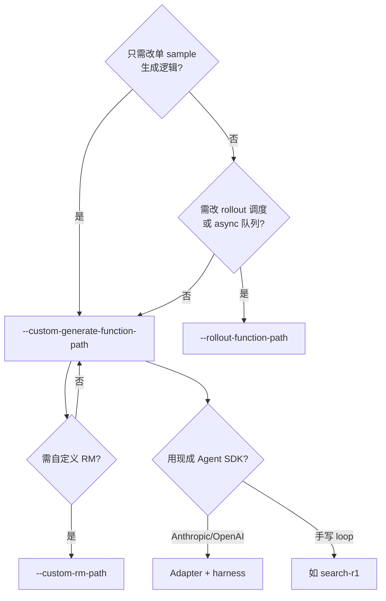
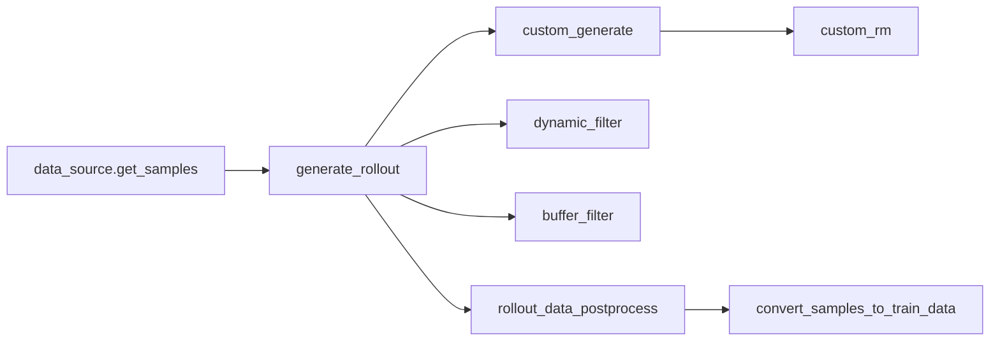
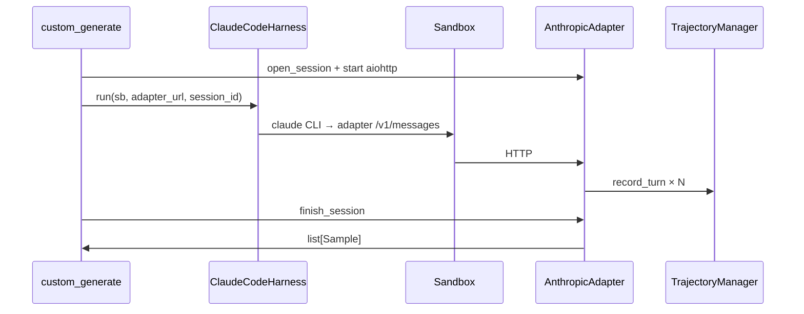

# Customization · 数据流与交互

## 1. Agentic RL 接入决策树



---

## 2. 默认 Rollout 链路上的 hook 点



**Explain：** `--custom-generate-function-path` 只替换 CG 节点；其余 hook 可选叠加。

---

## 3. Adapter + Harness 组合数据流



**Code（harness env 指向 adapter）：**

```python
## 来源：slime/agent/harness/claude_code.py L62-L66
        env = {
            "ANTHROPIC_BASE_URL": ctx.adapter_url,
            "ANTHROPIC_AUTH_TOKEN": ctx.session_id,
            ...
        }
```

---

## 4. 训练侧 hook 时序

| 时机 | 参数 | 典型用途 |
|------|------|----------|
| Megatron init 后 | `--custom-megatron-init-path` | 注册 buffer、自定义 optimizer |
| logprob 前 | `--custom-megatron-before-log-prob-hook-path` | MoE routing replay 准备 |
| train step 前 | `--custom-megatron-before-train-step-hook-path` | 冻结、日志 |
| loss 计算 | `--custom-loss-function-path` | 新 RL 目标 |
| advantage 前 | `--custom-reward-post-process-path` | reward shaping |

---

## 5. 与 [[27-Agent-Trajectory-00-MOC]] 的分工

| 组件 | 职责 |
|------|------|
| TrajectoryManager | token 线性化、drift、多 Sample |
| parsing.py | 原始 text → tool_uses |
| customization 文档 | **何时** 选哪个 CLI |
| harness | **如何** 在 sandbox 跑 CLI agent |

---

## 6. 日志 hook 返回值语义

**Code：**

```python
## 来源：docs/en/get_started/customization.md L364-L364
# Return: `True` to skip default logging, `False` to continue with default logging.
```

**Comment：** 自定义 wandb/tensorboard 时常返回 True 完全接管。

---

## 7. eval 与 train rollout 分离

**Explain：** `--eval-function-path` 默认等于 `--rollout-function-path`；eval 时可换更保守 sampling 或禁用 tool。

**Code：**

```python
## 来源：docs/en/get_started/customization.md L408-L409
**Default**: Same as `--rollout-function-path`
```

---

## 8. 环境变量覆盖契约测试

**Code：**

```python
## 来源：docs/en/get_started/customization.md L487-L491
python tests/plugin_contracts/test_plugin_rollout_contracts.py \
  --rollout-function-path my_project.custom_rollout.generate_rollout
```

**Comment：** 本地验证自定义 path 在 CI 断言下仍满足签名与返回结构。
