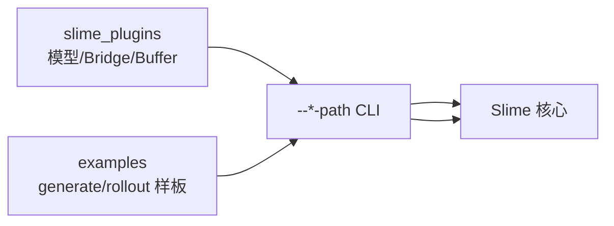

# Plugins 与 Examples 生态

> **阶段 VII · 扩展与生态** | Git：`22cdc6e1`  
> **源码范围：** `slime_plugins/rollout_buffer`、`examples/search-r1`、`examples/multi_agent`

---

## 本模块在架构中的位置

`slime/` 核心是训练闭环；**slime_plugins/** 放可选模型 Bridge / 算子扩展；**examples/** 放可运行的 RL 工作流样板。读者学完 [[28-Customization-00-MOC]] 后，本专题回答「具体怎么接」。



---

## 零基础一句话

**像 cookbook：** plugins 扩展「能训什么模型」；examples 扩展「用什么数据流训」——都通过 customization path 挂进主循环。

---

## 六件套阅读顺序

| 顺序 | 文件 | 一句话说明 |
|------|------|------------|
| 01 | [[29-Plugins-Examples-01-核心概念]] | rollout_buffer、三类 example 模式 |
| 02 | [[29-Plugins-Examples-02-源码走读]] | buffer.py、search-r1、multi_agent |
| 03 | [[29-Plugins-Examples-03-数据流与交互]] | 外部 buffer 与默认 Rollout 对比 |
| 04 | [[29-Plugins-Examples-04-关键问题]] | 选型、logprob 对齐、插件注册 |
| ✓ | [[29-Plugins-Examples-05-checkpoint]] | 验收清单 |

---

## 核心源码锚点

**Explain：** Search-R1 用 `--custom-generate-function-path` 实现多轮 search tool；multi_agent 用 `--rollout-function-path` 包装并行子 agent。

**Code：**

```python
## 来源：examples/search-r1/generate_with_search.py L145-L146
async def generate(args, sample: Sample, sampling_params) -> Sample:
    assert not args.partial_rollout, "Partial rollout is not supported for this function at the moment."
```

**Comment：** rollout_buffer 是 **独立 FastAPI 服务**，与 Slime 进程解耦，适合外部数据生成集群。

---

## 阅读路径

← [[28-Customization-00-MOC]]  
→ [[08-总结与索引-00-MOC]]（[[08-总结与索引-00-MOC]] 收官）
