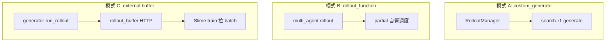
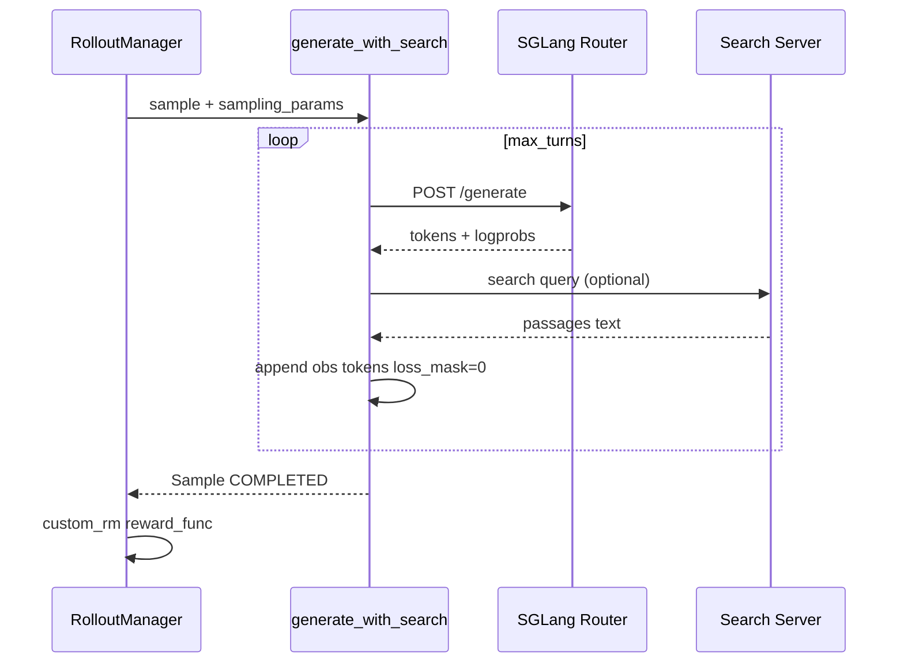

# Plugins Examples · 数据流与交互

## 1. 三种接入模式对比



| 模式 | Example | CLI |
|------|---------|-----|
| A | search-r1 | `--custom-generate-function-path` |
| B | multi_agent | `--rollout-function-path` |
| C | rollout_buffer plugin | 自定义 data_source 或外部集成 |

---

## 2. Search-R1 单 sample 数据流



**Explain：** 外层仍走 [[12-SGLang-Rollout-03-数据流与交互]]；仅 inner loop 自定义。

---

## 3. rollout_buffer 写读流


**Code：**

```python
# 来源：slime_plugins/rollout_buffer/buffer.py L245-L253
    def read(self):
        with self.not_empty:
            if len(self.buffer) == 0:
                return {"data": [], "meta_info": {}}
            result = self.buffer.get()
            self.total_read += len(result["data"])
            return result
```

---

## 4. multi_agent 数据流

**Explain：** `generate_with_multi_agents` 被 rollout function 调用；内部并行 `num_parallel` 个子 agent，合并为 `list[Sample]` 再 shuffle。

**与 fan-out 关系：** 各 sub-agent segment 应共享 `rollout_id`（在 `agent_system` 内实现，见 example 源码）。

---

## 5. plugins 与 checkpoint 链

| Plugin | 交互模块 |
|--------|----------|
| `megatron_bridge` | [[26-Checkpoint-M2HF-01-核心概念]] HF 加载 |
| `models/glm5` | Megatron model provider + converter 路由 |
| `rollout_buffer` | 与 [[11-DataSource-00-MOC]] 正交，可并存 |

---

## 6. coding_agent_rl（延伸）

未全文内嵌，但数据流为：**harness + adapter + sandbox test RM** 的 superset，见 `examples/coding_agent_rl` 与 [[27-Agent-Trajectory-03-数据流与交互]]。

---

## 7. fully_async 与 buffer

**Explain：** `examples/fully_async` 解决 long-tail agent rollout 不阻塞训练；与 rollout_buffer **不同**——前者在 Slime 进程内异步，后者是独立服务。

---

## 8. 与 CI 的关系

`tests/gemma4/` 等 example 级测试在 GRAPH-BATCH-MAP 列为批次 29 验证建议；plugins 改动应跑相关 CPU/GPU smoke。
