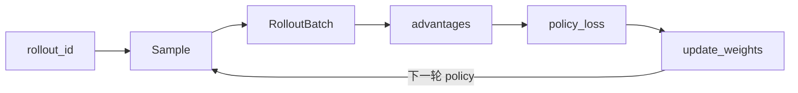

# 03 · 关键概念

> 12 个核心概念 · 每节 ETC + 双链到专题批

---

## 1 · rollout_id

**Explain：** 同步/异步主循环的外层迭代计数；贯穿 generate、train、save、eval 与 trace 归因。

**Code：**

```python
## 来源：train.py L62-L67
    for rollout_id in range(args.start_rollout_id, args.num_rollout):
        if args.eval_interval is not None and rollout_id == 0 and not args.skip_eval_before_train:
            ray.get(rollout_manager.eval.remote(rollout_id))

        rollout_data_ref = ray.get(rollout_manager.generate.remote(rollout_id))
```

**Comment：** `start_rollout_id` 支持 checkpoint 恢复；`num_rollout == 0` 可 eval-only。

→ [[02-训练主循环-01-核心概念]]

---

## 2 · Sample

**Explain：** Rollout 产出的最小训练单元；含 tokens、loss_masks、rewards、rollout_log_probs 等字段。

**Code：**

```python
## 来源：slime/utils/types.py L81-L120（节选）
@dataclass
class Sample:
    """The sample generated by the rollout."""

    prompt: str = ""
    response: str = ""
    tokens: list[int] = field(default_factory=list)
    loss_masks: list[int] = field(default_factory=list)
    rewards: float | list[float] = 0.0
    rollout_log_probs: list[float] = field(default_factory=list)
    status: SampleStatus = SampleStatus.PENDING
    metadata: dict[str, Any] = field(default_factory=dict)
```

**Comment：** `loss_masks` 区分 prompt/response 哪些 token 参与 policy loss；`rollout_log_probs` 用于 off-policy 校正（TIS/ICEPOP）。

→ [[10-Sample-Contracts-01-核心概念]]

---

## 3 · generate → train → update_weights

**Explain：** Slime 同步训练每个 rollout_id 的三步节拍；异步版 prefetch generate 但语义不变。

**Code：**

```python
## 来源：train.py L67-L89
        rollout_data_ref = ray.get(rollout_manager.generate.remote(rollout_id))
        # ... offload / critic 分支省略 ...
        ray.get(actor_model.async_train(rollout_id, rollout_data_ref))
        # ... save / eval 省略 ...
        actor_model.update_weights()
```

→ [[Slime-00-方法论-01-核心概念]] · [[全链路RL训练追踪]]

---

## 4 · PlacementGroup（colocate / offload）

**Explain：** Ray PG 把 train GPU 与 rollout GPU 映射到物理节点；`colocate` 强制 offload 以时分复用显存。

**Code：**

```python
## 来源：slime/ray/placement_group.py L42-L48
def _create_placement_group(num_gpus):
    if num_gpus == 0:
        return None, [], []
    bundles = [{"GPU": 1, "CPU": 1} for _ in range(num_gpus)]
    pg = placement_group(bundles, strategy="PACK")
```

→ [[03-Arguments-Ray-01-核心概念]] · [[06-PlacementGroup-01-核心概念]]

---

## 5 · RolloutManager

**Explain：** Rollout 三角的调度中枢；持有 DataSource、rollout fn、SGLang ServerGroup。

**Code：** 见 [[08-总结与索引-02-架构分层#Layer 2 · Rollout 生成]] 中 `generate()` 片段。

→ [[08-RolloutManager-00-MOC]]

---

## 6 · RolloutBatch / train_data

**Explain：** `_convert_samples_to_train_data` 将 Sample list 张量化为 Megatron 可消费的 dict（tokens、advantages、masks 等）。

**Code：**

```python
## 来源：slime/rollout/base_types.py L1-L26（节选）
@dataclass
class RolloutFnTrainOutput:
    data: list[list[Sample]]
    metrics: dict[str, Any] = field(default_factory=dict)
```

→ [[20-Train-Data-01-核心概念]]

---

## 7 · advantage_estimator（GRPO / PPO / GSPO）

**Explain：** `compute_advantages_and_returns` 根据 `--advantage-estimator` 就地写 advantages/returns。

**Code：**

```python
## 来源：slime/backends/megatron_utils/loss.py L661-L676
def compute_advantages_and_returns(args: Namespace, rollout_data: RolloutBatch) -> None:
    """Compute advantages and returns in-place based on `args.advantage_estimator`.
    ...
    Supported methods: "grpo", "gspo", "cispo", "ppo",
    "reinforce_plus_plus", and "reinforce_plus_plus_baseline".
    """
```

→ [[21-Loss-Advantages-01-核心概念]]

---

## 8 · policy_loss_function

**Explain：** PPO/GSPO clipped policy gradient；可选 TIS、KL penalty。

**Code：**

```python
## 来源：slime/backends/megatron_utils/loss.py L881-L896
def policy_loss_function(
    args: Namespace,
    batch: RolloutBatch,
    logits: torch.Tensor,
    sum_of_sample_mean: Callable[[torch.Tensor], torch.Tensor],
) -> tuple[torch.Tensor, dict[str, torch.Tensor]]:
    """Compute policy loss (PPO/GSPO) and metrics.
    Computes current log-probabilities and entropy from model logits, then
    calculates PPO-style clipped policy gradient loss.
    """
```

→ [[22-Loss-Policy-01-核心概念]]

---

## 9 · update_weights

**Explain：** 训练后把 Megatron 权重推送到 SGLang engine；支持 NCCL broadcast、disk、delta、tensor 多路径。

**Code：** 见 [[08-总结与索引-02-架构分层#Layer 5 · 权重同步]]。

→ [[24-WeightSync-Dist-01-核心概念]]

---

## 10 · customization hooks（--*-path）

**Explain：** 17 类可插拔函数路径，由 `load_function` 动态 import；CLI 传入点分路径，如 `slime.rollout.sglang_rollout.generate_rollout`。

**Code：**

```python
## 来源：slime/utils/misc.py L37-L45
def load_function(path):
    module_path, _, attr = path.rpartition(".")
    module = importlib.import_module(module_path)
    return getattr(module, attr)
```

→ [[28-Customization-01-核心概念]] · [[04-Arguments-TrainRollout-01-核心概念]]

---

## 11 · TrajectoryManager（Agentic RL）

**Explain：** 多轮 LLM 对话轨迹管理；adapters 对接 OpenAI/Anthropic API，最终转为 Sample。

→ [[27-Agent-Trajectory-01-核心概念]]

---

## 12 · trace / profile

**Explain：** `trace_utils` 为 Sample 级 span 归因；`TrainProfiler` 包装 PyTorch profiler 与 memory snapshot。

**Code：**

```python
## 来源：slime/utils/trace_utils.py L16-L24
TRACE_VERSION = 1
TRACE_CHILDREN_KEY = "_trace_children"
SGLANG_TRACE_META_KEYS = (
    "prompt_tokens",
    "completion_tokens",
    "cached_tokens",
    "queue_time",
    "e2e_latency",
    "decode_throughput",
)
```

→ [[08-总结与索引-07-可观测与CI]]

---

## 概念关系图



---

## 导航

- [[Slime-术语表]] — 完整术语索引
- [[08-总结与索引-04-导读路径]]
