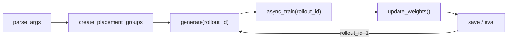
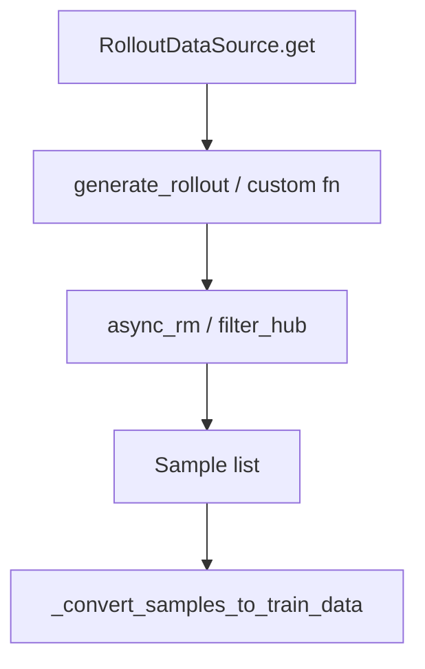
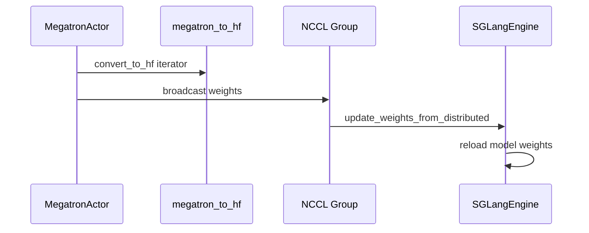

# 业务域流程

> 6 条 flow · 对齐 [[08-总结与索引-04-导读路径]] · domain-graph 文字版

---

## Flow 1 · rl-sync-loop（同步 RL 主循环）

**步骤：** parse_args → placement → generate → async_train → update_weights → save

**覆盖专题：** 02, 06–08, 19, 24



**入口代码：**

```python
## 来源：train.py L62-L89
    for rollout_id in range(args.start_rollout_id, args.num_rollout):
        rollout_data_ref = ray.get(rollout_manager.generate.remote(rollout_id))
        ray.get(actor_model.async_train(rollout_id, rollout_data_ref))
        actor_model.update_weights()
```

→ [[02-训练主循环-03-数据流与交互]] · [[全链路RL训练追踪]]

---

## Flow 2 · rl-async-loop（异步 RL 流水线）

**步骤：** prefetch generate(N+1) ∥ train(N)

**覆盖专题：** 02, 14, 20

**Explain：** `train_async.py` 在 train 当前 batch 时后台启动下一批 generate；fully-async rollout 可进一步解耦 sample 生产与 train 消费。

**Code：**

```python
## 来源：train_async.py L1-L20（节选结构）
# prefetch: rollout_data_ref = rollout_manager.generate.remote(rollout_id+1)
# 与 train(N) 并行，详见 14-Alt-Rollout
```

→ [[14-Alt-Rollout-03-数据流与交互]] · [[20-Train-Data-03-数据流与交互]]

---

## Flow 3 · rollout-sample（单样本 Rollout）

**步骤：** data_source → generate → rm_hub → Sample → tensorize

**覆盖专题：** 10–13



**Code：**

```python
## 来源：slime/ray/rollout.py L552-L558
        data, metrics = self._get_rollout_data(rollout_id=rollout_id)
        data = self._convert_samples_to_train_data(data)
        return self._split_train_data_by_dp(data)
```

→ [[10-Sample-Contracts-03-数据流与交互]] · [[13-RM-FilterHub-03-数据流与交互]]

---

## Flow 4 · agentic-rl（Agent 数据生成）

**步骤：** custom_generate → trajectory → convert → train

**覆盖专题：** 27–28, 29

**Explain：** TrajectoryManager 管理多轮 tool call；最终 `convert_to_samples` 进入标准 Rollout 管道。

→ [[27-Agent-Trajectory-03-数据流与交互]] · [[28-Customization-03-数据流与交互]]

---

## Flow 5 · weight-sync-nccl（NCCL 权重同步）

**步骤：** megatron_to_hf → broadcast → sglang reload

**覆盖专题：** 24–26



**Code：**

```python
## 来源：slime/backends/megatron_utils/actor.py L583-L599
    def update_weights(self) -> None:
        ...
        ) = ray.get(self.rollout_manager.get_updatable_engines_and_lock.remote())
```

→ [[24-WeightSync-Dist-03-数据流与交互]] · [[15-SGLang-Engine-03-数据流与交互]]

---

## Flow 6 · weight-sync-delta（Delta 磁盘同步）

**步骤：** delta write → engine patch

**覆盖专题：** 25, 26

**Explain：** 大模型全量 broadcast 成本高时，写 disk delta 后 engine 侧 patch；colocate 可用 `update_weight_from_tensor`。

→ [[25-WeightSync-Disk-01-核心概念]] · [[26-Checkpoint-M2HF-01-核心概念]]

---

## Flow 与层对照

| flow id | 主 layer | 关键文件 |
|---------|----------|----------|
| `flow:rl-sync-loop` | entry-orchestration | `train.py` |
| `flow:rl-async-loop` | entry-orchestration | `train_async.py` |
| `flow:rollout-sample` | rollout-generation | `rollout.py`, `sglang_rollout.py` |
| `flow:agentic-rl` | customization-agent | `trajectory.py` |
| `flow:weight-sync-nccl` | weight-sync | `update_weight_from_distributed.py` |
| `flow:weight-sync-delta` | weight-sync | `update_weight_from_disk_delta.py` |

---

## 导航

- [[Slime-模块依赖图]]
- [[08-总结与索引-02-架构分层]]
