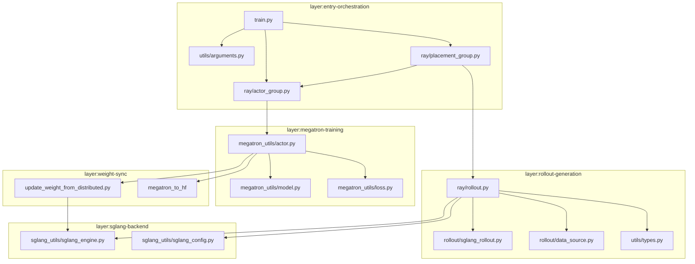
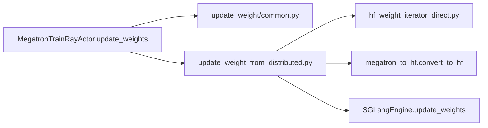

# 模块依赖图

> Mermaid 模块关系 + import 示例 · 对齐 `/understand` layers/edges

---

## 分层依赖（Mermaid）



---

## train.py 导入链

**Explain：** 入口层只依赖 Ray 编排与 arguments；不直接 import Megatron/SGLang 实现。

**Code：**

```python
## 来源：train.py L1-L6
import ray

from slime.ray.placement_group import create_placement_groups, create_rollout_manager, create_training_models
from slime.utils.arguments import parse_args
from slime.utils.logging_utils import configure_logger, finish_tracking, init_tracking
from slime.utils.misc import should_run_periodic_action
```

---

## RolloutManager 导入链

**Explain：** rollout.py 是 Rollout 层 hub，连接 sglang backend、rollout fn、types。

**Code（典型 import 模式）：**

```python
## 来源：slime/ray/rollout.py L1-L30（节选）
from slime.backends.sglang_utils.sglang_config import SglangConfig
from slime.rollout.base_types import call_rollout_fn
from slime.utils.misc import load_function
from slime.utils.types import Sample
```

---

## Megatron Actor 导入链

**Explain：** actor.py 依赖 model、loss、update_weight 子模块；通过 Ray 持有 rollout_manager 引用。

**Code：**

```python
## 来源：slime/backends/megatron_utils/actor.py L1-L40（节选）
from slime.backends.megatron_utils.loss import compute_advantages_and_returns, loss_function
from slime.backends.megatron_utils.model import initialize_model_and_optimizer, train
from slime.utils.misc import Box
```

---

## 权重同步依赖



→ [[24-WeightSync-Dist-03-数据流与交互]]

---

## 定制 hook 依赖

**Explain：** 所有 `--*-path` 参数经 `load_function` 动态加载，编译期无 import。

**Code：**

```python
## 来源：slime/utils/misc.py L37-L45
def load_function(path):
    module_path, _, attr = path.rpartition(".")
    module = importlib.import_module(module_path)
    return getattr(module, attr)
```

→ [[28-Customization-02-源码走读]]

---

## 与 SGLang upstream 边界

| Slime 模块 | SGLang 依赖方式 |
|-----------|----------------|
| `sglang_engine.py` | subprocess 启动 `sglang serve` |
| `sglang_rollout.py` | HTTP 调 router `/generate` |
| `arguments.py` | `sglang_parse_args()` 透传 CLI |

Slime **不 fork** SGLang 源码；见 [[与SGLang阅读对照]]。

---

## 导航

- [[08-总结与索引-02-架构分层]]
- [[08-总结与索引-05-文件地图]]
