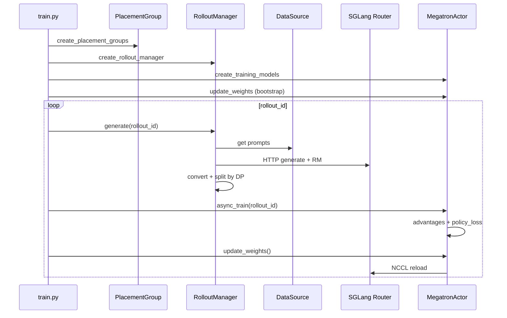

# 全链路 RL 训练追踪

> parse_args → placement → generate → async_train → update_weights → save  
> 每一 hop 嵌入源码，ETC 格式

本文追踪 **同步 RL 主循环**（`train.py`）一个 `rollout_id` 的完整生命周期。异步 prefetch、PD 分离、Agent 多轮在各 hop 标注扩展点。

---

## 总览时序



---

## Hop 0 · CLI 启动

**Explain：** `parse_args()` 三阶段解析；`train(args)` bootstrap 全部 Ray actor。

**Code：**

```python
## 来源：train.py L101-L103
if __name__ == "__main__":
    args = parse_args()
    train(args)
```

```python
## 来源：slime/utils/arguments.py L1546-L1559
def parse_args(add_custom_arguments=None):
    configure_logger()
    add_slime_arguments = get_slime_extra_args_provider(add_custom_arguments)
    pre = _pre_parse_mode()
    skip_sglang = pre.debug_train_only or pre.load_debug_rollout_data is not None
    sglang_ns = None
    if not skip_sglang:
        sglang_ns = sglang_parse_args()
```

**Comment：** `debug_train_only` 跳过 SGLang parse，用于纯训练 replay。

---

## Hop 1 · GPU 分配（PlacementGroup）

**Explain：** 按 `--actor-num-nodes`、`--rollout-num-gpus` 等创建 train/rollout/critic PG；colocate 时共享物理 GPU。

**Code：**

```python
## 来源：train.py L11-L12
    # allocate the GPUs
    pgs = create_placement_groups(args)
```

```python
## 来源：slime/ray/placement_group.py L42-L48
def _create_placement_group(num_gpus):
    if num_gpus == 0:
        return None, [], []
    bundles = [{"GPU": 1, "CPU": 1} for _ in range(num_gpus)]
    pg = placement_group(bundles, strategy="PACK")
```

→ [[06-PlacementGroup-02-源码走读]]

---

## Hop 2 · 创建 RolloutManager 与 Actor

**Explain：** RolloutManager 内嵌 SGLang ServerGroup；Actor 通过 RayTrainGroup 包装 MegatronTrainRayActor。

**Code：**

```python
## 来源：train.py L15-L26
    rollout_manager, num_rollout_per_epoch = create_rollout_manager(args, pgs["rollout"])
    actor_model, critic_model = create_training_models(args, pgs, rollout_manager)
    if args.offload_rollout:
        ray.get(rollout_manager.onload_weights.remote())
    actor_model.update_weights()
```

**Comment：** bootstrap 末尾 **必须** `update_weights()`，保证 SGLang 与 Megatron 初始权重一致。

---

## Hop 3 · generate(rollout_id)

**Explain：** RolloutManager Ray remote；内部 `_get_rollout_data` 调用 rollout fn → RM → filter。

**Code：**

```python
## 来源：train.py L67
        rollout_data_ref = ray.get(rollout_manager.generate.remote(rollout_id))
```

```python
## 来源：slime/ray/rollout.py L546-L559
    def generate(self, rollout_id):
        self.rollout_id = rollout_id
        self.health_monitoring_resume()
        data, metrics = self._get_rollout_data(rollout_id=rollout_id)
        if self.args.debug_rollout_only:
            return
        data = self._convert_samples_to_train_data(data)
        return self._split_train_data_by_dp(data)
```

**扩展点：**

- 自定义 generate：`--rollout-function-path`
- Agent 多轮：[[27-Agent-Trajectory-03-数据流与交互]]
- 异步 prefetch：[[14-Alt-Rollout-03-数据流与交互]]

---

## Hop 4 · Rollout 内部（DataSource → SGLang → RM）

**Explain：** 默认路径 `generate_rollout` 从 DataSource 取 prompt batch，HTTP 调 SGLang router，再 `async_rm` 打分。

**Code：**

```python
## 来源：slime/rollout/sglang_rollout.py L618-L633
def generate_rollout(
    args: Namespace, rollout_id: int, data_source: Any, evaluation: bool = False
) -> RolloutFnTrainOutput | RolloutFnEvalOutput:
    assert args.rollout_global_dataset
    if evaluation:
        ...
```

**SGLang 侧对应：** HTTP `/generate` → Scheduler → ModelRunner（见 [[全链路请求追踪]]）。

→ [[12-SGLang-Rollout-02-源码走读]] · [[13-RM-FilterHub-02-源码走读]]

---

## Hop 5 · offload_rollout（可选）

**Explain：** colocate 模式下 generate 后 offload SGLang 权重/KV，腾出 GPU 给 Megatron train。

**Code：**

```python
## 来源：train.py L69-L70
        if args.offload_rollout:
            ray.get(rollout_manager.offload.remote())
```

→ [[03-Arguments-Ray-04-关键问题]]

---

## Hop 6 · async_train(rollout_id)

**Explain：** RayTrainGroup 向各 DP rank `.remote("train")`；Actor 内 compute advantages → policy_loss → backward。

**Code：**

```python
## 来源：train.py L72-L81
        actor_trains_this_step = (not args.use_critic) or rollout_id >= args.num_critic_only_steps
        if args.use_critic:
            value_refs = critic_model.async_train(rollout_id, rollout_data_ref)
            if actor_trains_this_step:
                ray.get(actor_model.async_train(rollout_id, rollout_data_ref, external_data=value_refs))
        else:
            ray.get(actor_model.async_train(rollout_id, rollout_data_ref))
```

```python
## 来源：slime/backends/megatron_utils/actor.py L380-L394
    def train(self, rollout_id: int, rollout_data_ref: Box, external_data=None):
        if self.args.offload_train:
            self.wake_up()
        with timer("data_preprocess"):
            rollout_data = self._get_rollout_data(rollout_data_ref)
        if self.role == "critic":
            result = self.train_critic(rollout_id, rollout_data)
        else:
            self.train_actor(rollout_id, rollout_data, external_data=external_data)
```

```python
## 来源：slime/backends/megatron_utils/loss.py L661-L669
def compute_advantages_and_returns(args: Namespace, rollout_data: RolloutBatch) -> None:
    """Supported methods: "grpo", "gspo", "cispo", "ppo", ..."""
```

→ [[19-Train-Step-02-源码走读]] · [[21-Loss-Advantages-02-源码走读]]

---

## Hop 7 · update_weights()

**Explain：** Megatron rank 0 迭代 HF 权重 → NCCL broadcast → SGLang engine reload；闭环完成。

**Code：**

```python
## 来源：train.py L87-L92
        if args.offload_rollout:
            ray.get(rollout_manager.onload_weights.remote())
        actor_model.update_weights()
        if args.offload_rollout:
            ray.get(rollout_manager.onload_kv.remote())
```

```python
## 来源：slime/backends/megatron_utils/actor.py L583-L606
    def update_weights(self) -> None:
        if self.args.debug_train_only or self.args.debug_rollout_only:
            return
        (
            rollout_engines,
            rollout_engine_lock,
            ...
        ) = ray.get(self.rollout_manager.get_updatable_engines_and_lock.remote())
```

→ [[24-WeightSync-Dist-03-数据流与交互]] · [[15-SGLang-Engine-03-数据流与交互]]

---

## Hop 扩展 · save / eval

**Code：**

```python
## 来源：train.py L47-L60
    def save(rollout_id):
        actor_trains_this_step = (not args.use_critic) or rollout_id >= args.num_critic_only_steps
        if actor_trains_this_step:
            actor_model.save_model(rollout_id, force_sync=rollout_id == args.num_rollout - 1)
        if args.rollout_global_dataset:
            ray.get(rollout_manager.save.remote(rollout_id))
```

```python
## 来源：train.py L83-L95
        if should_run_periodic_action(rollout_id, args.save_interval, num_rollout_per_epoch, args.num_rollout):
            save(rollout_id)
        if should_run_periodic_action(rollout_id, args.eval_interval, num_rollout_per_epoch):
            ray.get(rollout_manager.eval.remote(rollout_id))
```

---

## 七 Hop 索引

| Hop | 名称 | 源码锚点 | 专题 |
|-----|------|----------|------|
| 0 | CLI 启动 | `train.py` main | 02 |
| 1 | GPU 分配 | `placement_group.py` | 06 |
| 2 | Bootstrap | `create_rollout_manager` | 07–08 |
| 3 | generate | `RolloutManager.generate` | 08 |
| 4 | Rollout 内部 | `sglang_rollout.py` | 11–13 |
| 5 | offload | `rollout_manager.offload` | 03 |
| 6 | async_train | `actor.py train` | 19–21 |
| 7 | update_weights | `actor.py update_weights` | 24–15 |

---

## 导航

- [[08-总结与索引-04-导读路径]]
- [[Slime-业务域流程]]
- [[与SGLang阅读对照]]
