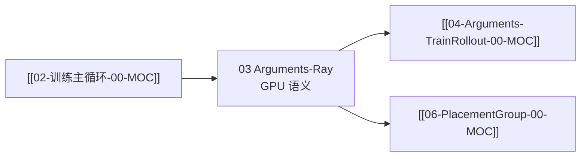

# Arguments-Ray · 专题概述

> **专题 03** | 阶段 I 启动与入口 | **代码热点专题**（内嵌代码 ≥400 行）  
> 源码：`slime/utils/arguments.py` 之 **Ray / Cluster / Colocate** 段 + `parse_args` + `slime_validate_args` 集群相关 validate

---

## 本专题目标

1. 解释 `--actor-num-nodes`、`--rollout-num-gpus`、`--colocate`、`--offload-*` 语义
2. 走读 `get_slime_extra_args_provider` → `add_cluster_arguments`
3. 理解 `parse_args()` 三阶段与 Ray 资源的关系
4. 掌握 `slime_validate_args` 中 colocate / debug / rollout_num_gpus=0 分支

---

## 文档导航

| 文档 | 内容 |
|------|------|
| [[03-Arguments-Ray-01-核心概念]] | colocate、offload、placement 术语 |
| [[03-Arguments-Ray-02-源码走读]] | add_cluster + parse_args + validate |
| [[03-Arguments-Ray-03-数据流与交互]] | CLI → args → PG 分配 |
| [[03-Arguments-Ray-04-关键问题]] | colocate 强制 offload、rollout_num_gpus=0 |
| [[03-Arguments-Ray-05-checkpoint]] | 验收 |

---

## 源码范围

| 符号 | 行号（约） | 覆盖 |
|------|-----------|------|
| `add_cluster_arguments` | L38–105 | ✅ |
| `get_slime_extra_args_provider` 注册顺序 | L1495–1525 | ✅ |
| `_pre_parse_mode` | L1530–1543 | ✅ |
| `parse_args` | L1546–1589 | ✅ |
| `slime_validate_args` offload/colocate 段 | L1861–1906 | ✅ |
| delta+colocate 拒绝 | L1992–1997 | 04 FAQ |

**刻意不覆盖：** Train/Rollout/customization 参数 → [[04-Arguments-TrainRollout-00-MOC]]

---

## 入口：cluster 参数定义

**Code：**

```python
## 来源：slime/utils/arguments.py L38-L42
        def add_cluster_arguments(parser):
            parser.add_argument("--actor-num-nodes", type=int, default=1, help="Number of nodes for training actor")
            parser.add_argument(
                "--actor-num-gpus-per-node", type=int, default=8, help="Number of gpus per node for training actor"
            )
```

---

## 衔接



---

## 阶段验收点

- [ ] 能解释 colocate 时 `rollout_num_gpus` 默认值
- [ ] 能说明 `rollout_num_gpus=0` 场景（external router only）
- [ ] 能口述 `parse_args` Phase 1/2/3
