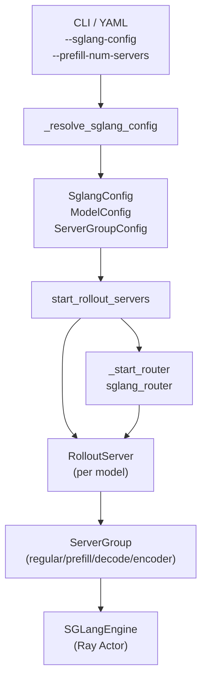

# EngineTopology · 专题概述

> **阶段 III · Rollout 生成** | 专题 **09** | Git：`22cdc6e1`  
> **源码范围：** `slime/ray/rollout.py`（ServerGroup / RolloutServer / start_rollout_servers / _start_router）、`slime/backends/sglang_utils/sglang_config.py`、`docs/en/advanced/pd-disaggregation.md`

---

## 本模块在架构中的位置

Slime 的 Rollout 侧不是「一个 SGLang 进程打天下」，而是 **按 YAML 或 CLI 声明的拓扑**，在 Ray Placement Group 上启动 **多模型 × 多 ServerGroup × 多 SGLangEngine**，每个模型背后挂一个 **sglang_router**。本专题聚焦 **引擎拓扑的声明（SglangConfig）与实例化（start_rollout_servers）**，是 [[08-RolloutManager-00-MOC]] 中 `RolloutManager.__init__` 调用链的下半段。



---

## 零基础一句话

**像 K8s 的 Deployment + Service**：`SglangConfig` 写「要几组、每组几卡、prefill 还是 decode」；`start_rollout_servers` 按图把 Ray Actor 和 Router 拉起来；HTTP 请求只打 Router，Router 再按 PD 规则分发到 prefill/decode worker。

---

## 六件套阅读顺序

| 顺序 | 文件 | 一句话说明 |
|------|------|------------|
| 01 | [[09-EngineTopology-01-核心概念]] | worker_type、多模型 Router、PD/EPD 术语 |
| 02 | [[09-EngineTopology-02-源码走读]] | **主文档**：配置解析 → Router → ServerGroup → Engine |
| 03 | [[09-EngineTopology-03-数据流与交互]] | GPU 槽位、port cursor、与 RolloutManager 的衔接 |
| 04 | [[09-EngineTopology-04-关键问题]] | PD 分离 vs 普通 regular 拓扑选型 |
| ✓ | [[09-EngineTopology-05-checkpoint]] | 验收：能否画出 actor 模型的 prefill+decode 布局 |

---

## 核心源码锚点

**Explain：** `RolloutManager` 构造时调用 `start_rollout_servers`，后者遍历 `SglangConfig.models`，为每个模型启动 Router 和若干 `ServerGroup`，并返回待 `ray.get` 的 `engine.init` 句柄。这是 RL 训练循环与 SGLang 推理集群之间的 **拓扑绑定点**。

**Code：**

```python
## 来源：slime/ray/rollout.py L1089-L1126
# 提交版本：22cdc6e1
def start_rollout_servers(args, pg) -> tuple[dict[str, Any], list[Any]]:
    """Start rollout servers without waiting for final engine initialization.

    Each model defined in the sglang config gets its own router and set
    of server groups.  Server groups within a model may have different
    ``num_gpus_per_engine`` (e.g. for PD disaggregation where prefill
    and decode use different TP sizes).

    Returns ``(servers, init_handles)`` where servers maps model name to
    ``RolloutServer`` and init_handles contains pending ``engine.init`` refs.
    """
    if args.rollout_external:
        return start_external_rollout_servers(args, start_router=_start_router)

    config = _resolve_sglang_config(args)

    servers: dict[str, RolloutServer] = {}
    pending_init_handles: list[Any] = []
    gpu_offset = 0
    engine_offset = 0

    rollout_pg_offset = _compute_rollout_offset(args)
    megatron_num_gpus = _compute_megatron_num_gpus(args)

    for model_idx, model_cfg in enumerate(config.models):
        model_cfg.resolve(args)

        has_pd = model_cfg.has_pd_disaggregation
        router_ip, router_port = _start_router(args, has_pd_disaggregation=has_pd, force_new=(model_idx > 0))

        if model_idx == 0:
            args.sglang_router_ip = router_ip
            args.sglang_router_port = router_port
```

**Comment：**

- `config.models` 支持 **多模型**（actor / ref / reward），每个模型 `force_new=True` 时分配独立 Router 端口。
- `has_pd_disaggregation` 来自 `ModelConfig.has_pd_disaggregation`，只要存在 `prefill` 或 `decode` 组即为 True。
- 第一个模型的 Router 地址写回 `args.sglang_router_ip/port`，兼容旧版单 Router 脚本。
- 完整 `_make_group` / EPD 两阶段启动见 [[09-EngineTopology-02-源码走读]] §4–§5。

---

## 与相邻专题的关系

| 方向 | 模块 | 关系 |
|------|------|------|
| 上游 | [[08-RolloutManager-00-MOC]] | `RolloutManager.__init__` 调用 `start_rollout_servers` |
| 下游 | [[12-SGLang-Rollout-00-MOC]] | `generate_rollout` 通过 Router HTTP 发请求 |
| SGLang | [[22-Disaggregation-00-MOC]] | SGLang 侧 PD worker 语义与 slime Router 配置对应 |
| 高级 | [[24-WeightSync-Dist-00-MOC]] PD-SGLangConfig | 更完整的 YAML 运维与 session affinity |

---

## 验收标准（摘要）

- 能说明 **regular / prefill / decode / encoder / placeholder** 五种 `worker_type` 的差异。
- 能对比 **`--prefill-num-servers`** 与 **`--sglang-config`** 两条配置路径。
- 能解释 **同一 model 内不可混用 regular 与 prefill/decode** 的原因（Router PD 模式）。
- 五篇正文合计 **≥ 15 段内嵌源码、≥ 200 行**；详见 [[09-EngineTopology-05-checkpoint]]。
