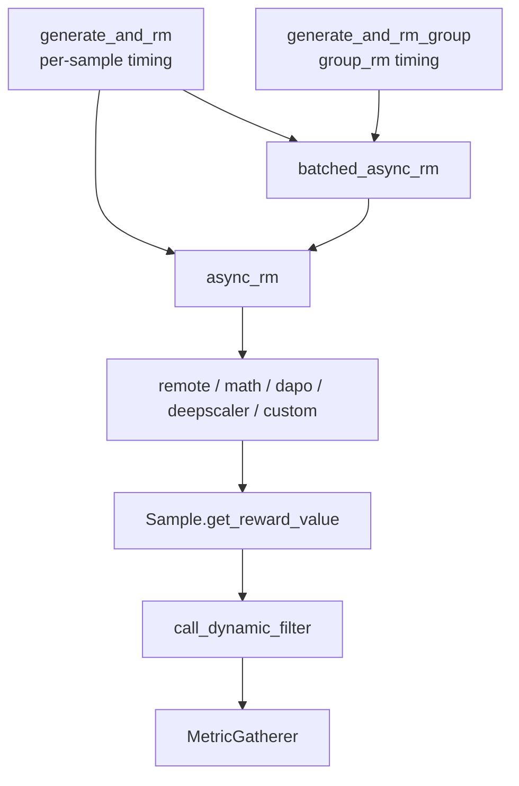

# RM-FilterHub · 源码走读

> 阅读顺序：rollout 何时打分 → RM hub 如何分发 → math/DAPO/DeepScaler scorer → dynamic filter 如何补样 → reward 标量如何被 filter 和 loss 侧读取。

---

## 1. Rollout 侧打分时机

### 1.1 单 sample 生成后的即时 RM

**问题与约束：** rollout 生成可能返回单个 `Sample`，也可能由 custom generate fan-out 成 `list[Sample]`；同时 aborted 样本和已由 custom generate 填好 reward 的样本不能重复打分。

**设计选择：** `generate_and_rm` 在 `group_rm=False` 时立即打分；fan-out 结果用 `batched_async_rm`，单样本用 `async_rm`，都包进 `trace_span(..., "reward_model")`。

**Explain：** `args.group_rm` 是打分时机的分界线。关闭时每条生成完成后尽快打分；开启时此处直接返回，等待整组生成完再联合打分。

**Code：**

来源：slime/rollout/sglang_rollout.py L263-L286

```python
if args.group_rm:
    return sample

if isinstance(sample, list):
    samples = sample
    if any(sample.status == Sample.Status.ABORTED for sample in samples):
        return samples

    samples_need_reward = [sample for sample in samples if sample.reward is None]
    with trace_span(samples_need_reward, "reward_model"):
        rewards = await batched_async_rm(args, samples_need_reward)
    for sample, reward in zip(samples_need_reward, rewards, strict=False):
        sample.reward = reward
    return samples
else:
    if sample.status == Sample.Status.ABORTED:
        return sample
    if sample.reward is None:
        with trace_span(sample, "reward_model"):
            sample.reward = await async_rm(args, sample)
```

**代码逻辑：** 先处理 group RM 的延迟打分；再区分 fan-out 与单样本；aborted 样本直接返回；只对 `reward is None` 的样本调用 RM。

**为什么这样写：** rollout pipeline 需要支持内置生成、custom generate、自带 reward 的插件和被中止的请求；显式分支避免把这些情况都塞进 RM hub。

**不变量与失败模式：** fan-out 路径的 `rewards` 顺序必须与 `samples_need_reward` 一致；如果 custom generate 返回 list 中混入 aborted 样本，整组直接跳过打分。

**Comment：** 这段决定“单条样本什么时候获得 reward”，后面的 hub 只负责“用什么规则获得 reward”。

### 1.2 group_rm 的整组联合打分

**问题与约束：** 某些 reward model 需要同一 prompt 的多个 sample 一起比较，例如组内排序、pass@k 或 DAPO 风格筛选前的联合打分。

**设计选择：** `generate_and_rm_group` 先并发调用每个 sample 的 `generate_and_rm`；当 `args.group_rm=True` 且未 abort 时，对整组调用一次 `batched_async_rm`。

**Explain：** group RM 要求 per-sample 路径不提前打分，因此 1.1 中的 early return 与这里的 group-level 打分是成对设计。

**Code：**

来源：slime/rollout/sglang_rollout.py L326-L331

```python
if not state.aborted and args.group_rm:
    with trace_span(group, "group_reward_model"):
        rewards = await batched_async_rm(args, group)
    for sample, reward in zip(group, rewards, strict=False):
        sample.reward = reward
```

**代码逻辑：** 等 `asyncio.gather` 收齐同组生成结果后，整组传给 `batched_async_rm`；返回 reward list 后按原组顺序写回 sample。

**为什么这样写：** group-level reward 需要看到完整候选集；如果在单 sample 完成时立即打分，就失去了组内相对信息。

**不变量与失败模式：** `batched_async_rm` 返回长度必须等于 `group` 长度；若组内存在 fan-out list，调用方需要保证 batch RM 能处理这种 shape。

**Comment：** `group_rm` 不只是性能开关，而是 reward 语义开关。

## 2. RM Hub 分发

### 2.1 per-sample async_rm 的优先级

**问题与约束：** reward 来源可能来自 eval 数据集注入的 per-sample custom RM、全局 custom RM、样本 metadata 中的 rm_type 或命令行 `--rm-type`。

**设计选择：** `async_rm` 按 per-sample custom path → 全局 custom path → metadata/args rm_type 的顺序分发；`boxed_` 前缀先提取 boxed answer 再进入具体 scorer。

**Explain：** per-sample custom path 优先级最高，使同一次 eval 可以按数据集覆盖 RM；没有 custom path 时才进入内置 scorer 表。

**Code：**

来源：slime/rollout/rm_hub/__init__.py L55-L96

```python
async def async_rm(args, sample: Sample, **kwargs):
    if sample.custom_rm_path:
        rm_function = load_function(sample.custom_rm_path)
        return await rm_function(args, sample, **kwargs)

    if args.custom_rm_path is not None:
        rm_function = load_function(args.custom_rm_path)
        return await rm_function(args, sample, **kwargs)

    metadata = sample.metadata if isinstance(sample.metadata, dict) else {}
    rm_type = (metadata.get("rm_type") or args.rm_type or "").strip()
    response = sample.response
    label = sample.label
    if rm_type.startswith("boxed_"):
        response = extract_boxed_answer(response) or ""
        rm_type = rm_type[len("boxed_") :]

    if rm_type == "remote_rm":
        return await remote_rm(args, sample)
    elif rm_type == "deepscaler":
        return get_deepscaler_rule_based_reward(response, label)
    elif rm_type == "dapo":
        return compute_score_dapo(response, label)
    elif rm_type == "math":
        return 1 if grade_answer_verl(response, label) else 0
```

**代码逻辑：** 自定义函数直接返回 reward；内置路径先确定 `rm_type`，再按字符串分派到 remote、deepscaler、dapo、math、f1、gpqa、ifbench、random 等 scorer。

**为什么这样写：** RM hub 需要同时服务训练和 eval，优先级必须让数据集级配置覆盖全局默认；`boxed_` 前缀提供轻量组合，不要求每个 scorer 都实现 boxed 提取。

**不变量与失败模式：** 若没有 custom path 且 `rm_type` 为空，会抛 `NotImplementedError`；若 metadata 中 `rm_type` 拼错，也会进入未实现分支。

**Comment：** 这段是 RM hub 的中心路由表，理解它就能解释大多数 reward 配置的落点。

### 2.2 batched_async_rm 的批量接口

**问题与约束：** batch RM 既可能是真正的批量 custom function，也可能只是对内置 per-sample scorer 的并发包装。

**设计选择：** 如果配置了 `args.custom_rm_path`，直接把整个 `samples` list 交给 custom function；否则对每个 sample 创建 `async_rm` task 并 `asyncio.gather`。

**Explain：** 这意味着内置 `rm_type` 的 batch 路径默认是并发 per-sample，不会自动把 remote HTTP 合并成一个 RPC。

**Code：**

来源：slime/rollout/rm_hub/__init__.py L99-L110

```python
async def batched_async_rm(
    args,
    samples: list[Sample],
    **kwargs,
) -> list[int | float]:
    if args.custom_rm_path is not None:
        rm_function = load_function(args.custom_rm_path)
        return await rm_function(args, samples, **kwargs)
    tasks = [async_rm(args, sample, **kwargs) for sample in samples]
    rewards = await asyncio.gather(*tasks)
    return rewards
```

**代码逻辑：** custom batch 路径只调用一次用户函数；非 custom 路径构造 N 个 coroutine，等待全部完成后返回 reward list。

**为什么这样写：** 自定义 RM 最可能知道如何批处理外部服务或组内比较；内置 scorer 保持 per-sample 简单语义，靠 asyncio 获得并发。

**不变量与失败模式：** `args.custom_rm_path` 在 batch 路径下必须实现 batch 签名；如果仍按单 sample 签名写，会在 group RM 或 fan-out 打分时失败。

**Comment：** 这也是 `group_rm=True` 时 custom RM 必须能处理 list 的原因。

### 2.3 remote_rm 的共享连接与重试

**问题与约束：** 远程 RM 需要承受高并发 rollout 请求，HTTP 失败也不能立即让整个 rollout 崩掉。

**设计选择：** 使用模块级共享 `aiohttp.ClientSession`，连接池 limit 为 64，总 timeout 为 120 秒；请求失败后指数退避并最多重试 10 次。

**Explain：** payload 固定包含 `prompt`、`response`、`label`，返回值直接是 `resp.json()`，标量提取留给 `Sample.get_reward_value(args)` 和 `--reward-key`。

**Code：**

来源：slime/rollout/rm_hub/__init__.py L22-L52

```python
def _get_shared_session() -> aiohttp.ClientSession:
    global _shared_session
    if _shared_session is None or _shared_session.closed:
        connector = aiohttp.TCPConnector(limit=64, enable_cleanup_closed=True)
        timeout = aiohttp.ClientTimeout(total=120)
        _shared_session = aiohttp.ClientSession(connector=connector, timeout=timeout)
    return _shared_session

async def remote_rm(args, sample: Sample, max_retries: int = 10):
    payload = {
        "prompt": sample.prompt,
        "response": sample.response,
        "label": sample.label,
    }
    session = _get_shared_session()
    for attempt in range(max_retries):
        try:
            async with session.post(args.rm_url, json=payload) as resp:
                resp.raise_for_status()
                return await resp.json()
        except Exception as e:
            ...
```

**代码逻辑：** 第一次调用创建共享 session；每次 remote RM 用同一 session POST 到 `args.rm_url`；HTTP 状态异常或网络异常触发退避重试，最后一次失败会 log warning 并重新抛出。

**为什么这样写：** rollout 并发下频繁创建 session 会浪费连接和 fd；退避可以吸收短暂服务抖动，但不会无限掩盖远端故障。

**不变量与失败模式：** `args.rm_url` 必须可用且返回 JSON；如果返回 dict 而后续没有配置 reward key，filter/loss 侧可能无法把它当标量使用。

**Comment：** remote RM 的“批量”并不在这里实现；默认 batch 路径会并发发出多次 POST。

## 3. Rule-based Math Scorer

### 3.1 math_utils 的 boxed 提取

**问题与约束：** 数学推理 response 常把最终答案放在最后一个 `\boxed{}` 或 `\fbox{}` 中；CoT 中间也可能出现早期 boxed，不能取第一个。

**设计选择：** `last_boxed_only_string` 从右向左找最后一个 boxed/fbox，再用大括号计数找到闭合位置；`extract_boxed_answer` 再调用宽松版 `remove_boxed`。

**Explain：** 宽松版 `remove_boxed` 在格式不匹配时返回 `None`，让上游可以把无效提取当作空答案处理。

**Code：**

来源：slime/rollout/rm_hub/math_utils.py L384-L426

```python
def last_boxed_only_string(string):
    idx = string.rfind("\\boxed")
    if idx < 0:
        idx = string.rfind("\\fbox")
        if idx < 0:
            return None

    i = idx
    right_brace_idx = None
    num_left_braces_open = 0
    while i < len(string):
        if string[i] == "{":
            num_left_braces_open += 1
        if string[i] == "}":
            num_left_braces_open -= 1
            if num_left_braces_open == 0:
                right_brace_idx = i
                break
        i += 1
    return None if right_brace_idx is None else string[idx : right_brace_idx + 1]

def extract_boxed_answer(solution: str) -> str:
    solution = last_boxed_only_string(solution)
    solution = remove_boxed(solution)
    return solution
```

**代码逻辑：** `rfind` 确保取最后一个 boxed；brace counter 支持 boxed 内部嵌套括号；提取失败返回 `None`。

**为什么这样写：** CoT 文本不一定规整，简单 regex 容易被嵌套花括号截断；从最后一个 boxed 开始更符合“最终答案在末尾”的数据约定。

**不变量与失败模式：** 只识别 `\boxed` 或 `\fbox`；如果答案不在这两个标记中，`extract_boxed_answer` 会返回 `None`。

**Comment：** `boxed_` rm_type 前缀复用了这套提取逻辑。

### 3.2 sympy 等价判定

**问题与约束：** 数学答案可能字符串不同但代数等价，例如分式、根式或表达式化简；但直接 eval 任意字符串有安全和性能风险。

**设计选择：** 先构造 `(gt)-(pred)`，通过 `should_allow_eval` 的黑名单与未知字母数量检查后，再用 `_sympy_parse` 和 `sympy.simplify` 判断是否为 0。

**Explain：** 所有异常都吞掉并返回 False，保证 reward model 不因单条难解析答案中断 rollout。

**Code：**

来源：slime/rollout/rm_hub/math_utils.py L351-L362

```python
def are_equal_under_sympy(ground_truth_normalized: str, given_normalized: str):
    are_equal = False
    try:
        expr = f"({ground_truth_normalized})-({given_normalized})"
        if should_allow_eval(expr):
            sympy_diff = _sympy_parse(expr)
            simplified = sympy.simplify(sympy_diff)
            if simplified == 0:
                are_equal = True
    except Exception:
        pass
    return are_equal
```

**代码逻辑：** 字符串经规范化后形成差值表达式；允许解析才进入 sympy；差值化简为 0 判等。

**为什么这样写：** 对 RL rollout 来说，单条 scorer 错误不应拖垮整个 batch；同时判等能力要比纯字符串匹配宽。

**不变量与失败模式：** `should_allow_eval` 过严会把本可判等的表达式判错，过松则可能导致解析变慢；当前实现选择保守失败。

**Comment：** 这是 `math` 与 DeepScaler scorer 共享的关键等价内核之一。

### 3.3 DAPO Minerva 答案提取

**问题与约束：** DAPO/Minerva 风格答案通常用 `Answer:` 标记，且该实现假定 ground truth 最终都是整数。

**设计选择：** 用大小写不敏感 regex 找所有 `Answer:` 行，取最后一个 match，规范化后与 `str(int(float(gt)))` 比较。

**Explain：** 无匹配时 prediction 是 `[INVALID]`；`gt_need_extract` 只影响 ground truth 是否先从 boxed 中提取。

**Code：**

来源：slime/rollout/rm_hub/math_dapo_utils.py L199-L212

```python
match = re.findall(answer_pattern, solution_str)
extracted_answer = match[-1] if match else "[INVALID]"
pred = normalize_final_answer(extracted_answer)

if gt_need_extract:
    gt = normalize_final_answer(remove_boxed(last_boxed_only_string(gt)))
else:
    gt = normalize_final_answer(gt)

gt = str(int(float(gt)))

return (pred == gt), pred
```

**代码逻辑：** response 中多个 `Answer:` 只取最后一个；prediction 和 ground truth 都走 normalize；ground truth 强制整数化。

**为什么这样写：** DAPO 数据设定是整数答案，严格整数化能避免 `2` 与 `2.0` 这类格式漂移影响标签约定。

**不变量与失败模式：** 如果 ground truth 不是可转 float 的整数格式，会在 `int(float(gt))` 报错；无 `Answer:` 的 response 会被判为无效。

**Comment：** 这条路径和通用 math scorer 不同，不走 sympy 等价。

### 3.4 DAPO strict box 模式

**问题与约束：** strict box verifier 只希望末尾附近的 boxed 答案有效，避免模型在长 CoT 早段写过一个 boxed 干扰最终判分。

**设计选择：** 有 pause token 时从最后一个 pause 附近截 100 字符；否则只看 response 最后 100 字符，再取最后 boxed 并与 GT 精确匹配。

**Explain：** 返回值是 `1` 或 `-1`，同时返回提取出的 prediction，供上层记录。

**Code：**

来源：slime/rollout/rm_hub/math_dapo_utils.py L226-L237

```python
if pause_tokens_index is not None:
    assert len(pause_tokens_index) == 4
    pred = pred[pause_tokens_index[-1] - 100 :]
else:
    pred = pred[-100:]

boxed_pred = last_boxed_only_string(pred)
extracted_pred = remove_boxed(boxed_pred) if boxed_pred is not None else None

return 1 if (extracted_pred == gt) else -1, extracted_pred
```

**代码逻辑：** 先缩小搜索窗口，再提取 boxed 内容，最后做字符串相等比较。

**为什么这样写：** strict 模式强调输出格式和最终答案位置；只看尾部可以惩罚没有在最终位置给出 boxed 答案的 response。

**不变量与失败模式：** pause token 模式要求 index 长度正好为 4；boxed 不存在时 `extracted_pred=None`，直接判负。

**Comment：** 它比 `math_utils` 的 boxed 提取更严格，不应混用语义。

### 3.5 DAPO remove_boxed 的严格断言

**问题与约束：** DAPO strict path 需要把格式错误显式暴露，而不是像通用 math scorer 那样把错误吞成 None。

**设计选择：** `remove_boxed` 断言字符串必须以 `\boxed{` 开头并以 `}` 结尾，然后返回内部内容。

**Explain：** 这与 `math_utils.remove_boxed` 的 try/except 行为不同，是 DAPO scorer 的一部分语义。

**Code：**

来源：slime/rollout/rm_hub/math_dapo_utils.py L59-L62

```python
left = "\\boxed{"
assert s[: len(left)] == left, f"box error: {s}"
assert s[-1] == "}", f"box error: {s}"
return s[len(left) : -1]
```

**代码逻辑：** 先检查左前缀，再检查右括号，最后切掉 wrapper。

**为什么这样写：** strict scorer 需要区分“没有按要求 boxed”与“答案内容不相等”；断言让错误格式无法悄悄通过。

**不变量与失败模式：** 传入 `None` 或非 boxed 字符串会触发断言/类型错误；调用方必须先判断 boxed 是否存在。

**Comment：** 不要把通用 math 的宽松 `remove_boxed` 替换到这里，否则 strict 行为会漂移。

### 3.6 DeepScaler scorer

**问题与约束：** DeepScaler 模板里 response 可能含有 `</think>` 或 `###Response` 分隔符；没有分隔符时不能可靠定位最终答案。

**设计选择：** 先按模板分隔符取模型答案段，再用 `extract_answer` 抽取答案；ground truth 支持单个 str/float/int，并可从 boxed 中提取。

**Explain：** 最终判分同时尝试 `grade_answer_mathd` 和 `grade_answer_sympy`，任一通过返回 1，否则返回 0。

**Code：**

来源：slime/rollout/rm_hub/deepscaler.py L4-L42

```python
def get_deepscaler_rule_based_reward(response, label):
    if "</think>" in response:
        model_solution = response.split("</think>")[-1]
    elif "###Response" in response:
        model_solution = response.split("###Response")[1]
    else:
        return 0

    model_answer = extract_answer(model_solution)
    if model_answer is None:
        return 0
    if label == "":
        return 0

    assert isinstance(label, (str, float, int))
    ground_truths = [label]
    ...
    for ground_truth in processed_ground_truths:
        is_correct = grade_answer_mathd(model_answer, ground_truth) or grade_answer_sympy(model_answer, ground_truth)
        if is_correct:
            return 1
    return 0
```

**代码逻辑：** 模板分隔失败、答案提取失败、空 label 都直接给 0；ground truth 预处理后逐个尝试 mathd/sympy 判等。

**为什么这样写：** DeepScaler 的 response 格式比通用 math 更固定，先按模板裁剪能减少 CoT 干扰。

**不变量与失败模式：** response 必须包含支持的分隔符；label 必须是单个标量类型，不支持 ground truth list。

**Comment：** DeepScaler 与 `math` 共用部分数学判题能力，但入口模板约束更强。

## 4. Dynamic Filter Hub

### 4.1 rollout 过滤补样环

**问题与约束：** 动态采样希望最终保留 `rollout_batch_size` 个有效 group；如果某组 reward 分布不合格，需要丢弃并继续过采样补齐。

**设计选择：** `generate_rollout_async` 加载可选 dynamic filter，维护 `target_data_size` 和 `state.remaining_batch_size`；每组生成后先 filter，不 keep 则记 metrics 并减少 remaining。

**Explain：** `data` 只收 keep 的 group，`all_data` 记录所有完成 group；被 drop 的 group 不推进进度条，也不会占用最终 batch。

**Code：**

来源：slime/rollout/sglang_rollout.py L394-L433

```python
dynamic_filter = (
    load_function(args.dynamic_sampling_filter_path) if args.dynamic_sampling_filter_path is not None else None
)

metric_gatherer = MetricGatherer()
target_data_size = args.rollout_batch_size

data = []
all_data = []
while len(data) < target_data_size:
    while state.remaining_batch_size < target_data_size:
        samples = data_source(args.over_sampling_batch_size)
        state.submit_generate_tasks(samples)

    done, state.pendings = await asyncio.wait(state.pendings, return_when=asyncio.FIRST_COMPLETED)
    for task in done:
        group: list[Sample] = task.result()
        all_data.append(group)

        dynamic_filter_output = call_dynamic_filter(dynamic_filter, args, group)
        if not dynamic_filter_output.keep:
            metric_gatherer.on_dynamic_filter_drop(reason=dynamic_filter_output.reason)
            state.remaining_batch_size -= 1
            continue
```

**代码逻辑：** 只要剩余可用任务数不足目标，就按 `over_sampling_batch_size` 拉新 prompt；每个完成 group 先进入 filter；drop 时释放一个 remaining slot 促使继续补样。

**为什么这样写：** dynamic filter 会降低有效样本率，rollout 必须把“生成多少”与“保留多少”拆开，否则最终 batch 会变小。

**不变量与失败模式：** filter 必须在 group reward 已写好后调用；如果 RM 返回 dict 且 reward_key 未配置，内置 filter 可能无法把 reward 转 tensor。

**Comment：** 这段是 Filter Hub 的主循环，比 scorer 更接近数据采样策略。

### 4.2 DynamicFilterOutput 与兼容包装

**问题与约束：** 老版本 filter 可能只返回 bool，新版本需要携带 drop reason 以便记录 metrics。

**设计选择：** `call_dynamic_filter` 在 `fn is None` 时返回 keep；如果用户函数返回的不是 `DynamicFilterOutput`，就包装成 `DynamicFilterOutput(keep=output)`。

**Explain：** 这样旧 filter 不需要立刻迁移，但新 filter 可以通过 `reason` 暴露更细的 drop 原因。

**Code：**

来源：slime/rollout/filter_hub/base_types.py L5-L21

```python
@dataclass
class DynamicFilterOutput:
    keep: bool
    reason: str | None = None

def call_dynamic_filter(fn, *args, **kwargs):
    if fn is None:
        return DynamicFilterOutput(keep=True)

    output = fn(*args, **kwargs)

    if not isinstance(output, DynamicFilterOutput):
        output = DynamicFilterOutput(keep=output)

    return output
```

**代码逻辑：** 无 filter 等价于全 keep；有 filter 时执行用户函数；bool 返回值被自动升级成 dataclass。

**为什么这样写：** 动态过滤是用户扩展点，兼容 bool 接口能降低已有脚本迁移成本。

**不变量与失败模式：** `keep` 应该是 bool 语义；若用户返回 tensor 或其他对象，dataclass 不会强制转换，后续 `if not dynamic_filter_output.keep` 的 truthiness 可能出错。

**Comment：** 这是 filter 插件 API 的稳定层。

### 4.3 drop metrics 聚合

**问题与约束：** 被 filter 丢弃的样本需要可观测性，但 reason 可能为空，不能产生无意义 metric key。

**设计选择：** `MetricGatherer` 用 defaultdict 计数 reason；`reason` 为空时直接忽略；`collect` 输出 `rollout/dynamic_filter/drop_{reason}`。

**Explain：** metrics 最终并入 rollout 输出，让训练日志看到不同 drop 原因的数量。

**Code：**

来源：slime/rollout/filter_hub/base_types.py L24-L37

```python
class MetricGatherer:
    def __init__(self):
        self._dynamic_filter_drop_reason_count = defaultdict(lambda: 0)

    def on_dynamic_filter_drop(self, reason: str | None):
        if not reason:
            return
        self._dynamic_filter_drop_reason_count[reason] += 1

    def collect(self):
        return {
            f"rollout/dynamic_filter/drop_{reason}": count
            for reason, count in self._dynamic_filter_drop_reason_count.items()
        }
```

**代码逻辑：** drop 时调用 `on_dynamic_filter_drop` 增量计数；rollout 结束时通过 `collect` 转成 metrics dict。

**为什么这样写：** metrics key 在 collect 时生成，内部只保存 reason→count，便于 filter 扩展自定义 reason。

**不变量与失败模式：** reason 中如果含有不适合 metric 名的字符，当前实现不会清洗；调用方需要选择稳定可读的 reason。

**Comment：** 内置 `check_reward_nonzero_std` 只在 drop 时提供 reason。

### 4.4 内置 check_reward_nonzero_std

**问题与约束：** DAPO 类动态采样常要求同一 prompt 的多个 sample 奖励有区分度；全对或全错的 group 对相对学习信号贡献小。

**设计选择：** 内置 filter 取每个 sample 的标量 reward，计算 float64 标准差，只有 std 大于 `1e-6` 才 keep；drop reason 带上 `zero_std_{reward}`。

**Explain：** reward 标量通过 `Sample.get_reward_value(args)` 取得，因此支持 remote RM 返回 dict 后用 `--reward-key` 抽取。

**Code：**

来源：slime/rollout/filter_hub/dynamic_sampling_filters.py L1-L14

```python
import torch

from slime.rollout.filter_hub.base_types import DynamicFilterOutput
from slime.utils.types import Sample

__all__ = ["check_reward_nonzero_std"]

def check_reward_nonzero_std(args, samples: list[Sample], **kwargs):
    rewards = [sample.get_reward_value(args) for sample in samples]
    keep = torch.tensor(rewards, dtype=torch.float64).std() > 1e-6
    return DynamicFilterOutput(
        keep=keep,
        reason=None if keep else f"zero_std_{round(rewards[0], 1)}",
    )
```

**代码逻辑：** group reward list → tensor → std；std 近似 0 时 drop，并用首个 reward 值生成 reason。

**为什么这样写：** 相同 reward 的 group 不提供偏好差异；用 std 阈值可以统一处理全 0、全 1 或同分 dict-key reward。

**不变量与失败模式：** `rewards` 必须能转成数值 tensor；如果 `sample.reward` 是 dict 且没有 `reward_key`，这里会失败。

**Comment：** 这是 quick start 中推荐的 dynamic filter 示例。

## 5. 配置与 Reward 标量

### 5.1 eval 数据集注入 custom_rm_path

**问题与约束：** eval 可能同时跑多个数据集，每个数据集的 reward 规则不同；全局 `--custom-rm-path` 不能表达 per-dataset 覆盖。

**设计选择：** 构造 eval sample 时，把 `dataset_cfg.custom_rm_path` 写入 `sample.custom_rm_path`，供 `async_rm` 的最高优先级分支读取。

**Explain：** 同一处还注入 metadata 和 custom generate path，保证 eval sample 携带自己的生成与判分配置。

**Code：**

来源：slime/rollout/sglang_rollout.py L568-L569

```python
sample.custom_rm_path = dataset_cfg.custom_rm_path
sample.generate_function_path = getattr(dataset_cfg, "custom_generate_function_path", None)
```

**代码逻辑：** 每个 eval prompt 复制成 sample 后，直接在 sample 对象上挂载数据集级 custom path。

**为什么这样写：** RM hub 的 `async_rm` 只需要看 sample 字段，就能让 per-dataset 配置覆盖全局参数。

**不变量与失败模式：** `dataset_cfg.custom_rm_path` 指向的函数仍需符合 per-sample custom RM 签名；否则 eval 打分会在运行时失败。

**Comment：** 这解释了为什么 `async_rm` 要先看 `sample.custom_rm_path`。

### 5.2 Sample.get_reward_value

**问题与约束：** RM 可以返回纯标量，也可以返回包含多个字段的 dict；filter 和 loss 侧需要统一拿到训练用标量。

**设计选择：** `Sample.get_reward_value(args)` 在没有 `reward_key` 时直接返回 `self.reward`，否则返回 `self.reward[args.reward_key]`。

**Explain：** 这是 dynamic filter 与后续训练逻辑共享的 reward 标量抽取入口。

**Code：**

来源：slime/utils/types.py L246-L247

```python
def get_reward_value(self, args) -> float:
    return self.reward if not args.reward_key else self.reward[args.reward_key]
```

**代码逻辑：** 函数不做类型转换，只按配置选择 reward 本体或 dict 中某个 key。

**为什么这样写：** 不同 RM 的返回 schema 不同，把 key 选择放在 Sample 方法里能让 filter/loss 不重复判断 dict。

**不变量与失败模式：** 如果 `reward_key` 设置了但 reward 不是 dict，或 dict 缺少该 key，会在索引时报错。

**Comment：** remote RM 返回 dict 时，`--reward-key` 是生产配置里必须核对的参数。

### 5.3 dynamic sampling 参数

**问题与约束：** dynamic filter 会 drop 一部分 group，因此 rollout 需要额外的过采样粒度和 filter 函数路径。

**设计选择：** `--over-sampling-batch-size` 控制补样时一次拉取多少 prompt；`--dynamic-sampling-filter-path` 指向用户 filter，并在 help 中给出内置示例。

**Explain：** 当可用样本低于目标时，补样粒度由 over-sampling batch 决定，而不是由 filter drop 数逐个触发同步生成。

**Code：**

来源：slime/utils/arguments.py L430-L450

```python
parser.add_argument(
    "--over-sampling-batch-size",
    type=int,
    default=None,
    help=(
        "This defines the granularity of the sampling batch in the rollout function. "
        "When the number of available samples falls below the target, a sampling "
        "operation of size over_sampling_batch_size will be triggered."
    ),
)
parser.add_argument(
    "--dynamic-sampling-filter-path",
    type=str,
    default=None,
    help=(
        "This is the filter function for dynamic sampling. "
        "You could use `slime.rollout.filter_hub.dynamic_sampling_filters.check_reward_nonzero_std` as an example."
    ),
)
```

**代码逻辑：** 两个参数都在 rollout 参数组：一个控制采样数量，一个控制 filter 函数加载路径。

**为什么这样写：** dynamic sampling 是 rollout 采样策略，不属于 RM hub 本身；参数放在 rollout 侧更贴近使用位置。

**不变量与失败模式：** filter path 必须能被 `load_function` 动态加载；over-sampling 太小会导致频繁补样，太大则可能产生较多未使用样本。

**Comment：** `generate_rollout_async` 中的补样循环正是消费这两个参数。

### 5.4 reward model 参数

**问题与约束：** RM hub 同时支持内置 rule-based scorer、远程服务、全局 custom RM、dict reward key 和 group-level RM。

**设计选择：** 参数集中在 `add_reward_model_arguments`：`--rm-type` 选择内置 scorer，`--reward-key`/`--eval-reward-key` 选择 dict 字段，`--group-rm` 控制整组打分，`--rm-url` 配远程服务，`--custom-rm-path` 配自定义函数。

**Explain：** `--custom-rm-path` 的 help 写的是 per-sample 签名，但在 `batched_async_rm` 中它也会被用作 batch custom RM，因此 group/fan-out 场景要按实际调用路径实现。

**Code：**

来源：slime/utils/arguments.py L1316-L1356

```python
def add_reward_model_arguments(parser):
    parser.add_argument("--rm-type", type=str, default=None, help="Type of the reward model")
    parser.add_argument(
        "--reward-key",
        type=str,
        default=None,
        help="Some reward model may return a dict instead of a value, this is the key to extract the reward value from the dict. ",
    )
    parser.add_argument("--eval-reward-key", type=str, default=None, help="The eval variant for --reward-key")
    parser.add_argument("--group-rm", action="store_true", default=False, help="Whether to do rm on a whole group.")
    parser.add_argument(
        "--rm-url",
        type=str,
        default=None,
        help="URL for the reward model service for --rm-type remote_rm, e.g. http://localhost:8000",
    )
    parser.add_argument(
        "--custom-rm-path",
        type=str,
        default=None,
        help="Path to the custom reward model function. If set, we will use this function to calculate the reward instead of the default one.",
    )
```

**代码逻辑：** 这些参数最终分别被 `async_rm`、`batched_async_rm`、`remote_rm`、`Sample.get_reward_value` 和 rollout 打分时机分支读取。

**为什么这样写：** reward model 的可替换性横跨 rollout、RM hub 和 loss/filter 数据读取；集中定义参数便于配置层发现。

**不变量与失败模式：** `--rm-type remote_rm` 需要 `--rm-url`；dict reward 需要正确 key；`--group-rm` 需要 batch RM 能处理整组样本。

**Comment：** 这组参数是排查 reward 不生效时的第一组锚点。

---

## 6. 调用关系小结



| 问题 | 落点 |
|------|------|
| 单样本何时打分 | `generate_and_rm` |
| 整组何时打分 | `generate_and_rm_group` + `--group-rm` |
| RM 类型如何分派 | `async_rm` |
| batch/custom 如何调用 | `batched_async_rm` |
| 数学答案如何判分 | `math_utils` / `math_dapo_utils` / `deepscaler.py` |
| 动态过滤如何补样 | `generate_rollout_async` + `call_dynamic_filter` |
| dict reward 如何取标量 | `Sample.get_reward_value` + `--reward-key` |

核心不变量是：reward 写回 `sample.reward` 后，filter 和 loss 侧都应通过相同的标量抽取规则读取；`group_rm` 改变打分时机，也要求 batch RM 的输入输出顺序稳定；dynamic filter drop 后必须补样，最终保留的 group 数仍等于 `rollout_batch_size`。
