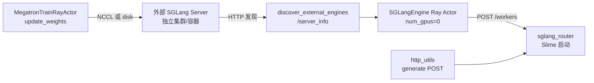

# External Engines · 专题概述

> **阶段 III · Rollout 生成** | Git：`22cdc6e1`  
> **源码范围：** `external.py`、`health_monitor.py`、`http_utils.py`、`docs/en/advanced/external-rollout-engines.md`

---

## 本模块在架构中的位置

External Engine 模式让 **SGLang 推理进程由训练任务外部部署**，Slime 训练 job 只做三件事：HTTP 发现引擎拓扑、启动 Router 并注册 worker、在 `update_weights` 时通过 NCCL 或 disk 同步 actor 权重。与 `--sglang-config`（Slime 自己 launch server）互斥。



---

## 零基础一句话

**「自带厨房的外卖模式」**：饭店（SGLang）自己开业，Slime 只负责查菜单（server_info）、挂外卖平台（Router）、以及定期送新菜谱（权重同步）。

---

## 用户场景

**Persona：** 平台工程师小林把 rollout 部署在独立推理集群（Fireworks 式），训练 GPU 与 serving GPU 型号不同；他需要 `--rollout-external-engine-addrs` 接入已有 SGLang，并用 disk/delta 传输权重，同时理解为何 external 模式不支持 Slime 内置 fault tolerance。

---

## 六件套阅读顺序

| 顺序 | 文件 | 一句话说明 |
|------|------|------------|
| 01 | [[16-External-Engines-01-核心概念]] | external vs sglang-config、worker 类型、权重传输选型 |
| 02 | [[16-External-Engines-02-源码走读]] | **主文档**：发现→建组→Router 注册→HTTP 客户端全链路 |
| 03 | [[16-External-Engines-03-数据流与交互]] | 启动时序、generate POST、health monitor 与 offload 协作 |
| 04 | [[16-External-Engines-04-关键问题]] | 互斥参数、PG 布局、disk 路径、无 recover 等 FAQ |
| ✓ | [[16-External-Engines-05-checkpoint]] | 验收：能否说明 external 模式完整部署路径 |

---

## 核心源码锚点

**Explain：** `parse_args` 末尾若检测到 `--rollout-external-engine-addrs`，会调用 `apply_external_engine_info_to_args` 探测每个 engine 的 GPU 数与 worker 类型，并写入 `args.rollout_num_engines`；`RolloutManager.__init__` 中 `start_rollout_servers` 走 `start_external_rollout_servers` 分支。

**Code：**

```python
## 来源：slime/utils/arguments.py L1851-L1854
    args.rollout_external = args.rollout_external_engine_addrs is not None

    if args.rollout_external and not args.debug_train_only:
        apply_external_engine_info_to_args(args, logger=logger)
```

```python
## 来源：slime/ray/rollout.py L1103-L1104
    if args.rollout_external:
        return start_external_rollout_servers(args, start_router=_start_router)
```

**Comment：**

- `rollout_external=True` 时 Placement Group **不预留 rollout GPU**（见 [[16-External-Engines-01-核心概念]] § PG 布局）。
- `SGLangEngine` Ray Actor 以 `num_gpus=0` 创建，仅作 HTTP 代理 + Router 注册，不 launch 本地子进程。
- `ExternalRolloutServer.recover()` 为空操作——引擎生命周期归外部系统。

---

## 与相邻专题

| 方向 | 专题 | 关系 |
|------|------|------|
| 上游 | [[15-SGLang-Engine-00-MOC]] | `SGLangEngine._init_external` sanity check + Router 注册 |
| 上游 | [[08-RolloutManager-00-MOC]] | `RolloutManager` 启动 servers、health monitor |
| 下游 | [[24-WeightSync-Dist-00-MOC]] | external + disk/delta 权重同步路径 |
| 对照 | [[15-SGLang-Engine-00-MOC]] | `--sglang-config` 互斥方案 |

---

## 验证建议

1. 参考 `tests/test_qwen3_4B_external_pd.py`：独立 launch prefill/decode server，训练侧传 `--rollout-external-engine-addrs`。
2. 启动后检查日志 `Detected external SGLang engines:` 与 Router `POST /workers` 200。
3. disk 模式确认 trainer 与 engine 共享 `--update-weight-disk-dir` 可见路径。
