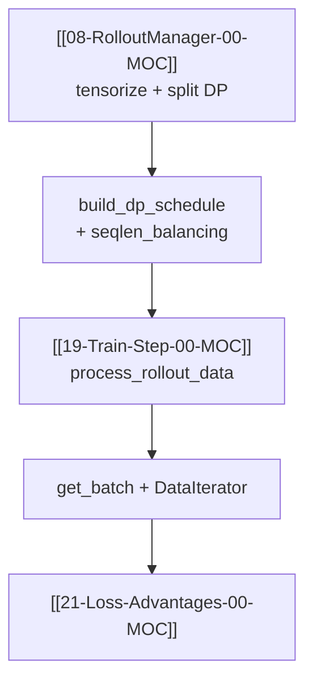

# Train Data · 专题概述

> 主题：Rollout 样本 → `RolloutBatch` → DP 分区 → CP-ready micro-batch

---

## 本专题目标

读完本专题六件套后，读者应能：

1. 说明 `RolloutManager._split_train_data_by_dp` 如何调用 `build_dp_schedule`，以及 `process_rollout_data` 在 Actor 侧如何还原 `partition`
2. 解释 `get_batch` 如何把 per-sample token list 变成 Megatron `PackedSeqParams`（含 CP zigzag / allgather-CP 两路径）
3. 对比 **dynamic batch**（first-fit + mbs 对齐）与 **static micro_batch_size** 的调度差异
4. 理解 `DataIterator` / `get_data_iterator` 与 VPP 多 stage 的关系
5. 知道 `log_rollout_data` 如何用 CP 正确的 `(sum, count)` 聚合 rollout 指标

---

## 文档导航

| 文档 | 内容 |
|------|------|
| [[20-Train-Data-01-核心概念]] | RolloutBatch 调度字段、CP 批构造术语 |
| [[20-Train-Data-02-源码走读]] | **主文档**：data.py + dp_schedule + seqlen_balancing |
| [[20-Train-Data-03-数据流与交互]] | RolloutManager → Ray Box → Actor train |
| [[20-Train-Data-04-关键问题]] | uneven DP、超长样本、FLOPs 平衡 |
| [[20-Train-Data-05-checkpoint]] | 验收清单 |

---

## 源码范围

| 优先级 | 文件 / 符号 | 本专题覆盖 |
|--------|-------------|---------|
| P0 | `megatron_utils/data.py` — `get_batch`, `DataIterator`, `get_data_iterator` | ✅ |
| P0 | `utils/dp_schedule.py` — `build_dp_schedule` | ✅ |
| P0 | `utils/data.py` — `process_rollout_data` | ✅ |
| P1 | `utils/seqlen_balancing.py` — Karmarkar-Karp / first_fit | ✅ |
| P1 | `data.py` — `log_rollout_data`, `gather_log_data` | 02/03 |
| 上游 | `ray/rollout.py` — `_split_train_data_by_dp` | 03 |
| 下游 | [[21-Loss-Advantages-00-MOC]] — loss 消费 `RolloutBatch` | 衔接 |

---

## 入口：`build_dp_schedule` 在 Rollout 侧被谁调用

**Explain：** 生成阶段结束时，`RolloutManager._split_train_data_by_dp` 根据 `train_parallel_config` 与 `global_batch_size` 计算每个 DP rank 的样本索引与 micro-batch 索引表，再打包成 Ray `Box` 发给各 Actor。

**Code：**

```python
## 来源：slime/ray/rollout.py L829-L851（节选）
    def _split_train_data_by_dp(self, data):
        dp_size = self.train_parallel_config["dp_size"]
        total_lengths = [len(t) for t in data["tokens"]]
        data["total_lengths"] = total_lengths

        partitions, micro_batch_indices, num_microbatches, global_batch_sizes = build_dp_schedule(
            self.args,
            self.train_parallel_config,
            total_lengths,
            global_batch_size=self.args.global_batch_size,
            rollout_indices=data["rollout_ids"],
        )
```

**Comment：**

- `rollout_indices` 来自 `Sample.index`（同一 prompt 的 n 条 rollout 共享 id），保证 **同一 rollout 的 sibling 样本落在同一步**
- `partitions[r]` 是全局 sample 下标；Actor 侧 `process_rollout_data` 用 `partition` 重排 `total_lengths` 等列表
- `micro_batch_indices[r]` 是 **rank 内 local 下标** 的 mbs 列表，供 `DataIterator` 消费

---

## 衔接关系



---

## 阶段验收点

- [ ] 能口述 pack-first-distribute-second 四步（按 rollout 分步 → pack mbs → 对齐 K → 分配 DP）
- [ ] 能说明 `allgather_cp` 与默认 CP 在 `get_batch` 的 token / loss_mask 处理差异
- [ ] 能解释 `rollout_mask_sums` 为何要在 step 级预计算（见 [[21-Loss-Advantages-01-核心概念]]）

---

## 相关测试

- `tests/test_dp_schedule.py` — 调度不变量
- `tests/test_seqlen_balancing.py` — 分区算法
